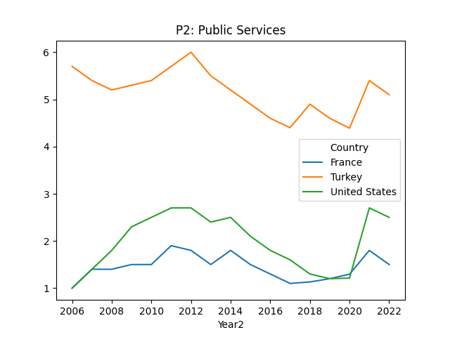
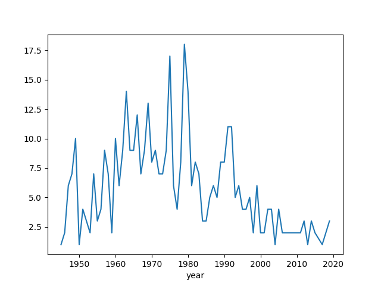

# Democracy Status 

### Polity

Here is democracy status from the Polity dataset. Their `DEMOC` and
`AUTOC` columns contain the level of insititutional leanings of a
country, `POLITY` column is one subtracted from the other, it ranges
btw -10 and +10, the latter being full democracy.

```python
import pandas as pd
df = pd.read_excel('../../mbl/2020/p4v2018.xls')
df = df[df.year > 1950]
df.loc[df.polity < -10, 'polity'] = np.nan
df['polity'] = df['polity'].interpolate(method='linear')
polity = df.groupby('year')['polity'].mean()
polity.plot()
plt.savefig('polity-all.png')
```


### BTI

[Data](https://www.bti-project.org/en/meta/downloads.html) comes from
the BTI Transformation Index that evaluates aspects of governance for
selected countries, recently updated for 2020.

```python
import pandas as pd
df = pd.read_stata('../../mbl/2020/BTI 2006-2020.dta')
df1 = df[['country','dem_stat','year']]
df1 = df1[df1.country.isin(['Russia','Turkey','Iran','China','Ukraine'])]
df1=df1.pivot(index='year', columns='country', values='dem_stat')
df1.plot()
plt.savefig('bti-compare.png')
```


<a name='btiall'></a>

```python
import pandas as pd
df = pd.read_stata('../../mbl/2020/BTI 2006-2020.dta')
g = df.groupby('year').dem_stat.mean()
g.plot()
plt.savefig('bti-all.png')
```


### Democracy Barometer

[Data](https://democracybarometer.org/data-and-documentation/)

```python
import zipfile
with zipfile.ZipFile('db.zip', 'r') as z:
   df = pd.read_csv(z.open('DB_data_2020_all_data_Standardised.csv'),sep=';') 
   df = df[['Year','DQ']].groupby('Year').mean()   
   print (df.tail(5))
   df.plot()
   
plt.savefig('db-all.png')
```

```text
            DQ
Year          
2013  3.870913
2014  3.855549
2015  3.857140
2016  3.864331
2017  3.821315
```


<a name='fsi'></a>

### The Fragile States Index

[The Fragile States Index](https://fragilestatesindex.org/) (FSI)
produced by The Fund for Peace (FFP), attemps to highlight pressures
that states experience, through its various measures and a final
score (lower is better) that shows how fragile a state is.


```python
import pandas as pd
df = pd.read_csv('fsi.csv')
df['Year2'] = df.apply(lambda x: pd.to_datetime(x['Year']).year, axis=1)
df = df[df.Country.isin(['United States','France','Turkey'])]
```

```python
c = 'P2: Public Services'
df2 = df[['Country','Year2',c]]
df2=df2.pivot(index='Year2', columns='Country', values=c)
df2.plot(title=c)
plt.savefig('fsi1.png')
```




```python
c = 'P1: State Legitimacy'
df2 = df[['Country','Year2',c]]
df2=df2.pivot(index='Year2', columns='Country', values=c)
df2.plot(title=c)
plt.savefig('fsi2.png')
```


[Code](fsi.py)

<a name='coups'></a>

### Coups

Worldwide annual counts of military interventions. Based on Cline Center
Coup D’état Project [Dataset](https://databank.illinois.edu/datasets/IDB-5672473)

```python
import pandas as pd
df = pd.read_csv('Coup_Data_v2.0.0.csv')
df = df[df['event_type'] == 'coup']
g = df.groupby('year').size()
print (g.tail(5))
```

```text
year
2013    1
2014    3
2015    2
2017    1
2019    3
dtype: int64
```

```python
g.plot()
plt.savefig('coups.png')
```



