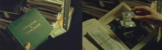

# Postmodernism
Here is the comment I've posted on onegoodmove.org on postmodernism:There are some well-known postmodern stances one which is their "disdain of science". Because everything is relative, nothing can be known -or so the thinking goes- hence it's all unnecessary and futile to theorize, prove anything. In big questions, they might very well be right, but they are throwing the baby with the bathwater. We don't need to know all curvatures of space/time to go to the moon, or write prove a mathematical theorem. I remember first time I studied post-modernism, I thought "this sounds so anti-everything that it stinks of French". And voila! It was a French invention. Even in art there was this fool called Duchamp who put a pot (for peeing) on display and said "this is art". Why? "Just because I said so". That is a common thread in postmodernist thinking by the way. Another biggie in the field is/was the late Jean Baudrillard. Yes, that Baudrillard the inspiration for the Matrix movies - look closer in a scene where Neo holds a book it says "Simulation and Simulacra" on the cover. That's the Baudrillard book that supposedly inspired the Wachowski brothers. However, the movie became something other than postmodernist movie on the way, it slammed industrialization in its own way not the way Baudrillard intended -and that's good-. :) I believe there is a lot of Toffler in Matrix, who, by the way despises postmodernism. 

at

July 25, 2007

