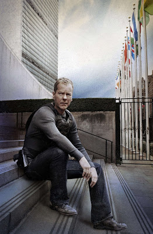

# 24 - II
You  want proof on 24's anti-bureucracy stance? OK. Before we start though, this word actually does not do 24 justice... There is more at work than meets the eye, 24 is anti-bureucracy, when it doesn't work, but also anti-establishment, when it doesn't work. And let's be honest, most of the time, both of these constructs fail to deliver the kinds of results needed for 21st century.Take 8th Season. President Taylor tries to cover-up the fact Russian government was involved in a terorist attack in order to save some piece deal in Middle East. (Leaving aside that US is  portrayed naively as the powerful hegamon, "the one to broker a deal") we see a  president who tries to keep a secret from people, going as far as trying to lock away Jack Bauer because Bauer wants people to know Russians were involved in the plot. The moment the president decides to cover this up, even according to her own chief of staff she is on  grounds for impeachement. Also for Jack Bauer, the issue is very clear-cut. After the said decision president Taylor is not fit for office. We said Bauer represents "the people" right? Well, there you go; people "see" this decision sucks. Can you lock away "the people"?No you can't. So Bauer escapes, and soon is on the move again. This time, against his own government. Oh, while we are on the subject: People, "the crowd" being part of the "show" is not a new development in art. This is essentally what the judges in American Idol represent - they are the people. But we've been doing this  in our homes for ages, aren't we? You sit in front of TV and make comments on the show.. I've watched some movies with my friends whose ramblings on a movie were actually funnier than the movie itself. Remember Beavis and Butt-head. Not the  "Cornolio" type adventures obviously, the parts when they sit down and watch music videos and  poke fun, belittle, mock. Aren't we doing that for years? Boy George.. Huhhh..huuhhh.. he doesn't look like "boy".. uhhh..On  Web-tech front: Isn't Web 2.0 all about crowdsourcing, power of the people, etc? Clay Shirky's book "Here Comes Everybody" comes to mind, as well as the cast of popular show Lost. This particular group of people are, literally, everyone. People from all walks of life, corner of the planet, type, age, gender and race.Moving on:24 also plays around another concept present in Western World. Our theory is the main cultural tug of war in Western world is between Jesus / Middle Ages vs. Rome.Well, according to this theory, Jack Bauer is a (post)modern day knight.This is all to clear. Besides, the concept of a knight shows up again and again in American art. Iron Man is one example, down to his body armor, but this analysis can be extended to any superhero movie made lately; who are knights; They are autonamous, have "fiefdoms" (a city, batcave, fortress of solitude, etc), and are either in trouble with authorities, but always, seperate from them.On the other side, there is Rome.This the the central despot, the king, the ruler. Byziantum (II. Rome). The Ottomans (III. Rome).Pay attention to the scene in 24 when Taylor presidency takes a turn for the worst. The new "advisor" makes his case with these words from Shakespeare's Julius Ceasar.There is a tide in the affairs of men,Which, taken at the  flood, leads on to fortunewhich essentially means the ends justify the means. Do whatever f..k you want, if it is for something better.But in 3rd Wave world, where people are "wired" and "informed"; this just does not cut it.And the knight, will not take it.

at

April 30, 2010

