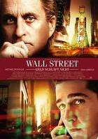

# Wall Street: Again
Oliver Stone has done it again; he somehow managed to add another item to the list of my favorite Stone movies. Wall Street, Any Given Sunday, and now, WS Money Never Sleeps.Some things have changed since Wall Street Part I, and some things haven't. 1987 movie was painting trader Gordon Gekko as a kind of a gunslinger, a maverick of sorts, like.. Pick a movie from the era, uh, say..  Top Gun. In Wall Street instead of fighter pilots, we had traders, instead fighter planes, we had junk bonds. Gordon Gekko barked buy orders into his phone with the same intensity as Maverick would yank on the controls of his plane in  a dogfight. But the result was the same; Gekko was in a system, and he knew how to work it.And this is the point where the first movie starts diverging from the second; In WS the financial structure, "the system" was big, all encompassing, and essentially.. working. We liked Gekko because he could do more than any mortal could do in that system. Bud Fox was planted in there to be our eyes, he was the regular guy, and we looked at Gekko through him. We admired that person, wished to be as ruthless and opportunistic as he (maybe), even if we never could be. This is why even though Stone tried to paint Gekko as the bad guy, it never worked, as countless of traders walking up to Michael Douglas after the movie proves, telling him he was their inspiration.But that was 1987.In 2008, it seemed we reached, and surpassed  Gekko. He was a gunslinger in a world of other gunslingers, when you had distant towns (economies), and less a connected globe. This point is driven home by Stone at the first scene; Gekko collects his belongings while leaving prison and one of his old items is a humangus cell phone that looks more like a brick than a phone. Clearly this technology and its owner is out of place in today's 24/7, subsecond, Wi-Fi, click-and-buy, snooze-you-lose silicon world.Today's crooks, if Gekko was ever one, are way above the system. They not only exploit it, they now run it. Even when they sink, there is someone to save them; otherwise they happily spread rumors, falsify records, and trade big. Everything is just bigger in WS Part II. We don't have gunslingers in this world any more, we have people showing up to duel at high noon with a fucking machine gun and a nuclear weapon. It's not fun, not as it used to be. Not anymore.And Oliver Stone deliveres that message very well. While doing this, he still manages to give us a new hero through Gordon Gekko who now doubles as a fortune teller, and through his predictions we can see how different our new world truly is. On top of all that, we get a third story with a Bud Fox II, who is tempted by the semi-evil of a now older Gekko, but this is just the closing of the same storyline from Part I. It is a redemption of sorts, and it's very nice to have. We  see Bud Fox 2 to become successful with his green energy plans, and Gekko  become a grandfather, there is hope, and somethings do get better, a storyline ends. Stone probably figured he had to do that to balance out the obscenely negative parts of the story which unfortunately became much, much worse, due to events in real life. But the partial optimism of Part II has also rings of truth in it; People keep on living, keep on working. WS II ends on a high note.Job well done.

at

November 07, 2010

