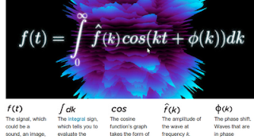

# Noise Cancelling

Very nice. Wired talks about the formula used in noise cancelling
headphones; this is the kind of thing I'd like to see more in
Wired. Programs do stuff, but mathematical statements are about
relationships. They dont do, they say what is.

