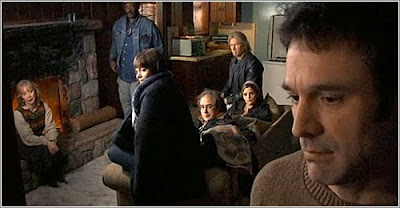

# The Man From Earth

Here is proof that we don't need spaceships, lasers, and giant robots
for good scifi. The Man From Earth is built on one scifi assumption,
that a caveman becomes immortal and is still living among us
today. This basic framework is naturally ripe for the scriptwriters to
explore and they do explore it skillfully. The movie is about the
caveman's story being told through his eyes and we roll through
hundreds years of history, culture, religion which is a fascinating
and very personalized journey. Surprisingly, all of the storytelling
takes place in one room. TMFE also successfully creates a campfire
mood which is fitting -- given that the central character is a
caveman.[SPOILER] But that is not all. We find out caveman became many
things over the years, he studied with the Buddha, and then he became
Jesus! My favorite part of the movie is when he butts heads with Rome:
"[he came] into the Roman Empire. He didn't like what they became--A
giant killing machine. He went to the near east thinking, "[w]hy not
pass the Buddha's teachings on [..] So he tried. One dissident against
Rome? Rome won".The movie is apparently on code, since Western worlds
cultural tug-of-war is between Rome and Jesus, militarism and piece.

