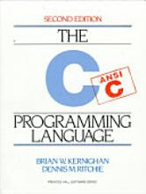

# Dennis Ritchie

Developer of the programming language C and contributer to the famous
OS Unix system Dennis Ritchie has passed away. I talked my history
with the language a little bit here, and the book I was given in that
story was Ritchie's book!BTW, Unix, C and their derivaties are inside
many mobile devices, including iPhone, iPad and Android. It's funny
actually, there are some big words written on Steve Jobs these days,
such as he changed the way we live. But an equal appreciation (if not
more) needs to go to the unseen genius' whose inventions power the
devices that people hold in their hands. Unix may not be shiny, but it
is the thing that runs in the background when users click on those
buttons, and slide those icons.

Wired

