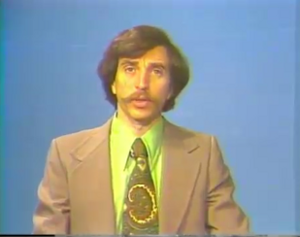

# Seriously

I think the colors on this man's outfit permanently blinded me.. My God.. I took 
the snapshot while I was watching the lecture video for  MIT OCW Signal 
Processing class, taped back in 70s. I had to watch it to find out more something,  but I am not able to focus, the colors on the teacher literally 
lull your mind. 

Joking aside this is Alan V. Oppenheim, who wrote the book on signal processing.. But.. what is up with that tie ? This is messed up stuff right there. I fear the kind of fashion wave that can make a man wear this, I am not kidding. Forget WWI and II man, we left some scarily ridicolous period of time behind. Wheew.

