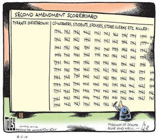

# Cartoon

It is interesting to note that the sick f--k that he was, Timothy McVeigh did not need any guns to do his dirty deed. In a 3rd wave society, there is just way too much knowledge in the populace,  a tryant has zero chance in this day and age, guns or no guns.

Note:

A first look at the perp: His base types suggest that there is huge conflict between head and heart, emotions at the level of irrationality, being "in love with love" mentality, and a tendency for being lost in turbulent emotions. He has Leave the Child Behind type as well as Hesitant Creator. Both types carry an undercurrent of self-doubt, and push the person in a way of responsibility and a direction of taking risks. LtB would bring some executive ability as well; but I think this kid was just too far gone, sadly the executive ability came into play for truly "executing" his victims right before he took his own life. It's too bad really. Breivik was an ideologue. This kid was simply emotionally unbalanced, with a need to accomplish and create.

