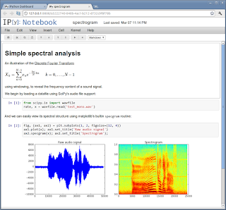

# What's In A Notebook?

Another huge development: a new technology, iPython Notebooks, are
making waves in research, education and publication.

Notebooks are HTML based documents which can be edited through a
browser (as well as other means) and they can combine math formulas,
rich media, as well as code. By code, we dont just mean only the
"text" of code. We mean actual, running code. Yes, the document can
run a piece of code, in-place, and show its output right there on the
document itself. The author simply needs to enter code in a cell, and
press the key.

Code can be any numerical, scientific computation.

Output could be a string, a table of strings, numbers or entire 2D /
3D graphs (as seen above) - static or animated. Notebook technology is
a first among its kind to allow all content to be combined in one
place, and moreover, do it based on established open source
technologies.

Code is written mainly in language called Python that is fast becoming
the de-facto language of scientific computing. This language's ability
to act as a glue to other languages such as C, Fortran, and its
ease-of-use, expressive syntax made it indispensible in numerical
computing environments, and now in education.

Notebooks require a server which can simply run on a student's
machine, or on a seperate server (even on a cloud) that is shared,
serving many requests. One for general use already exists -
nbviewer.ipython.org

Research can easily be conducted through notebooks. A notebook
in-progress can be shared with a colleague who can view it, copy  it,
modify it, rerun it. Through the new tech, data / numerical
exploration / prototyping, research and final publication are all in
one place, the document is the unit of collaboration.

Education can greatly benefit from this technology. As documents get smarter, transmitting ideas through documents become simpler, hence we take one more step toward teacherless classrooms and 3W education which means good-bye to factory style schools. 

News: Sloan Foundation awarded a $1.15M grant to the iPython
project. The proposal for the grant is here.

