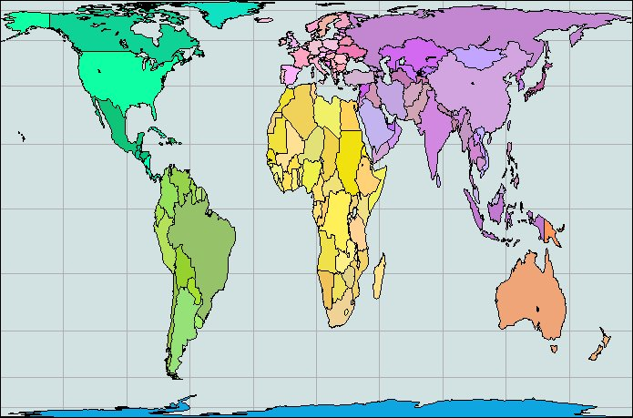

# The Peters Map

The Third Wave, A. Toffle, 1980 

Some map makers, meanwhile, are rebelling against the conventional
world map seen in every Second Wave classroom. Since the industrial
revolution the most commonly used map of the world has been based
on Mercator's projection. While this type of map is convenient for
ocean navigation, it wildly distorts the scale of land surfaces. A quick
look at your handy atlas will—if it uses a Mercator map— show
Scandinavia as larger than India, even though the latter is actually
almost three times larger.

Hot controversy rages among map makers over a new projection
developed by Arno Peters, a German historian, to show land surfaces
in proper proportion to one another. Peters charges that the distortions
of the Mercator map have fostered the arrogance of the industrial
nations and made it difficult for us to see the non-industrialized world in proper political, as well as cartographic, perspective.

"Developing countries have been cheated with regard to their surface
and their importance," Peters contends. His map, strange to the
European or American eye, shows a shrunken Europe, a flattened and
squashed Alaska, Canada, and Soviet Union, and a much elongated
South America, Africa, Arabia, and India. 

[The Peters Map is below]

