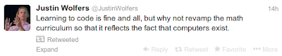

# #computation

I 2nd that motion. The difference is subtle but important. Just talk to Gilbert Strang from MIT, he will tell you what's up.

We need both obviously, plain vanilla coding and computational math. Kids are graduating from high school today without having created a simple friggin histogram using a simple one-liner hist(x) where x is one dimensional data. It's a damn shame.

