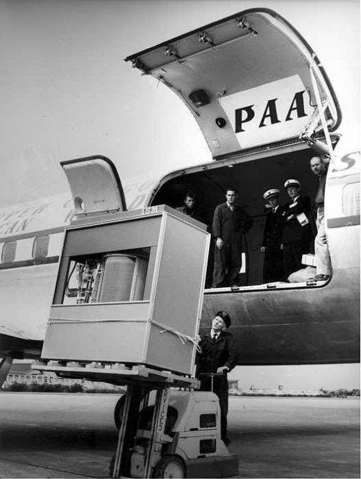

# 5 Megabyte Hard Drive

A 5 megabyte IBM hard disk is loaded into an airplane. It weighed over
1000kg, year 1956.

5 Megabytes! 

People wonder where the jobs have gone. If we bring back 5 MB hard drive that weighs a ton, maybe we could create more jobs. There are 6 people standing around right there while that thing is being loaded onto the plane. 

