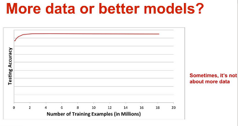

# Big Data

Link

Big data is a big business, even if everyone working in the field 
actually hates the term. Some argue it's too broad, others say it's 
purposely all-encompassing.

--

U have to know when big data is good and when it is not. In terms of modeling (summarizing it) it is good when the dimensionality of your data is high. By dimensionality I mean the "columns" in a tabular data format. If I had a table of average temparature per year and country, dimensions would be country and temparature. If I had the number of brilliant people in those countries who do not believe global warming, that would be another dimension (would that column always be zero? hmm). 

Now intuitively it makes sense when these dimensions are in the thousands, millions or billions,  having more data would show more combinations of them, and increase chances for pattern matching. Somewhat related to this, there was an argument started by Norvig of Google who said "more data beats better algorithm". There were objections. It needs to remembered though Norvig deals a lot with natural language processing, and in those problems the dimensionality is naturally high. Every word in a language in essence becomes a dimension for NLP ppl. With problems with lower dimensions, more data might not make a difference, as data scientist from Netflix aptly demonstrated (he also answers Norvig in the presentation). He showed a graph too, it's like, after 2 mil data points for this particular model, there is no improvement in accuracy.

And sometimes there are cases when the output of the processing is big; Google computes a rank for all pages on the Net, in that case the input is big because the output is big. 

