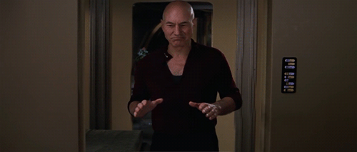

# Mambo

There were some weird-ass Star Trek TNG movies now that I think about
it. In one, Insurrection, Picard walks into the room, orders music on
the computer, and starts dancing to Mambo. I guess bcz Insurrection
was a feature film they figured the characters have to do "big
things", "relax a little". This was the times when Trek movies were
largely fan affairs, and their scripting, even directing would be kept
"in the family". Good times.
