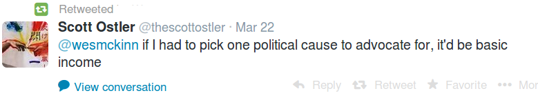

# #thumbsup

No tax cuts, no tax breaks, no minimum wage increases. Basic income is the simplest solution that can work. Aging population? Dont care. Everyone has basic income, if there is less to go around, everyone gets less. Government controlled health care, medicare? Dont care. Everyone has basic income, use that to buy health care, and drugs. Due to the 3rd Wave and white collar style of living, life is becoming increasingly complicated, we need simplicity. People can go in and out of work many times througout their life, so a steady basic income can ward off a lot of unwanted stress in society. 

We said this before,  this income can simply be "mined" using a proper digital currency (a new version of Bitcoin), so central mechanisms do not have to take part in this scheme. 

Some talk about a liberterian utopia, or socialist utopia. Actually through new tech and decentralization, the future can be both.   

