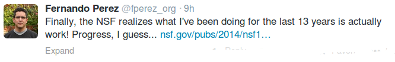

# NSF Is Getting It

Link  

Dear Colleague:

How scientific research is conducted across all science disciplines is 
changing. One important direction of change is toward more open science,
 often driven by projects in which the output is purely digital, i.e., 
software or data. Scientists and engineers who develop software and 
generate data for their research spend significant time in the initial 
development of software or data frameworks, where they focus on the 
instantiation of a new idea, the widespread use of some infrastructure, 
or the evaluation of concepts for a new standard. Despite the growing 
importance of data and software products the effort required for their 
production is neither recognized nor rewarded. At present there is a 
lack of well-developed metrics with which to assess the impact and 
quality of scientific software and data. Unlike generally accepted 
citation-based metrics for papers, software and data citations are not 
systematically collected or reported.  NSF seeks to explore new norms 
and practices in the research community for software and data citation 
and attribution, so that data producers, software and tool developers, 
and data curators are credited for their contributions.

 Note: Perez is the creator of the iPython Notebook technology. 

