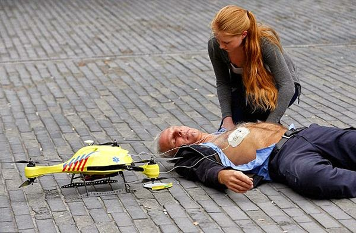

# Ambulance Drone

Link 

When we think of drones, we’ve come to expect either soulless killing
machines, toys for hobbyists, or an invasion of our privacy. We’ve
never thought of them as live-saving miracle workers, but that’s
exactly what a Dutch-based student unveiled last week.

Belgian engineering graduate Alec Momont introduced what he termed the
“ambulance drone,” a flying defibrillator that can reach heart attack
victims or other patients in need exponentially faster than its
flesh-and-blood brethren.

at

November 26, 2014

