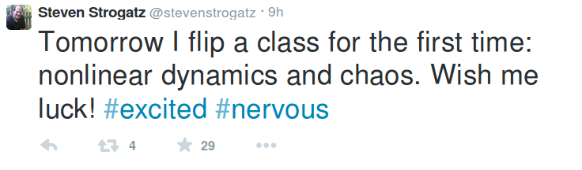

# Flipping a Class

Strogatz is one of the best teachers in the world on nonlinear
dynamics & chaos theory and he decided to "flip" his class. What is
flipping? Another class has the description,

Math 1241 will use an “inverted” (or flipped) format for class
instruction. The lecture material will be posted online in the form of
videos and text that will be watched and read at home. Given that you
will be expected to spend significant time outside of class with the
lecture material, there will be less homework assigned than in a
typical math course. Instead, much of the “homework” will be done in
class, where you will work on problems and projects in groups.  This
approach can scale too; Theoretically Strogatz isnt needed to flip his
lecture, others can flip his courses for him (his video lectures have
been on Youtube for some time). In beneficial to have Strogatz around
to answer questions obviously, but if enough knowledge-base builds
around a course, there'll be enough people / material to answer
questions. Certification: star teacher approves other teachers, who
can approve more, on it goes, and anyone in this chain can assign
fail/pass grades to anyone. Your pass grade can always carry your
distance to "the grandmaster"; "I have Strogatz-3 for nonlinear
dynamics, and Strang-2 for linear algebra" meaning the chain for this
class certification is 3 levels removed from the big honcho. With 6
hops you can reach a lot of people on the planet (which is very funny
because this happens to be the subject of another famous Strogatz
paper).

