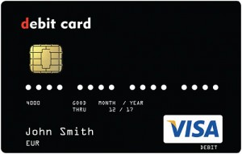

# Bitcoin Debit Card

Link

In the past year or so, a new trend has emerged in the world of Bitcoin in the form of digital currency debit cards. Several companies are trying to make a name for themselves in this market, with the likes of Xapo and ANX being two of the major names. E-coin, a UK-based company, may have a leg up on their competitors though as their Bitcoin debit card is available right now for a very small fee.

E-coin offers a Bitcoin debit card – from the Visa brand – to their users, as the small fee of US$10 per card – that includes free worldwide shipping. Delivery of the card takes 2-3 business days for European residents and 1-2 weeks for other countries [..]

All it takes is a valid email address and basic personal information to sign up, and once you requested your E-coin Bitcoin debit card, it will be sent to your home address. There is no request for any identification verification such as an ID scan or utility bill when requesting your E-coin card, making this about as anonymous as possible when it comes to Bitcoin debit cards.

Funding your E-coin Bitcoin debit card can be done through the E-coin website. A Bitcoin wallet address is generated automatically, or you simply generate a new one from your Account area. Users do have to keep in mind that – due to security reasons – it will take five network confirmations before your Bitcoin deposit is credited to your E-coin account [..]

There is a rather complex process taking place in the background when converting Bitcoin into fiat currency and loading it onto the card, but for the customer the transaction is instant.You can literally load your card while queueing at an ATM and withdraw cash straight away! [..]

Considering the fact that e-Coin’s Bitcoin debit card can be used both online [for services such as Netflix, Paypal, and Amazon to name a few] and offline at more than 30 million ATM’s and 25 million merchants worldwide, you can see why this product could prove to be invaluable in order to establish Bitcoin as a global currency [..]

--

I was wondering if banks would innovate and push out CC companies, or upstarts working with CC brands push out banks. It seems second option is more likely. Bitcoin stores my money becoming my bank, while new companies innovate in connecting this money with the outside world, interfacing with various "legacy" systems and/or new technologies. I'd like to see peer-to-peer payment, between two smart phones with a simple  touch for example. Then there would not even a need for ATMs. Well.. one thing at a time. 

