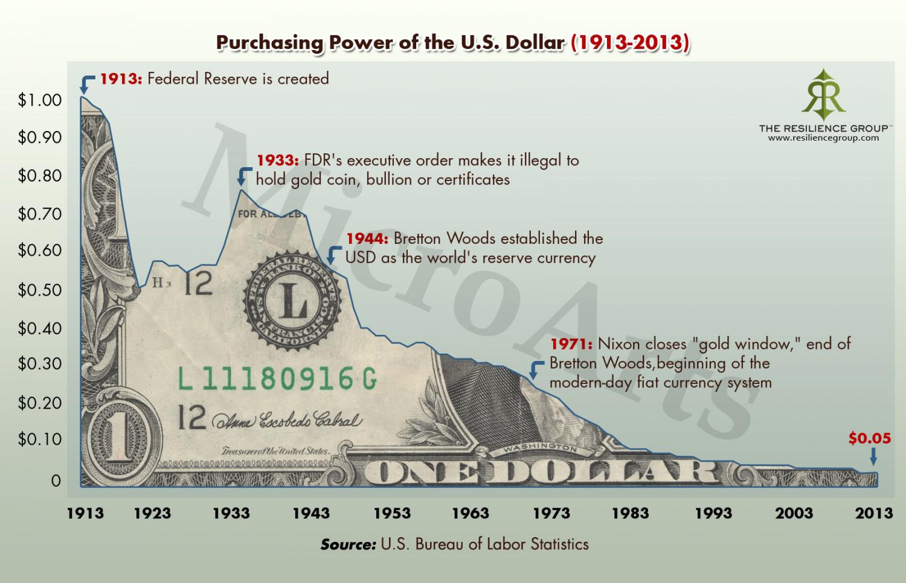

# USD

Link 

A potential [predictable event] is the coming decline in value of the United States Dollar, USD [..] Looking at the charts [..] and the USD purchasing power history since the Federal Reserve was created, several movements can be seen. In the short term, the USD has been in a strong uptrend, but over the last several years since the financial crisis, the USD has had a wide range of fluctuations. However, looking back to the early 1900s, the USD has been gradually losing its purchasing power.

The recent uptrend in the USD has occurred because of a divergence in monetary policy between the US central bank and the other central banks around the world. The US was the first to the Quantitative Easing (QE) party and has been the first out. In the mean time, Japan and Europe have only begun to really crank up the speed of their money-printing presses.

The Fed has stopped QE infinity, at least for the time being. That is, the Fed has stopped actively printing money to buy government-backed debt, GBS, as well as mortgage-backed debt, MBS; but the Fed is still reinvesting the interest that it receives from the 4+ trillion dollar hoard of MBS and GBS on its balance sheet. Because of the timing, the USD is currently not expanding as rapidly as the other world currencies and has thus increased in value tremendously over the past several months. This divergence in monetary policy has made the USD appear to be the "best house in a bad neighborhood." [..]

The catalyst for weakness in the USD that is looming on the horizon later in 2015 and possibly into 2016 is outside of the US completely [..It's the rise of Yuan ..].

The big commodity that moves opposite to the USD (also known as the Petrodollar) is oil. If the dollar goes down, oil is going to go up. There are a multitude of ways to invest in oil, as it has declined 60% from the middle of 2014 to the beginning of 2015. I have written on the decline in oil and its coming rebound [..]

