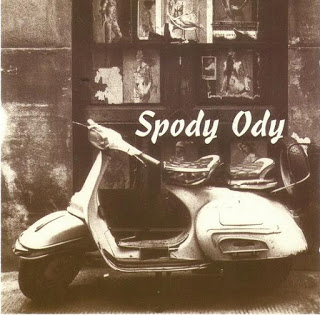

# Where The Bottles Break

Once upon a time I played in a band. We recorded an album, under the
name Spody Ody. The studio recording time was a gift to Charles, our
lead guitarist, and we all chipped in some more to record this amateur
album. Year 1998, place Boston. Drums were played by your truly.

My favorite song is Where the Bottles Break - the piece was adapted
from John Gorka with the same name. Now that I listen to the song
again, it feels a little, just a little commie... u know.. but not
overtly so... I think it's more about this guy losing a place he
liked, and being overrun by outside forces he cannot control. It's
more against modernity than free-markets in many ways.  And against a
certain mega-rich person :)

[MP3](https://www.dropbox.com/s/pzw1z0u61atkzjk/04.mp3?dl=1)

Another, Prison of Love, do not remember where it comes from, and why
we recorded it... Watch out for the fast double bass sounding two-kick
sound, that's no double-bass actually... that's a "double tap" on a
single leg on a single drum. Yiieaah.. When I was on a roll I could
hit that shit.. I even know a guy who could do three. Like, awesome.

[MP3](https://www.dropbox.com/s/nebfxonjgn0u692/05.mp3?dl=1)

