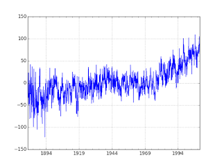
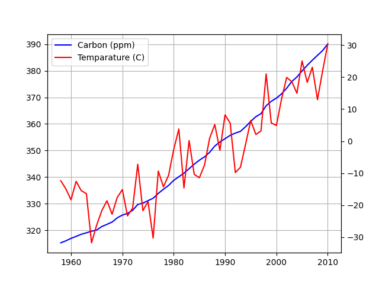

# Temparature Increase

Is the temparature real? There are many methods here; Within the
context of pure time series methods, the best chance of climate change
deniers had was arguing that temperature time series data could be
random walk. Example for RW is stock price movement where values "can
go up or down, in an unpredictable fashion". So deniers try to chalk
up the temperature increase in the past 70 years to this kind of
movement. They cannot even argue variations of random walk BTW, it has
to be pure random walk, if there is a drift, or a trend there
(indicating up movement) they are screwed.

It turns out they are statistical tests for that. We used dataset from
GISS, temperature anomalies between 1880-2010 are captured here
(anomalies are relative to the 1951-80 base period means). We used ADF
test, the implementation we used is able to test for combination of
hypothesis' -- pure RW, no pure RW no drift no trend, etc. Well, the
test shows GISS data is not pure random walk, it is random walk with a
trend (trend stationarity).

At this point deniers can try to shift gears and argue for
mean-reversion (opposite of random walk), "what goes up must come down
and vice versa" surely there is a certain amount of mean-reversion in
this data. Traders love mean-reversion by the way, and if you could
trade on temperature data wouldn't you? Hell yeah! Buy low in the
winter, sell high in the summer. But the deniers can never prove
full-mean reversion on this data, and since the ADF test blew through
all threshold values all indicators are screaming out a trend.

There are other methods as well, such as cointegration, that took care
of the attribution part of the equation. That final analysis was the
one that truly sealed the deal. It is game-over for the deniers.

Temparature anomaly data from GISS, anomalies are relative to the
1951-80 base period means.

```python
import pandas as pd
dfclim = pd.read_csv('climate-giss.csv',index_col=0,parse_dates=True)
```

```python
dfclim.Temp.plot()
plt.hold(False)
plt.savefig('climate_01.png')
plt.hold(False)
```



## ACF / PACF

```python
import statsmodels.api as sm
plt.hold(True)
sm.graphics.tsa.plot_acf(dfclim.Temp.values.squeeze(), lags=50)
plt.savefig('climate_02.png')
plt.hold(False)
```


```python
import statsmodels.api as sm
plt.hold(True)
sm.graphics.tsa.plot_pacf(dfclim.Temp, lags=50)
plt.savefig('climate_03.png')
plt.hold(False)
```


## Dickey Fuller Tests


```python
%load_ext rpy2.ipython
%R library(urca)
```

```python
series = dfclim.Temp
%R -i series
%R  adf <- ur.df(series, type = 'trend',selectlags="AIC")
%R -o adfout adfout <- summary(adf)
print adfout
```

```text

############################################### 
# Augmented Dickey-Fuller Test Unit Root Test # 
############################################### 

Test regression trend 


Call:
lm(formula = z.diff ~ z.lag.1 + 1 + tt + z.diff.lag)

Residuals:
    Min      1Q  Median      3Q     Max 
-80.967  -9.868   0.214  10.370  85.279 

Coefficients:
              Estimate Std. Error t value Pr(>|t|)    
(Intercept) -10.578706   1.163642  -9.091   <2e-16 ***
z.lag.1      -0.277517   0.020894 -13.282   <2e-16 ***
tt            0.014425   0.001428  10.105   <2e-16 ***
z.diff.lag   -0.224780   0.024657  -9.116   <2e-16 ***
---

Residual standard error: 16.81 on 1562 degrees of freedom
Multiple R-squared:  0.2205,	Adjusted R-squared:  0.219 
F-statistic: 147.3 on 3 and 1562 DF,  p-value: < 2.2e-16


Value of test-statistic is: -13.2819 58.8243 88.2169 

Critical values for test statistics: 
      1pct  5pct 10pct
tau3 -3.96 -3.41 -3.12
phi2  6.09  4.68  4.03
phi3  8.27  6.25  5.34

```


```python
import statsmodels.api as sm
arima_mod1 = sm.tsa.ARIMA(dfclim.Temp, (1,1,2)).fit()
print arima_mod1.aic
```

```text
13238.7766703
```

```python
arima_mod2 = sm.tsa.ARIMA(df.Temp, (2,0,1)).fit()
print arima_mod2.aic
```

```text
13277.4918251
```

```python
import statsmodels.api as sm
dfclim = pd.read_csv('climate.csv',sep='\s*',header=None,names=['Temp'])
df = dfclim.copy()
df.index = pd.Index(sm.tsa.datetools.dates_from_range('1880m1', '2010m8'))
df.to_csv('climate2.csv')
print dfclim.head(4)
```

```text
   Temp
0   -42
1   -17
2   -21
3   -33
```

```python
from numpy import log, polyfit, sqrt, std, subtract

def hurst(ts):
    lags = range(2, 100)
    tau = [sqrt(std(subtract(ts[lag:], ts[:-lag]))) for lag in lags]
    poly = polyfit(log(lags), log(tau), 1)
    return poly[0]*2.0

print hurst(dfclim.Temp)
```

```text
0.040611546891
```


<a name='carbon'/>

## Carbon and Temparature

Plotted carbon levels in the atmosphere and global temparature, trying
to gauge a relation between the two. Carbon data comes from
[here](https://climate.nasa.gov/vital-signs/carbon-dioxide/).

```python
import urllib.request as urllib2, io
import pandas as pd

url = "ftp://aftp.cmdl.noaa.gov/products/trends/co2/co2_mm_mlo.txt"
r = urllib2.urlopen(url).read()
file = io.BytesIO(r)
df = pd.read_csv(file,comment='#',header=None,sep='\s*')
g1 = df.groupby(0)[3].mean()
```

```python
dfc = pd.read_csv('climate-giss.csv',index_col=0,parse_dates=True)
dfc['year'] = dfc.apply(lambda x: x.name.year,axis=1)
dfc['mon'] = dfc.apply(lambda x: x.name.month,axis=1)
dfc['TempC'] = ((dfc.Temp-32)*5.0)/9.0
g2 = dfc.groupby('year')['TempC'].mean()
```

```python
g = pd.concat([g1, g2], axis=1).dropna()
g.columns = ['Carbon','Temparature']

ax1 = g['Carbon'].plot(color='blue', grid=True, label='Carbon (ppm)')
ax2 = g['Temparature'].plot(color='red', grid=True, label='Temparature (C)',secondary_y=True)
h1, l1 = ax1.get_legend_handles_labels()
h2, l2 = ax2.get_legend_handles_labels()
plt.legend(h1+h2, l1+l2, loc=2)
plt.savefig('carbontemp.png')
```



Strong correlation, but does that mean causation?

Running a Granger causality test, which tries to reject the hypothesis
that second time series (carbon) does *not* cause the first series
(temparature).

```python
import statsmodels.tsa.stattools as t
res = t.grangercausalitytests(g[['Temparature','Carbon']],maxlag=3)
print (res)
```

```text

Granger Causality
number of lags (no zero) 1
ssr based F test:         F=34.1256 , p=0.0000  , df_denom=49, df_num=1
ssr based chi2 test:   chi2=36.2149 , p=0.0000  , df=1
likelihood ratio test: chi2=27.4837 , p=0.0000  , df=1
parameter F test:         F=34.1256 , p=0.0000  , df_denom=49, df_num=1

Granger Causality
number of lags (no zero) 2
ssr based F test:         F=11.4685 , p=0.0001  , df_denom=46, df_num=2
ssr based chi2 test:   chi2=25.4301 , p=0.0000  , df=2
likelihood ratio test: chi2=20.6321 , p=0.0000  , df=2
parameter F test:         F=11.4685 , p=0.0001  , df_denom=46, df_num=2

Granger Causality
number of lags (no zero) 3
ssr based F test:         F=5.3519  , p=0.0032  , df_denom=43, df_num=3
ssr based chi2 test:   chi2=18.6695 , p=0.0003  , df=3
likelihood ratio test: chi2=15.8641 , p=0.0012  , df=3
parameter F test:         F=5.3519  , p=0.0032  , df_denom=43, df_num=3
{1: ({'ssr_ftest': (34.12560659900744, 4.0997667759058264e-07, 49.0, 1), 'ssr_chi2test': (36.214929452007894, 1.7671160136200755e-09, 1), 'lrtest': (27.483689910062537, 1.584249217215468e-07, 1), 'params_ftest': (34.12560659900759, 4.099766775905632e-07, 49.0, 1.0)}, [<statsmodels.regression.linear_model.RegressionResultsWrapper object at 0x7f54b4946518>, <statsmodels.regression.linear_model.RegressionResultsWrapper object at 0x7f54b4946630>, array([[0., 1., 0.]])]), 2: ({'ssr_ftest': (11.468479812558117, 9.099787320501968e-05, 46.0, 2), 'ssr_chi2test': (25.43010741045496, 3.005538798970397e-06, 2), 'lrtest': (20.632104155556192, 3.309752413988568e-05, 2), 'params_ftest': (11.468479812556222, 9.099787320513459e-05, 46.0, 2.0)}, [<statsmodels.regression.linear_model.RegressionResultsWrapper object at 0x7f54b4946898>, <statsmodels.regression.linear_model.RegressionResultsWrapper object at 0x7f54b49469b0>, array([[0., 0., 1., 0., 0.],
       [0., 0., 0., 1., 0.]])]), 3: ({'ssr_ftest': (5.351917020399335, 0.003196324450636187, 43.0, 3), 'ssr_chi2test': (18.669477978137216, 0.0003199702464963456, 3), 'lrtest': (15.864090764221487, 0.0012091064117637019, 3), 'params_ftest': (5.351917020398325, 0.0031963244506395256, 43.0, 3.0)}, [<statsmodels.regression.linear_model.RegressionResultsWrapper object at 0x7f54b4946c50>, <statsmodels.regression.linear_model.RegressionResultsWrapper object at 0x7f54b4946d68>, array([[0., 0., 0., 1., 0., 0., 0.],
       [0., 0., 0., 0., 1., 0., 0.],
       [0., 0., 0., 0., 0., 1., 0.]])])}
```

The hypothesis is rejected at a very strong level. Carbon content in
atmo *did* cause a global increase in temparature.
