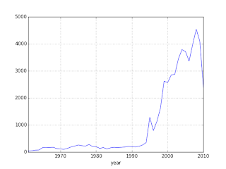

# UFOs

Do I believe in UFOs? Data does not allow for easy refutation of a UFO
hypothesis

I found a good dataset on UFO reportings, here is some code for a plot.

[Data](https://drive.google.com/uc?export=view&id=16bC7IoJIE0VDqt2rt9wUW6e4MgLz1Q7w)

```
import pandas as pd, zipfile

with zipfile.ZipFile('ufo.csv.zip', 'r') as z:
   d = pd.read_csv(z.open('ufo.csv'),sep=',',parse_dates=['DateOccurred'])
d = d.sort_index(by=['DateOccurred'])
d = d[pd.isnull(d['DateOccurred']) == False]
dates = d.DateOccurred.astype(str)
dates = dates[dates!='nan']
d['year'] = dates.apply(lambda x: datetime.strptime(x, '%Y-%m-%d').year)
g = d.groupby('year').size()
g[g.index>1960].plot()
```

The plot is for yearly count of UFO reports,



The dataset has UFO reports that go back to 1400s, with long
descriptions of what people said when they reported the event. One
sighting was recorded by a Confederate soldier during the Civil
War. He thought it was a Union balloon but the thing he reported was
moving too fast for a balloon. He must have thought "those damn
Yankies and their tech!". I read all that with a general skepticism;
One hypothesis I had was "UFO sightings increase with scifi becoming
more accessible through media, people project their scifi fantasies
onto the real world". Then the graph should've shown huge increase
after the 60s/70s, it did not. There is a huge increase, but it is
after 1992. What happened that year? Bill Clinton is elected as
President. I don't know. Did the aliens started finding Earth more
interesting because of Bill Clinton?  Weird. There is a drop at 2008 -
well, Barack Obama is elected as President. Aliens lose interest after
this time? Joking aside, I urge readers the test their own
hypothesis'. Some more: Let's say UFO delusion effects a certain
percent of the population, then with more people we'd have more
sightings. Then why is there a fall after 2008? Or why isn't there an
exponential rise (in parallel to population growth which is
exponential) much earlier than 1992? Or, if UFO sightings are actually
sightings of Air Force weirdo toys mistaken for UFOs, then why is
there a fall during Reagan years?  The Gipper would've loved to fund
that kind of tech.

<a name='nuforc'/>

NUFORC Dataset

This dataset contains over 80,000 reports of UFO sightings over the
last century. Original data from [1]. The scrubbed version is below,
along with sample code to plot it,

[Data](https://drive.google.com/uc?export=view&id=1Jho5cLnKqdwfooY9j_GuEj2tf3oO-LPT)

[Code](ufo.py)

[Output](ufo-out.html)

Code filters out sightings before 2010, then downsamples to reduce the
plotted points. 

<a name='analysis1'/>

US Per State Analysis, Ratio Comparison

In this analysis, per state sightings ratio was compared to ratio of
that state's population. More people report more sightings, but do
some states report *more* sightings disproportionate to their
population, perhaps indicating something mysterious..? Proportion
ratio z-test was used to determine significance, result is below. We
eliminate states that do not fit, then find the middle point of
sighting locations in that state. Also plotted are known US nuclear
missile bases (red circles).

[Output](ufo-sig-out.html)

References

[1] https://www.kaggle.com/NUFORC/ufo-sightings