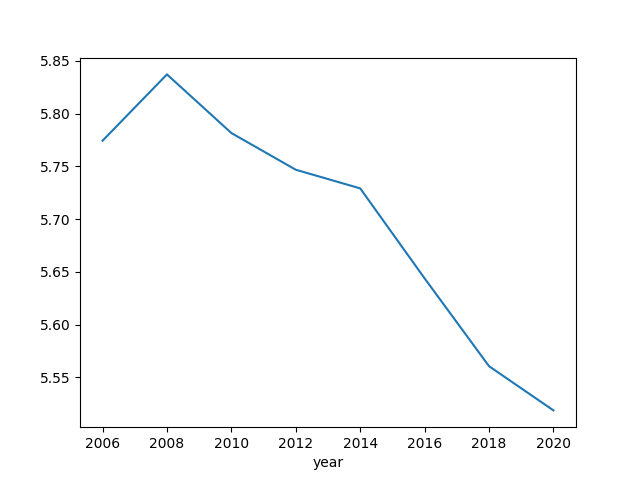
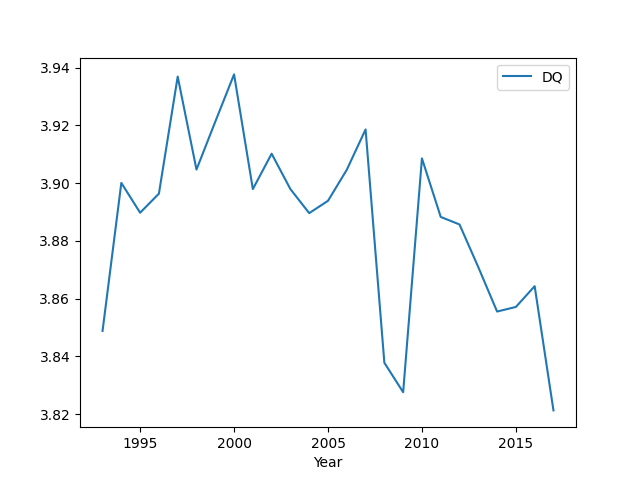

# Democracy Status 

### Polity

Here is democracy status from the Polity dataset. Their `DEMOC` and
`AUTOC` columns contain the level of insititutional leanings of a
country, `POLITY` column is one subtracted from the other, it ranges
btw -10 and +10, the latter being full democracy.

```python
import pandas as pd
df = pd.read_excel('../../tweets/2020/p4v2018.xls')
df = df[df.year > 1950]
df.loc[df.polity < -10, 'polity'] = np.nan
df['polity'] = df['polity'].interpolate(method='linear')
polity = df.groupby('year')['polity'].mean()
polity.plot()
plt.savefig('polity-all.png')
```


### BTI

[Data](https://www.bti-project.org/en/meta/downloads.html) comes from
the BTI Transformation Index that evaluates aspects of governance for
selected countries, recently updated for 2020.

```python
import pandas as pd
df = pd.read_stata('../../tweets/2020/BTI 2006-2020.dta')
df = df.set_index('year')
df1 = df[df.country == 'Russia'].dem_stat
df2 = df[df.country == 'Turkey'].dem_stat
df3 = df[df.country == 'Iran'].dem_stat
df4 = df[df.country == 'China'].dem_stat
df5 = df[df.country == 'Ukraine'].dem_stat
df3 = pd.concat([df1,df2,df3,df4,df5],axis=1)
df3.columns = ['RU','TR','IR','CH','UKR']
df3.plot()
plt.savefig('bti-compare.png')
```


<a name='btiall'/>

```python
import pandas as pd
df = pd.read_stata('../../tweets/2020/BTI 2006-2020.dta')
g = df.groupby('year').dem_stat.mean()
g.plot()
plt.savefig('bti-all.png')
```




### Democracy Barometer

[Data](https://democracybarometer.org/data-and-documentation/)

```python
import zipfile
with zipfile.ZipFile('db.zip', 'r') as z:
   df = pd.read_csv(z.open('DB_data_2020_all_data_Standardised.csv'),sep=';') 
   df = df[['Year','DQ']].groupby('Year').mean()   
   print (df.tail(5))
   df.plot()
   
plt.savefig('db-all.png')
```

```text
            DQ
Year          
2013  3.870913
2014  3.855549
2015  3.857140
2016  3.864331
2017  3.821315
```




<a name='coups'/>

### Coups

Based on Cline Center Coup D’état Project [Dataset](https://databank.illinois.edu/datasets/IDB-5672473)

```python
import pandas as pd
df = pd.read_csv('Coup_Data_v2.0.0.csv')
df = df[df['event_type'] == 'coup']
g = df.groupby('year').size()
print (g.tail(5))
```

```text
year
2013    1
2014    3
2015    2
2017    1
2019    3
dtype: int64
```

```python
g.plot()
plt.savefig('coups.png')
```


