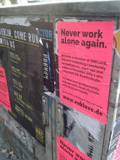

# Enklave

Saw this yesterday. 3W  economy does not require people go to work - the work comes to us. New age collaboration doesn't have to be in perfect sync 
either, it can happen over intermittent lines, and tools, through people
 who are whereever.

Co-working spaces are popping up all over the place, there is one on
the street I live on. Amazon has Pop-up Lofts in NY, London, Berlin,
where anyone can work, and get cloud service support from their tech
people if necessary.

