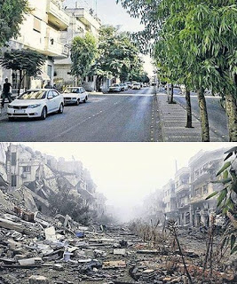

# Homs

This is an image of a street in the Syrian city Homs before and after the war:

Wikipedia: "Homs is one of many cities in Syria where large anti-government demonstrations have been held, part of the wider Syrian civil war. It has been referred to as the "Capital of the revolution." Thousands to tens of thousands gathered in the city's main square on 17–18 April 2011 in a sit-in protesting the government of current president Bashar al-Assad. At least 62 people were killed by government security forces in armed clashes against local anti-government militants".

Then one thing led to another, and the second picture above is the final result.. The question is, is this a normal response befitting an anti-government demonstration? Actually the reason of the disproportionate blowback is clear: a minority sect was in power in Syria who were scared of losing  that power. Two-party-with-quotes approach would have had two parties comprised of  70% Sunnis, 20% Alewites, 10% Christians, so when one of them regularly gets the fuck out (a great thing) noone is scared. Minorities are courted, everyone has a say one way or the other. A small sect in power, be it a minority as in Syria, or religious fanatics as in Iran, or nationalist / jingoists as in Russia is unacceptable. 
