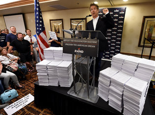

# The Tax Code

While we are on the subject of simplification [link]:

At nearly 4 million words, the U.S. tax law is so thick and
complicated that businesses and individuals spend more than 6 billion
hours a year complying with filing requirements, according to a report
Wednesday by an independent government watchdog. That's the equivalent
of 3 million people working full-time, year-round.  Someone printed
the entire tax code once (I believe it is R. Paul in that picture),

Look at the size of that thing. This is insanity, right? 

