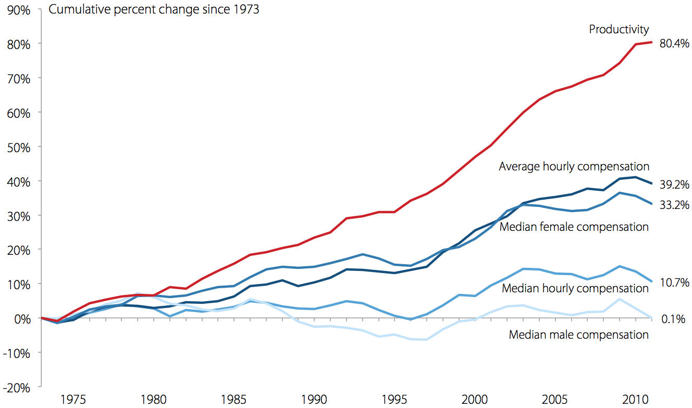
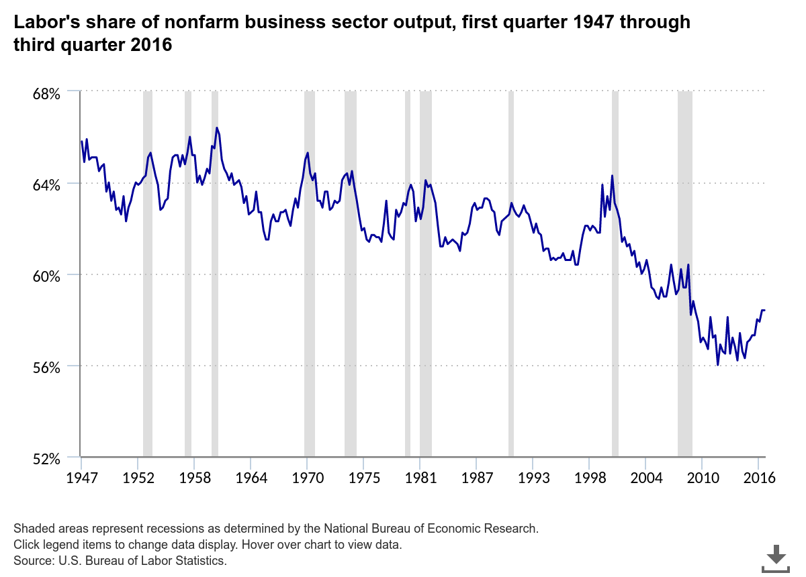

# 1973

I have an odd relationship with this year - so I collected some
big events that happened then. This list will grow.

---

The OPEC oil embargo on the United States.

Committee on the Environment is created in the European Parliament.

The Nixon administration began negotiations on what came to be known
as "the petrodollar recycling system". Under the arrangement Saudis
would only sell their oil in US dollars, and invest the excess of
their oil earnings in US banks, capital markets. The IMF would then
use this money to facilitate loans to oil importers who could be
having difficulty in covering the increase in oil prices. The
arrangement kept the price of dollar high which allowed US to print
money and buy anything it wants. It is claimed making sure most oil is
sold in dollars is at the root of most American wars after the 70s.

The Standard Model of Physics was finalized which unified the three
fundamental forces in one framework. Particle physics is said to have
reached its peak (no significant development took place since). The
model is still criticized however as having too many constants to
describe the nature, as being not fundamental.

Syria and Egypt launched the Yom Kippur War against Israel, and
lost. Also, this war was not as much off a slam-dunk as the previous
Six Day War had been during 1967, and probably would not have been won
if US had not supplied Israel heavily. Egypt also become an American
client-state right afterwards, dumping the Soviets.

Britain entered the European common market: Funny story here is GCHQ
hacked the communications and intercepted messages between other
European countries to get a leg-up in the negotiations. 

Roe vs Wade Supreme Court decision on abortion.

Joe Biden joins the Senate

On April, the Chicago Board Options Exchange (CBOE) was formed to
trade options on common stocks. This marked the first time an option
was traded on an exchange.

World Trade Center in New York becomes the tallest building in the
world.

The U.S. helped the overthrow of the elected government of Allende of
Chile and put in place a military dictatorship under General Pinochet,
on September 11. This is basically 9/11 for Chileans.

The Sears Tower in Chicago is finished, becoming the new world's
tallest building in the world, beating WTC's record, in the same year.

Nixon was inaugurated for his second term in office.

Just two days after Nixon's inauguration, his predecessor, former
President Lyndon Johnson, suffered a heart attack and died.

Vietnam War ended, Paris Piece Accords signed.

Watergate hearings begin.

Nixon abandoned price controls at the start of the year.

Student-led rebellion, demonstrations against the military junta in
Greece.

Newly created Bangladesh elects first Prime Minister.

Sydney Opera House is opened.

Bruce Lee dies. 

The Bosporus Bridge is completed joining Europe and Asia in Istanbul,
at the 50th anniversary of the republic's foundation, a few weeks
after a new government was elected (the gov, comprised of largely
leftists, partly Islamists, did not last long, and its only important
decision would be to invade Cyprus next year, which in turn, helped
trigger the fall of the junta in Greece, kinda like British invasion
of the Falklands triggering the fall of the junta in Argentina).

Wage increase started to slow, a situation that lasted until today.
The link between productivity increases and wage increase broke, and
continued to diverge ever since.

Labor's share of income starts decreasing the same year
(from [link](https://www.bls.gov/opub/ted/2017/labor-share-of-output-has-declined-since-1947.htm))

Black and Sholes published their seminal paper on pricing options.

Leonid Brezhnev visits Bonn - first time a Soviet leader ever set foot
in West German territory.

According to the Polity dataset and looking at yearly averaged
democracy scores, democracy was fell to its lowest point in the 20th
century. Since the 20th century is over, this year holds the record
for lack of democracy around the world within that century.

Denis Ritchie published his research paper on the famous computer
language called C. "The development of the C programming language was
a huge step forward and was the right middle ground - C struck exactly
the right balance, to let you write at a high level and be much more
productive, but when you needed to, you could control exactly what
happened" says Bill Dally, chief scientist of NVIDIA and Bell
Professor of Engineering at Stanford. "[It] set the tone for the way
that programming was done for several decades."

Clifford Cocks, working in secrecy at the United Kingdom’s Government
Communications Headquarters (GCHQ) discovered a public-key based
cryptosystem, three years before Ronald Rivest, Adi Shamir, and
Leonard Adleman publicized the same approach called RSA.

Thompson, Ritchie, and others at AT&T Bell Labs began developing a
small operating system on a little-used PDP-7. The operating system
was soon christened Unix, a pun on an earlier operating system project
called MULTICS. In 1972-1973 the system was rewritten in the
programming language C, an unusual step that was visionary: due to
this decision, Unix was the first widely-used operating system that
could switch from and outlive its original hardware [..] The name Unix
(originally Unics) is itself a pun on Multics. The U in Unix is
rumored to stand for uniplexed as opposed to the multiplexed of
Multics, further underscoring the designers' rejections of Multics'
complexity in favor of a more straightforward and workable approach
for smaller computers.

With the Smithsonian Agreement, most of the world's currencies
switched to a floating exchange rate joining United States who had
switched two years previously.

The government agency ARPA funds the outfitting of a packet radio
research van at SRI to develop standards for a Packet Radio Network
(PRNET). As the unmarked van drives through the San Francisco Bay
Area, stuffed full of hackers and sometimes uniformed generals, this
tech was to become the basis of wireless, packet-switched digital
networks, including the kind your mobile phone uses today.

Mr. Metcalfe and his colleagues at Xerox PARC adopted and tweaked the
[wireless communication] ALOHAnet technology in creating Ethernet.

Professor Lighthill was asked by the UK Parliament to evaluate the
state of AI research in the United Kingdom. His report, now called the
Lighthill report, criticized the utter failure of AI to achieve its
"grandiose objectives.". This is the beginning of the so-called AI
Winter where funding for the field were substantially reduced.

The Criticize Lin (Biao), Criticize Confucius campaign was started by
Mao Zedong which lasted until the end of the Cultural Revolution.

The War Powers Act is passed which attempts to define when and how the
US president could send troops to battle by adding strict time frames
for reporting to Congress after sending troops to war, in addition to
other measures.

After the oil embargo Nejat Veziroglu, a Turkish born scientist,
formed the Clean Energy Research Institute (CERI) at the University of
Miami to investigate alternate energy sources. Veziroglu however
already had done extensive research on hydrogen as a fuel use (on
planetary missions) and knew it to be a viable
resource. Organization's findings confirmed this, so Veziroglu
organized the first major conference next year on hydrogen energy, and
started popularizing its use. Words such as "hydrogen economy" were
first coined by Dr. Veziroglu.

Skylab, the United States' first space station, is launched.

The Sikorsky S-69, an American experimental co-axial compound
helicopter flew for the first time on July 26, 1973.

Genetic engineering based on recombination was pioneered by American
biochemists Stanley N. Cohen and Herbert W. Boyer, who were among the
first to cut DNA into fragments, rejoin different fragments, and
insert the new genes into E. coli bacteria, which then reproduced.

Economist Milton Friedman convinced Richard Nixon to end the military
conscription.

Spanish PM is assassinated in Madrid by the Basque separatist group
ETA. The assassination is considered to be the biggest attack against
the state since the end of the Spanish Civil War in 1939.

Pierre Trudeau (Justin Trudeau's father) was the Prime Minister in
Canada, Willy Brandt (guy who fell on his knees apologizing for DE
actions in WWII later) was Germany's Chancellor, Indira Gandhi was PM
in India (first and to date the only female Indian PM).

Cheap gas and an endless real estate boom were hallmarks of the thirty
years of postwar American dominance and prosperity; both ended in
1973–1974. There were shortages of gasoline, electricity, and even
onions, and rumors of insufficient stockpiles of everything from
mustard to vegetable oil to cat food. In November of 1973, *The
Tonight Show* host Johnny Carson made a joke about a toilet paper
shortage, prompting a run on toilet paper as Americans rushed to buy
every roll they could find.

The famous image of [Lenna](https://en.wikipedia.org/wiki/Lenna) or
Lena became a standard test image widely used in the field of image
processing. It is a picture of the Swedish model Lena from previous
year's Playboy magazine.

George Foreman beats Frazer (who had beaten Ali beforehand) in a
surprise win and becomes champion. Ali would beat Foreman the next
year and also beat Frazer later on.

Mariner 10 a space probe launched by NASA on 3 November 1973 flied by
the planets Mercury and Venus the next year. It was the first
spacecraft to perform flybys of multiple planets.

The first spacecraft to ever reach Jupiter, NASA’s Pioneer 10 which
launched on March 3, 1972 reached Jupiter on December 3, 1973.

The use of supercomputers to solve aerodynamic problems began to pay
off around this time. One early success was the experimental NASA
aircraft called HiMAT (Highly Maneuverable Aircraft Technology),
started in 1973, designed to test concepts of high maneuverability for
the next generation of fighter planes. Wind tunnel tests of a
preliminary design for HiMAT showed that it would have unacceptable
drag at speeds near the speed of sound; if built that way the plane
would be unable to provide any useful data. The cost of redesigning it
in further wind tunnel tests would have been around $150,000 and would
have unacceptably delayed the project. Instead, the pwing was
redesigned by a computer at a cost of 6,000 dollars.

Akaike Information Criteron discovered.

Lattice gas models were first introduced by Hardy, Pomeau, and de
Pazzis. Their paper became the basis of Lattice-Boltzmann methods.

A chef named Peng Chang-kuei created the General Tso's Chicken, he was
a banquet chef for Chinese Nationalists and he fled to Taiwan with
them after their 1949 defeat by Mao Zedong’s Communists. It was there
that he came up with the general idea for the dish, and he brought it
to the States when he immigrated to New York in 1973.

Movies Released in 1973

The first movie based on *Star Trek* TV show was released, not in US,
but in Turkey - *Tourist Omer Travels in Space* is the first movie
based on ST universe.

Other movies: James Bond Live and Let Die, Soylent Green, The
Exorcist, American Graffiti, The Sting. Oh and [Magnum
Force](https://encrypted-tbn0.gstatic.com/images?q=tbn:ANd9GcQtzIrzo-G82xJuy4dGijVDFwWoJMxmMhxKKuzuDwxUTqoDwJBQ).

Movies Taking Place in 1973

*Kong: Skull Island* starring Samuel Jackson takes place right after
the piece concluding the Vietnam War, and some of the soldiers
dealing with that go to an island where they encounter a giant
orangutan.

In *X-Men: Days of Future Past* the character Wolverine goes back in
time to 1973 to fix some problems that would unravel in the future. He
wakes up in US next to a lava lamp.

Famous books: The Princess Bride, Rendezvous with Rama.

