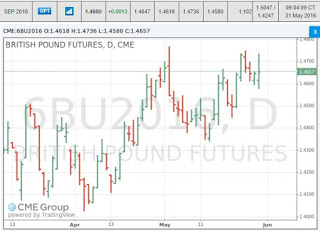

# British Pound Futures

The word is Brexit would cause the value of pound to fall, so I looked
at the September futures contract for British pound. You can take
delivery for bunch of pounds (62500 of them in one contract) just like
you can take delivery for bushel of wheat, corn, or  ... lean hog (not
kidding) through futures. Anyway, GBP contract is paid in dollars, so
the price of the contract can be construed as the market's view on the
exchange rate therefore Brexit? The trend is up.

