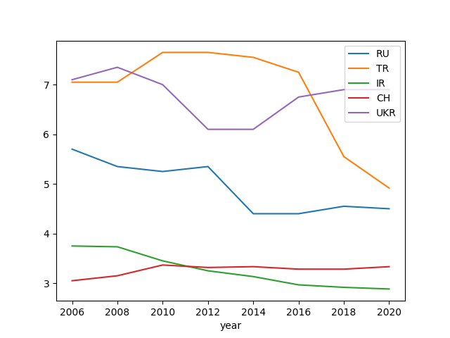
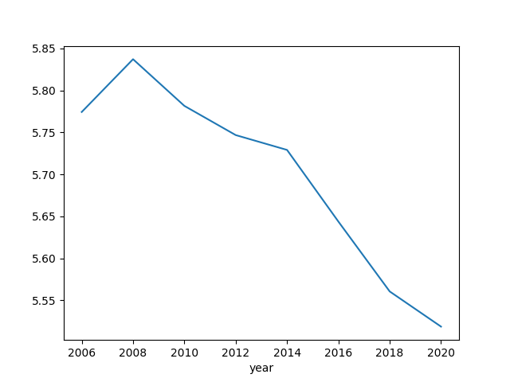
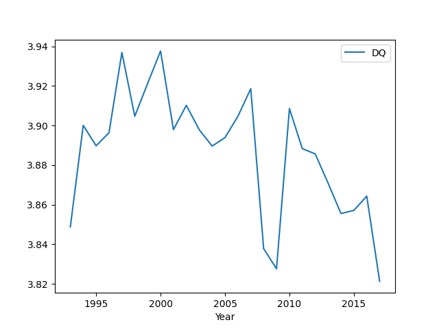

# Why Are Democracies Better?

B. de Mesquita's research indicates democratic nations are richer, and
they are richer because of democracy. The relationship is not mere
correlation - it is causation. But we need to define democracy
carefully.

A country's well-being depends on the size of its "winning coalition",
let's give it the variable W, the larger the better (in democratic
countries W is the entire population).

Winning coalition W is # of people whose support a leader needs to
rule, this is the group of people he needs to keep happy to stay in
power, selectorate S is the # of people from among which members of W
are recruited.

With small W, leader only needs to keep a small group happy paying
them off is easier, with large W, bribe becomes harder so leader must
emphasize public services, striving to be elected on the basis of
policy. S in a democracy is the entire electorate, for autocracies a
much smaller group would do i.e. the military, or some sort of
"guard", or a single party out of which even a smaller W would select
the leader.

In The Logic of Political Survival BBM makes the case that it is
better to use W as a measure of better governance. According to this
research increases in W effect GDP growth positively. Here is the
causation part - BdM calculates increase in W based as difference
between W of two years ago and calculates its relation between the
current year's growth. The relation exists.

BdM also controls for what it is traditionally known as democracy. In
a separate regression he takes out effects of W,S from inside this
traditional "democracy" variable, so what remains (the residuals) are
taken to be all other parts (benefits?) of democracy that is not
related to W or S. This residual has no effect on the regression,
meaning traditional concept of democracy is irrelevant.

Another hypothesis is that there is a dependence between kleptocracy
and W, S; and yes the book finds government theft is maximal when W is
small and S is large, signifying a rigged electoral system where the
electorate is large but their votes do not count, an inner circle
decides everything. With bigger W, kleptocracy decreases.

Once the general richness of society is accounted for, there is a
negative correlation between construction (an area ripe for government
theft) and the winning coalition size, W, meaning better governance
means less construction that involve theft. Rich societies naturally
build more, or they build in proportion to their income, and if they
are governed well no more than necessary. The "more" of this extra
construction can involve shady dealings and that part is caught by the
regression.

[Code](../../2015/04/parochial-interests.md)

<a name='elections'/>

Elections

US elections (most likely elections in other democratic countries as
well) are decided as a go / no-go decision on the incumbent
party. While judging the incumbent only three variables are used: GDP
growth, party incumbency (second term or not), and incumbent
executive's net approval rating. The prediction works very well on
almost all US election data.

It is interesting the analysis works well with such rough / few
numbers such as growth and general popularity. But in a way this makes
sense; Voting for a single person is a blunt instrument really, hence,
the basis people use to judge it is also pretty general. If a party
stays in power for too long, people want to throw them out, if there
is no growth, the incumbent is not popular, the climb for the
candidate from that party becomes steeper and steeper. The method is
very smart in some sense because the only reliable data the electorate
has can only be based on existing accomplishments (through these
general variables), that's why the vote is based incumbent, i.e. the
person on whom people have the best available data.

<a name='policy'/>

People do not judge candidates by looking at the totality of their
policy positions (hmm I assign a number from 1 to 10 to each position,
then average them all, compare both candidates,that is the likelihood
of my vote). People are much better deciding on people, not on
issues. This also implies that a win does not validate a politician's
all policy positions, since people mostly did not give a shit about
them. Taking the vote as a confirmation of all previously positions,
locking them in, or thinking people are some kind of magical policy
oracle is a fallacy. Everyone has a job to do - modernity is based on
the division of labor. Post-modernity could be something else, we are
not there yet.

Which election system is best? BdM has good things to say on the
French run-off system, being more demanding. From BdM's The Dictator's
Handbook:

"It is worth observing that the United States has one of the world’s
biggest winning coalitions both in absolute numbers and as a
proportion of the electorate. But it is not the biggest. Britain’s
parliamentary structure requires the prime minister to have the
support of a little over 25 percent of the electorate in two-party
elections to parliament. That is, the prime minister generally needs
at least half the members of parliament to be from her party and for
each of them to win half the vote (plus one) in each two-party
parliamentary race: half of half of the voters, or one quarter in
total. France’s runoff system is even more demanding. Election
requires that a candidate win a majority in the final, two-candidate
runoff."

On the other hand, another research, which looked at parliamentary vs
presidential systems in terms of economy, came up with a different
answer: purely parliamentary system.

[Paper](https://link.springer.com/article/10.1007/s11127-018-0552-2) by McManus et al.

I dont have the time to dig into this yet (to replicate it in Python)
-- here is [the
data](https://muratk3n.github.io/thirdwave/en/2019/12/PvsPData.csv.zip)
(from Dr. McManus).

Coalitions

In democratically backward countries that live in a comotose,
proto-fascistic state a "coalition" is created *beforehand*, in the
mind of a fascist, and any ideology that is outside of this legit mix
is immediately delegitimized. This is a mistake. The emergent,
self-organized blocks of ideologies, as clusters, carry within a good
signal, if enough though leaders coalesced around something, chances
are there is an approach that needs representing.

Logistically coalitions are fine, but you need ideologically distinct
parties.. There can be no gaps, nothing left out, otherwise fascists
will step in to fill the void. Obviously some coalitions will be able
to deliver more than others, but at least seperate parties decide how
that coalition is formed, on their own terms. Each viewpoint
contributes, and by [averaging](../../2020/07/crowd-wisdom.md)
the optimal decision is reached.

BTW "average" could also be a long-run average between two (or more)
views (cld be immed avg too). One party cld be for 30% tax rate,
another for 70%. Each enact their thing one in power, if they can,
long-running average is 50%.

<a name='war'/>

War

Democracies are better at war. They win almost all the wars they start
and about two-thirds of the wars in which they are targets of
aggression. Democracies are better able to make war
collectively. Autocracies, with the small winning coalitions [..] tend
to seek private benefits from fighting. A thirst for private goods
means that autocracies optimize at a smaller coalition size to avoid
diluting the spoils of war. Democracies, in contrast, already supply
public goods to large domestic winning coalitions [4]. In essence,
since democratic leaders need to inform the public and provide public
goods, and war is always ugly, they have a huge interest in finishing
the war as soon as possible. To that end they mobilize better, plan
more effectively and fight to finish. This makes them better
fighters. Autocrats can hide the goings-on of a war, so they would
never feel the pressure to finish, hence do not fight in a way that'll
help them do so. The war drags on.

Democratic Status 

[Data](https://www.bti-project.org/en/meta/downloads.html) comes from
the BTI Transformation Index that evaluates aspects of governance for
selected countries, recently updated for 2020.

```python
import pandas as pd
df = pd.read_stata('../../tweets/2020/BTI 2006-2020.dta')
df = df.set_index('year')
df1 = df[df.country == 'Russia'].dem_stat
df2 = df[df.country == 'Turkey'].dem_stat
df3 = df[df.country == 'Iran'].dem_stat
df4 = df[df.country == 'China'].dem_stat
df5 = df[df.country == 'Ukraine'].dem_stat
df3 = pd.concat([df1,df2,df3,df4,df5],axis=1)
df3.columns = ['RU','TR','IR','CH','UKR']
df3.plot()
plt.savefig('bti-compare.png')
```



<a name='btiall'/>

```python
import pandas as pd
df = pd.read_stata('../../tweets/2020/BTI 2006-2020.dta')
g = df.groupby('year').dem_stat.mean()
g.plot()
plt.savefig('bti-all.png')
```



Polity

Here is democracy status from the Polity dataset. Their `DEMOC` and
`AUTOC` columns contain the level of insititutional leanings of a
country, `POLITY` column is one subtracted from the other, it ranges
btw -10 and +10, the latter being full democracy.

```python
import pandas as pd
df = pd.read_excel('../../tweets/2020/p4v2018.xls')
df = df[df.year > 1950]
df.loc[df.polity < -10, 'polity'] = np.nan
df['polity'] = df['polity'].interpolate(method='linear')
polity = df.groupby('year')['polity'].mean()
polity.plot()
plt.savefig('polity-all.png')
```


Democracy Barometer

[Data](https://democracybarometer.org/data-and-documentation/)


```python
import zipfile
with zipfile.ZipFile('db.zip', 'r') as z:
   df = pd.read_csv(z.open('DB_data_2020_all_data_Standardised.csv'),sep=';') 
   df = df[['Year','DQ']].groupby('Year').mean()   
   print (df.tail(5))
   df.plot()
   
plt.savefig('db-all.png')
```

```text
            DQ
Year          
2013  3.870913
2014  3.855549
2015  3.857140
2016  3.864331
2017  3.821315
```




References

[4] The Logic of Political Survival, B. de Mesquita

