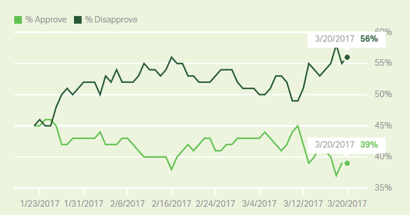

# Approval Rating: Gallup

Not good mon. T needs to make friends fast - with these abysmal numbers whole lota House and Senate Reps can haul ass and desert him.

To make friends, u offer concessions, to anyone, to your side,  to the other side. Climate issues need to be embraced wholeheartedly (Ivanka is already a supporter, no?), this is something Fuckbart needs to and can live with. If Fuckbart protests, go to their readers and poll them. Ask them to prioritize issues, and see what comes up at the top. I guarantee climate change denial will not be one of them.

Reps do not care about the wall, or bans either. They are causing a major distraction, and making the White House look inept.

"Following through on promises" is being mumbled a lot - this has something to do with T's psych profile; The Vagabond is said to lack an inner stability, they act as if living out of a suitcase, being uncommitted and lacking follow-through. But there are various levels of follow-through here - usually the problem is a person going to the mechanic for engine trouble and forgetting to pick up the fucking car. I don't think that kind of follow-through is  what 70 year old person with certain degree of business and family success really needs to work on. But people always have a degree of self-doubt on their areas of development, so Bannon is hitting that shit, on purpose, to make Trump wobbly - that's his way in. Follow-through? T didn't know much about healthcare, immigration, or other nuances of governmet. How the bloddy hell are you gonna follow-through on things you knew nothing about?

