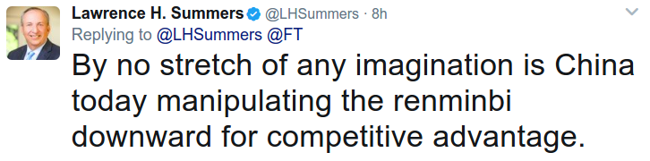

# #currency

Yes - in fact afaik on 2015 Congress voted to give China more rights at the IMF as quid-pro-quo on their acting nice on the currency manipulation front. It'd be hasty to act on some offense that doesn't even exist. U don't want to get into a "fucka me? fucka you" kind of situation prematurely.

