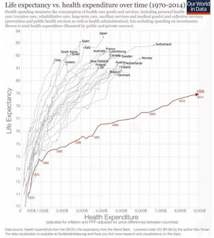

# One Is Not Like the Others

The only country without universal health care in that picture is US.

Recent news: WH thinking of withholding payment to insurance companies? This makes me think: gov paying to insurance companies? Man.. for a country who prides itself for aligning itself with the free market, US sure gets itself into some stupid shit. Case in point: Scott Walker’s $3 billion fraud. If gov will pay business to do all that, why don't they just pay people to dig holes and fill them up? (That's a Keynes quote BTW, I can do all that, drop that reference, Waahaa!). Similar thing happened before 2008 crisis. We want people to own houses. Fine. But gov then gets into weird relationships with the debt markets (through F. Mae, F. Mac), creating obscene incentives, contributing to a financial blow-up.

There are few things going on here in general: US gov keeps wanting to provide services through companies, both burdens and empowers them unnecessarily at the same time. Why such power / responsibility for corporations? Maybe the reason is that US corporation's past is mired in slave-owning. The relationship between employer and employee is that of a owner and slave. Not too long ago slave owning was a serious part of business in US at least in the South. So this repugnant culture could have seeped into people's psyche. Maybe government kind of likes to control people through this modern-day slave ownership.

Second problem is US Democrats are shameful bunch of piss-pot, bitchy little push-overs, helpless imbeciles who have all but lost the ability to spend an iota of brain power to combat inequality. The left in other parts of the West are much stronger, it is thanks to them these countries had universal healthcare. In US when  basic income legislation was introduced, it was by a Republican (Nixon). When Democrats prepare legislation, as in Obamacare it becomes an exercise of legislative fiddling around the edges, trying to find different ways to work through corporations which increases their burden and their power. The Democratic Party should be the one thinking of alternative (actually well-known, but anyway) solutions. If they can't do that, why do they even exist? Don't push forward another suave shiny brother with a big smile, promising change.. Change yourself.

