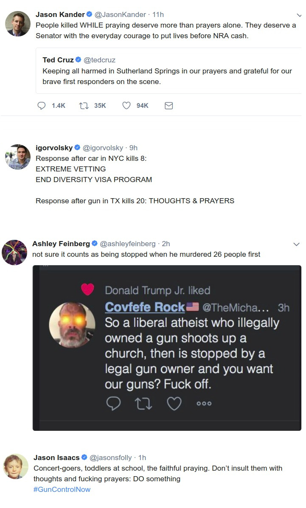

# #allMyExesAreDyingInTexas

It dawned on me the other day maybe the constitutional, or even
cultural angle is the wrong way to look at this problem. All these
people are dying simply because of one thing: the profit motive. Gun
manufacturers want to make money, so some people need to die. It is as
simple as that.  Again, just like in healthcare insurance, capitalism
is being unleashed in an area for which it is not suitable. Reagan
Revolution went too far? Hell, even Reagan himself was for gun control
- so who are these losers walking the halls of power today claiming to
follow him and busily "praying" after every massacre? 

