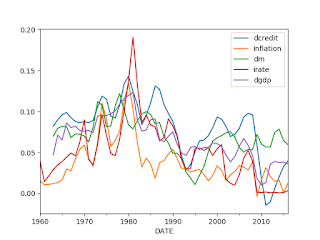

# Governments, Money, Economy

Comment

In order for an economy to grow, we need savings.

Wrong

Credit from banks to businesses do not depend on savings. Private
banks create the credit out of thin air.

(In comparison government spending does not cause money creation,
unless during "unorthodox" times like after 2008 with QE, or
occasionally in small amts during normal times by the FED to nudge
short term rates).

Additionally: "savings are not needed for growth" does not mean "let's
screw the savers". Ultra-low interest rates not only created a bubble
in the financial markets but also punished
[thrift](https://www.ft.com/content/de61140c-b68b-11e8-a1d8-15c2dd1280ff).

[Richard Werner](https://eprints.soton.ac.uk/418719/1/20_03_2018_Does_Forei.pdf)

[From *The New Paradigm in Macroeconomics*] Without fully reflecting
the implications of credit creation, macroeconomic theories were
doomed to misunderstand also other concepts, such as the role of
savings and the determinants of growth. Most of modern economics
assumes – and policy-makers cite regularly – the idea that there is a
given amount of savings that poses a physical limit for the total
amount of money that can be raised by firms and hence invested. In
reality, savings are not limited at any moment in time. They are not a
constraint on loans or investment. Occasionally economists worry about
a ‘savings shortage’ or ‘capital shortage’, which they feel is holding
back growth. There is no such thing. Savings do not impose a limit on
economic growth. If more money is required for investment, banks can
simply create it.


There

Comment

Countries need foreign direct investment to grow.

Wrong

[Paper](https://eprints.soton.ac.uk/418719/1/20_03_2018_Does_Forei.pdf)

Question

What are GDP activities, what are non-GDP activities

See Werner

New Paradigm in Macroeconomics. Non-GDP activities are construction,
real-estate, mortgage bonds, financial speculation (margin loans),
pure consumption. Credit should not flow to these activities. Credit
to businesses (preferably small) producing services, products that
others want to buy are cool.

[Bank of England](https://www.bankofengland.co.uk/-/media/boe/files/quarterly-bulletin/2014/money-creation-in-the-modern-economy.pdf)

The vast majority of money held by the public takes the form of bank
deposits. But where the stock of bank deposits comes from is often
misunderstood. One common misconception is that banks act simply as
intermediaries, lending out the deposits that savers place with
them. In this view deposits are typically ‘created’ by the saving
decisions of households, and banks then ‘lend out’ those existing
deposits to borrowers [..] Indeed, viewing banks simply as
intermediaries ignores the fact that, in reality in the modern
economy, commercial banks are the creators of deposit money. This
article explains how, rather than banks lending out deposits that are
placed with them, the act of lending creates deposits — the reverse of
the sequence typically described in textbooks

Yes

Banks do not need deposits to lend money. They **create** money out of
nothing and just lend it.

There are some limits of course (not in the amount they can create
-that has other limits, in a bigger sense-, which gives them great
power), for example they cannot create money for themselves, and
simply write it as profit. They must make money from the interest they
lend out. It is little weird but this is how finance system ended up
to be, at least in the Western context, that is somewhere between
government and  commercial spheres, distributed among many
actors. Some dark corners of politics is trying to crush those
distributed smaller actors by ultra-low interest rates, but that is a
topic for another day.

Question

So they are not trying to grow the economy through low rates but crush
smaller actors?

Yes

Low rates wouldn't cause growth anyway. This is another lie.

[Question](http://www.resilience.org/stories/2014-10-28/why-do-banks-want-our-deposits-hint-it-s-not-to-make-loans/)

All of [that] leaves us to wonder: If banks do not lend their
depositors’ money, why are they always scrambling to get it? Banks
advertise to attract depositors, and they pay interest on the
funds. What good are our deposits to the bank?

Deposits are cheap

(From the same link) Ever since the Federal Reserve Act was passed in
1913, banks have been required to clear their outgoing checks through
the Fed or another clearinghouse. Banks keep reserves in reserve
accounts at the Fed for this purpose, and they usually hold the
minimum required reserve. When the loan of Bank A becomes a check that
goes into Bank B, the Federal Reserve debits Bank A’s reserve account
and credits Bank B’s. If Bank A’s account goes in the red at the end
of the day, the Fed automatically treats this as an overdraft and
lends the bank the money. Bank A then must clear the overdraft.

Attracting customer deposits, called “retail deposits,” is a cheap way
to do it. But if the bank lacks retail deposits, it can borrow in the
money markets, typically the Fed funds market where banks sell their
“excess reserves” to other banks. These purchased deposits are called
“wholesale deposits.”

Note that excess reserves will always be available somewhere, since
the reserves that just left Bank A will have gone into some other
bank. The exception is when customers withdraw cash, but that happens
only rarely as compared to all the electronic money flying back and
forth every day in the banking system.

Borrowing from the Fed funds market is pretty inexpensive – a mere
0.25% interest yearly for overnight loans. But it’s still more
expensive than borrowing from the bank’s own depositors.

[Question](http://positivemoney.org/how-money-works/advanced/how-do-banks-become-insolvent/)

If banks can create money, then how do they become insolvent? After
all surely they can just create more money to cover their losses? Or,
since they simply create money out of nothing, than those loans are
"non-performing (not paid back)", why does it matter? They were
created out of nothing and they became nothing.

It is still a loss

Even though the main capital may not matter, they would be losing the
interest they'd be making. They could simply make new loans, but that
could take a long time to come back as profit (the principal, when it
is paid back, is destroyed by the way, aint that weird?). If there is
a systemic crisis where most loans are non-performing, then the bank
could be missing out on a lot of the profit it could be making, and
its liabilities (of which deposits are one) can exceed its assets, it
can go under - become insolvent.

That kind of insolvency can easily occur if banks are allowed to loan
into a bubble, ppl keep coming to the bank, bank keeps creating money,
useless money grows bubble, then pops. Regulation such as
Glass-Steagal Act could slow such trends, but were done away by
corporate Democrats.

The problem with insolvency is that if it is widespread banks will be
hesitant to loan to real businesses which produce value. Credit crunch
occurs, growth falters.

Question

Are my deposits in any kind of danger at a bank?

Depends on the amount

All deposits below certain value (in the 10s of thousands, but not in
the millions) are insured by the government.

Question

How does the FED effect the credit market

Indirectly

If banks do not have enough deposits to meet reserve requirements,
banks lend to each other everyday, the average of that rate is the
famous Fed Funds rate. FED itself can lend to banks, or sell / buy
treasuries to effect a rate it targets, but it cannot go against the
market in obscene ways. That's why in Werner's analysis rate is seen
to follow growth, not lead it.

Economy is lead through its credit creation. Now, commercial banks can
be in an illegal collusion with eachother to nudge it in a certain
direction, or be guided through the central bank in insidious ways, or
government can effect banks somehow (as in Japan resulting in its
infamous recession that never ends), but economy is always guided
through its credit.

Question

Then can we say banks create deposits?

Yes and No

When banks create money for credit they would put that money in
deposit account at their branch. But that money could go into another
deposit account in another bank, and it could also leave the country
to finance some plant there, etc. 

But yes, since all money is credit, deposits, which are money, are also credit, hence created by banks.

Richard Werner

(From *New Paradigm in Macroeconomics*) The representation of banks as
mere intermediaries [..] depict it as a process of successive lending
of already existing purchasing power  [..] Bank A receives a new
deposit of USD 100. If the reserve requirement is 1%, textbooks say
that the bank will lend out USD 99, and deposit USD 1 with the central
bank as reserve. The USD 99 will, however, be deposited with another
bank, Bank B, which will also be able to lend out 99% of that amount
(USD 98.01), and keep 1% as reserve. This process continues until in
the end a total of USD 9900 has been lent out [..]

While even this description does conclude that the overall banking
system creates money, credit creation seems to be the result of a
diffuse process, in which money ‘circulates’ in the economy (in line
with the concept of ‘velocity’ in the quantity equation). Most of all,
we are told that each bank can only lend 99% of the money deposited
with it. This renders banks similar to fund managers who lend out
savings deposited with them and thus they are considered mere
financial intermediaries. Thus Bernanke’s understanding of credit
creation as the (successive?) ‘channelling of savings’ to investors is
not far-fetched and most economists do consider banks merely an
alternative channel to capital market or other intermediation.

[A] more accurate presentation of credit creation [..] depicts the
balance sheet of a bank that receives a new deposit of USD 1, recorded
as a new liability of the bank. Instead of lending out USD 99, as the
textbooks tell us, the bank will use the USD 100 as reserve with the
central bank (entered as asset on its balance sheet). The USD 100 can
now become the 1% on the basis of which the bank can lend out 99 times
as much. Thus this very first bank can grant a new loan amounting to
USD 9900. The moment the loan is granted, the bank simultaneously
increases its assets by USD 9900 (the amount of the loan, which is an
asset for the bank) and its deposits by USD 9900 – the per- son or
company who receives the loan of USD 9900 will actually obtain a book
entry of USD 9900 in his or her deposit account – money that can now be
spent on transactions. The money the bank has created, USD 9900, is 99%
of the increase in the bank balance sheet (USD 100 new deposit plus
USD 9900 in loans/deposits).  Thus the reserve requirement is met.

Right

Comment

If it wasn't for the stimulus after 2008 crisis the economy would have
been worse

If that's true, why was it discontinued?

There was no new round on the stimulus during late 2009, when
unemployment was still high, and economy was still sluggish. Why?

Because it didn't work.

Question

But government spending can energize an economy

Wrong

Government spending crowds out private spending thereby reduces
investment and growth.

If you simply give money for existing production, that can be
inflationary. It will not induce more production, hiring.

On government spending the left needs to use the angle of social help,
not growth. Policing is a social service, does not (directly) cause
growth. But it helps an environment where ppl can live, produce,
etc. Even direct money schemes like UBI are not helpful in growth per
se. Indirectly they will help happier citizenry, which will help a
better functioning economy.

Do not argue for anti-austerity during crisis in growth terms
either. Crisis' are caused when credit is fed into speculative
finance. That needs to be kept apart from the real economy. If crisis
happens you jail bankers, take away their money, wealth, cancel
people's debt, nationalize bankers' assets, or tar and feather them,
who cares? As long as their shit does not touch the real economy it
will be fine.

Comment

The Great Depression of 30s ended when World War II started, All that
government spending helped the economy to recover. Then in a sense
WWII ended the Great Depression

Wrong

The end of the war ended the depression.

From [link](https://www.forbes.com/sites/peterferrara/2013/11/30/the-great-depression-a-ended-by-the-end-of-world-war-ii-not-the-start-of-it/#7783c26a57d3)

"A common fallacy is that the Great Depression was ended by the
explosive spending of World War II.  But World War II actually
institutionalized the sharp decline in the standard of living caused
by the Depression.  The Depression was actually ended, and prosperity
restored, by the sharp reductions in spending, taxes and regulation at
the end of World War II .[..]

Statistics showed a rise in GDP during the war.  But that just
reflects misdefined statistical analysis.  The military guns, tanks,
ships, and planes produced and counted as showing rising GDP did not
reflect improved standards of living for working people, or anyone
else.  Yes, they did win the war, and that victory was a social good
[..].  But these were not economic goods and services, and should not
be counted as such.

The sale prices of goods and services sold in voluntary market
transactions reflects the true value of the goods and services
produced, because they reflect what consumers are willing to pay for
them, and so reflect the benefit that consumers see in them.  But the
same voluntary market transactions where consumers are spending their
own hard earned money were not involved in the government’s
acquisition of the military guns, tanks, ships and planes produced
during World War II.  The cost of all that military materiel was
simply added to GDP, as if it reflected increased production.  But
would not a better measure of the economic value of that military
materiel, and of any coerced government transaction, be to subtract
the cost of that production from GDP, rather than adding it?

Perhaps this economic reality can be seen better in other military
conflicts.  Did the American Civil War reflect a time of soaring
economic prosperity for America, when both the South and the North
were producing weapons of as much mass destruction for Americans as
was feasible at the time?  What about the cost of the Mexican-American
War in the 1840s?  Did the cost of the Vietnam War represent a net
addition to, or a net subtraction from, American GDP?  Or the cost of
the most recent wars in Iraq and Afghanistan?

I am not a pacifist who thinks defense spending has no value.  But
that value cannot be measured the same as consumer or productive goods
and services that do increase the standard of living for working
people and their families, and are purchased through voluntary market
transactions.

World War II institutionalized the falling standards of living of the
Depression through wage and price controls, and extensive rationing of
consumer goods and services.  The economic deprivation, and reduced
standards of living, continued, although people perceived it was now
for a good cause.

But increased government spending does nothing to create economic
recovery, growth and prosperity.  That is because the money to finance
that increased government spending is drained from the private sector,
either through increased taxes, or increased borrowing.  That entire
transaction involves a net drag on the economy.  Increased taxes to
finance the increased spending involve counterproductive incentives
that reduce production and growth.  Increased government borrowing
drains investment capital from productive activities in the private
sector and reallocates it to non-productive government consumption.

There can never be inadequate demand for any good or service in a free
market economy, which is the problem Keynesian witch doctors think
they are solving.  If demand for any good or service is insufficient
to buy up all the available supply, the price for the good or service
will decline, increasing demand and reducing supply, until they are
equal.

This was all further demonstrated by the end of World War II.  As
George Gilder explains [..] “After World War II, when ten million
demobilized servicemen returned to an economy that had to be converted
from a garrison state to civilian needs, economists steeled themselves
for a renewed depression.  A sweeping Republican victory in the
Congressional election of 1946, however, brought an end to the wartime
government-planning regime [..] “Every Keynesian economist confidently
predicted doom.  [..] Gilder, however, explained what actually
happened, “But a drop in government spending after a war does not
depress creativity; it unleashes it.  [..] Economic growth surged by
10 percent over two years and the civilian labor force expanded by
seven million workers….[..]"

Eisenhower

Every gun that is made, every warship launched, every rocket fired,
signifies in the final sense a theft from those who hunger and are not
fed, those who are cold and are not clothed.

Exactly

[Keynes](http://econtalk.co.uk/undefined/)

[In the depths of the great depression] the Government should have
people dig up holes and then fill them up.

Not a GDP Activity

Economic activity, as measured in GDP, captures producing something
that people want to buy.

Someone digging a hole and filling it up is not a service, a product
anyone wants.  We might as well give everyone free money, which is
fine, but we need to realize this is social help, not economic
activity.

Comment

We printed money to pay for the extra US military spending in the 2017
budget.

No we did not

US paid for that with debt. It issued bonds, a debt obligation sucking
up existing money from the system. It did not create new money. Let's
be careful while speaking on money creation. It is one of the basic
tenets of the economy. All variables like growth, inflation depend on
it.

Question

MMT says we print money until we see inflationary effects, then we
balance it with taxing

Well..

If you can balance it with taxing, why not spend, issue bank credit to
private enterprise (the only driver of growth) responsibly, and tax
appropiately from get-to? Why go into all this roundabout way of
excessive printing, then taxing?

Essentially what we definitely do not want is marrying money printing
to the budgetary Congressional sausage making process. If money
creation is tied to that shit, it will be a disaster. Look at
Zimbabwe, Argentina, Turkey.

Also, let's not take the special case of US with its reserve currency,
and create an entire system out of it. US dollar, because of the
petrodollar system, is always on demand. That's why excessive
printing, when it was done by the central bank, or through shadow
banking, etc never caused excessive inflation. The rest of the world
takes all that money and it does not return to US. But one cannot rely
on this scheme to go on forever. Surely we cannot build a "new" system
on top of that assumption.

I put "new" in quotes because MMT is not new. It is governments
printing currency - see Zimbabwe, Venezuella (yes their government is
truly a piece of crap, neocons not liking a country does not
automatically imbue them with righteousness).

MMT is also used as a psychological tool by some on the left, trying
not to ruffle too many feathers with new spending  saying "no need for
new taxes, we'll just print money". There is no need to go to this
roundabout way just to feel good about stuff. There is enough existing
money for free college, Medicare-for-all. Hell M4A will make
healthcare even cheaper than it is now!

Question

Bill Clinton balanced the budget 1998-2001, did that help the economy?

Yes

He did it for the wrong reasons, they scared him with "the bond
market", and other financial voodoo he didn't really understand, but
yes, balanced budget was the right thing to do.

Comment

We don't need to worry about government deficits we print our own
money

No we don't

FED does not monetize all Treasury debt (printing money and giving it
to gov). This line of thinking comes from MMT, they supposedly
discovered something in government payments, but what they thought
they "found" is a timing quirk, between the supposed money creation
and payment. But at the end of the day, for that year, there is
balance in the budget,  MMT folks know this. They asked Stephanie
Kelton the other day "if we print our money why issue bonds?". She
said "we don't have to, we are simply giving someone interest for
holding our debt". So gov deficit is financed with bonds -- right
now. Then MMT makes it sound like "wout bonds, you'd miss on the
interest, that's all". But it is more than that. Bond issuence pulls
money from economy so it is not inflationary. MMT money printing would
be inflationary.

What happens today: yes, FED prints money and buys / or sells gov
bonds sometimes, to nudge money base in either direction. Keyword -
sometimes. Nowadays most money creation comes from private banks. And
the current system (with proper controls) ain't that bad.  If small
banks are protected, given more incentive to lend for public use, it
would work even better.

We also know government spending crowds out private spending => we
don't want  gov spending excessively => balanced budget.

Question

But austerity during crisis hurts the economy

Apples and Oranges

For 2008 conditions you say, "cutting public spending to cover up /
save Ponzi activity is senseless". The real economy and Ponzi economy
are different, and should be kept away from each other (ideally credit
for speculative aims are cut off, the fake economy does not exists,
boom and bust never happens, at least in the size it does today as to
hurt the real economy).

I see economists (!) making the mistake of  making anti-austerity
arguments on real economics grounds -aw but someone need to spend
during crisis maan-. No. Credit flow needs to be restored during
crisis and u do whatever it takes for that (write-off debt,
nationalize, watch some bankers go bust). Gov does everything to keep
that shit away from the real economy.  That is the main variable to
fix. Don't go off in the boonies trying to justify emergency measures
on lukewarm economics grounds.

Then, in the normal economy where ppl engage in GDP producing
activities, pay tax, etc, no deficit spending. No MMT. There is enough
money to pay free-college, Medicare-for-all.

We designed government to always work with existing money, take in
through tax, finance deficits with bonds. If gov has printing ability,
it will get out of hand, fast.

Question

The well-known policy conclusion of Keynes’ analysis of the 1930s
depression was that in recessions, when private demand is weak,
government demand needed to step in and boost aggregate demand until
the economy was back at full employment. But some say this increased
government spending "crowd out" private investment, meaning gov
spending simply replaces private one and overall investment does not
change. Is this true?

Yes

From New Paradigm in Macroeconomics, "In other words, given the amount
of credit creation produced by the banking system, an autonomous
increase in government expenditure g must result in an equal reduction
in private demand. As the government issues bonds to fund increased
fiscal stimulation, private sector investors (such as life insurance
companies) that purchase the bonds must withdraw purchasing power
elsewhere from the economy. With an unchanged national income pie
(whose growth is restricted by [increase in credit going to productive
enterprise] , the total amount of new purchasing power created – the
overarching budget constraint on the economy), any increases in
government spending must shrink the private sector share of the
pie. The same applies (more visibly) to tax-financed government
spending. With unchanged credit creation, every dollar in additional
government spending reduces private sector activity by one dollar".

The derivation and empirical test is here
-[Code](/en/2018/05/werner.html),[Data](crowd.csv). The coefficient
has to be -1 for verification, ours is around -0.57, could be due to
data collection issues. Werner finds -1 for Japan.

Question

What are types of credit given for speculation? If gov wanted to stop
this where would it start? 

Here

From [link](https://www.postkeynesian.net/downloads/Werner/RW301012PPT.pdf)

Margin loans (credit for financial speculation)

Loans to non-bank financial institutions

Credit for real estate speculation:

   to construction companies

   Mortgages, buy-to-let mortgages

   real estate investment funds, other financial investors

Loans to structured investment vehicles

Loans to Hedge Funds

Loans for M&A

Loans to Private Equity Funds

Direct financial investments by banks

BTW, ultra-low interest rates, on top not being able to cause growth,
can also adversely effect (read: increase) M&A - big actors gobbling
up the small.

Also see the formula ΔP_f , how it was setup, very clean - Granger
causality is from C_f to P_f.

Question

Do tax cuts cause growth?

No

Tax cuts that blow up the deficits will cause crowd-out effects, reducing growth.

This is the natural result of the way we setup government spending - we chose to make govs to always work with existing money, either by collecting money ppl already earned (tax), or when in deficit financing it through bond issuance which also takes existing money (in promise for repayment for later date). The choice was made, apparently, for govs not to fiddle with money creation (they do it through backdoor sometimes but still), keeping that away from politicians. I can see how this came to be.

[Peter Schiff](https://youtu.be/1Fd58n4HhAM?t=382)

"We had a lot of problems that happened in 70s, under Nixon and
Ford. But those problems started in the 60s, the great society, the
war on poverty, going to the moon. It was Lyndon Johnson's 'guns and
butter', it was all the money we printed in the 60s that gave us the
inflation in the 70s".

Schlefer, *The Assumptions Economists Make*

"Johnson's policies of spending on 'guns and butter'-Great Society
social welfare programs and the Vietnam War - were seen as causing
inflation to increase (as, in fact, Keynesian economists warned). And
the 1970s saw rising inflation and inflationary fears. Monetarists,
led by Milton Friedman, argued that government efforts to manage the
economy often did more harm than good, and in particular they blamed
the Federal Reserve for printing too much money. Their claim is
debatable".

---

The disagreement between two economy experts on such a basic concept
is disconcerting.. And neither are quite right. Let's check. By
"printing money" it is usually meant expansion of monetary base, we
use M2 measure for that. We also get data for non-finance credit
expansion,

```
# Fred - 'M2SL','GDP','CRDQUSAPABIS','FPCPITOTLZGUSA','FEDFUNDS'

df['irate'] = df.irate / 100.0
df['inflation'] = df.inflation / 100.0
df = df.dropna(axis=0)
df = df.set_index('DATE')
w = 3
df['dcredit'] = pd.rolling_mean(df['nonfincred'].pct_change(),window=w)
df['dm'] = pd.rolling_mean(df['m2cd'].pct_change(),window=w)
df['dgdp'] = pd.rolling_mean(df['gdp'].pct_change(),window=w)
df[['dcredit','inflation','dm','irate','dgdp']].plot()
```



Increase in credit meaning money, more then necessary for GDP
producing activities can easily explain this inflation. Then a sharp
drop in credit creation in the beginning of 80s (Reagan years) helps
contain inflation, they slammed on the brakes again during Bush
I. There is also a period during mid-80s when M2 goes down credit goes
up, it is the latter that effects inflation. Then there is the huge
drop post 2008 of course due to subprime debt crisis.

Werner's theory is very simple. Give credit for growth, any more than
growth capacity is inflation. Do not give bank credit to speculative
activities, or for pure consumption. If we print money (what banks do
when they give credit) for speculation the result is Ponzi activity,
everyone loses.


