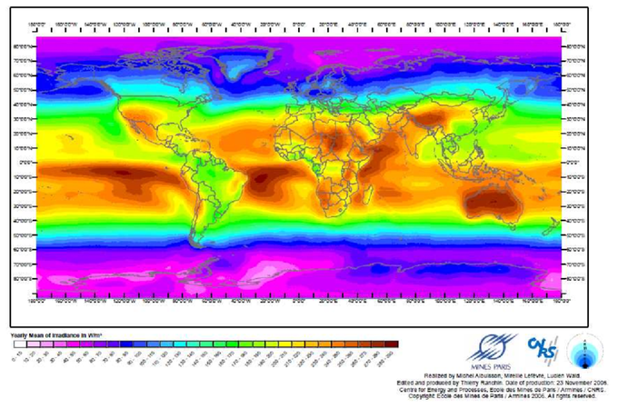
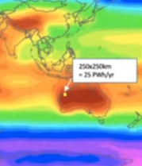

# The Sunshine Map

See a scientist [presentation](https://youtu.be/gtmWGPaDkoI?t=367),
Dr. McFarlane, who is an expert on green ammonia generation (which can be
exported, and turned into hydrogen at the point of use).

That little patch of 250 km by 250 km can generate 25 Petawatt-hours
in a year. More than enough for the entire world. From [vid](https://youtu.be/gtmWGPaDkoI?t=417).

