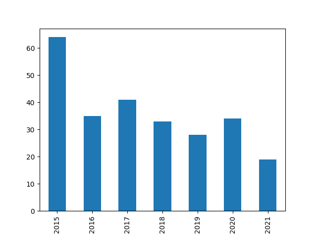
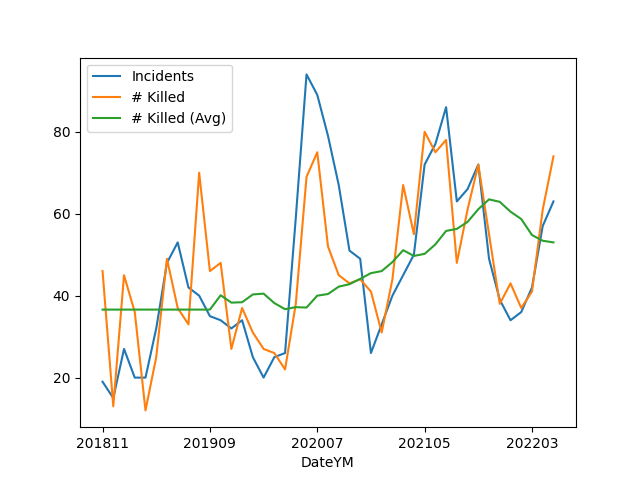

# Conflict Statistics

### UCDP/PRIO Armed Conflict Dataset

[Data](https://ucdp.uu.se/downloads/)

Deaths, Incidences, Globally

```python
import pandas as pd

def overall_deaths(mon):
   url = 'https://ucdp.uu.se/downloads/candidateged/GEDEvent_v21_0_%d.csv' % mon
   df = pd.read_csv(url)
   g = df[['country','deaths_b']].\
       groupby(['country']).\
       agg({'country':'count', 'deaths_b': 'sum'})
   g.columns = ['incidents','deaths']
   return g.sort_values('deaths',ascending=False)

print (overall_deaths(mon=9).head(20))
```

```text
                          incidents  deaths
country                                    
Afghanistan                      47     265
Yemen (North Yemen)              63     223
Nigeria                          55     119
Ethiopia                         15      67
DR Congo (Zaire)                 69      55
Myanmar (Burma)                  78      55
Mozambique                       16      34
Iraq                             31      32
Philippines                      15      32
Pakistan                         19      30
Colombia                         13      21
Syria                            54      19
Mexico                          328      18
Kenya                             5      15
Cameroon                         33      12
India                            15      12
Mali                             17       9
Central African Republic         18       8
Ukraine                          14       7
Israel                            4       7
```

Details for Specific Country

```python
import pandas as pd

def country_attacked(mon, country):
   url = 'https://ucdp.uu.se/downloads/candidateged/GEDEvent_v21_0_%d.csv' % mon
   df = pd.read_csv(url)
   df1 = df[df.country == country]
   g = df1[['country','deaths_b','side_b']].\
       groupby(['side_b','country']).\
       agg({'side_b':'count', 'deaths_b': 'sum'})
   g.columns = ['incidents','deaths']
   return g.sort_values('deaths',ascending=False)

print (country_attacked(9, 'Syria'))
```

```text
                                                incidents  deaths
side_b                                 country                   
Syrian insurgents                      Syria           21      15
SDF                                    Syria           14       3
PKK                                    Syria            1       1
Civilians                              Syria            2       0
Government of United States of America Syria            1       0
IS                                     Syria           15       0
```

<a name='gdeltme'/>

### GDELT Middle East

Iraq and Syria based conflict stats. GDELT uses natural language
processing ("AI") to extract Actor - Action - Actor triplets. The
result is not curated, there can be mistakes, but as an overall
outlook, it can be useful.

US military bases, Syria, reverse-engineered from [source](https://bit.ly/3gOBQHx),
are also added.

[Codes](http://data.gdeltproject.org/documentation/CAMEO.Manual.1.1b3.pdf)

[Data](http://data.gdeltproject.org/events)

[Script](confstat-me.py)

The output of the code is below

[Output](conflict-out.html)


<a name='gdeltukr'/>

### GDELT Ukraine

[Script](confstat-ukr.py)

[Output](conflict-ukr-out.html)

<a name='gdtroop'/>

### GDELT, Troop Deployments

Filtering on CAMEO code 154 (military deployment), attempting to
extract geoloc from the text itself, and filtering for the word
'troop' in the URL.  No regional filtering, we attempt to find
worldwide deployments, by all countries.

[Script](confstat-milmob.py)

[Output](conflict-milmob.html)

<a name='unarmed'/>

### Unarmed Non-Whites Shot By Police

Data is from WaPo [data](https://github.com/washingtonpost/data-police-shootings).

```python
import pandas as pd
f = 'https://raw.githubusercontent.com/washingtonpost/data-police-shootings/master/fatal-police-shootings-data.csv'
df = pd.read_csv(f)
df = df[(df.race != 'W') & (df.armed == 'unarmed')]
df['year'] = pd.to_datetime(df['date']).dt.year
df.groupby('year').size().plot(kind='bar')
plt.savefig('unarmed.png')
```



<a name='usgun'/>

### US Gun Violence

Data came from the [Gun Violence Archive](https://www.gunviolencearchive.org/reports),
see data for "mass shootings - all years". Plot is monthly incidents and deaths.


```python
import pandas as pd, zipfile
with zipfile.ZipFile('mass-shooting-us.zip', 'r') as z:
      df =  pd.read_csv(z.open('USmassshooting.csv'))

df['Date'] = df.apply(lambda x: pd.to_datetime(x['Incident Date']), axis=1)
df['DateYM'] = df.apply(lambda x: "%d%02d" % (x['Date'].year, x['Date'].month), axis=1)
g = df.groupby('DateYM').agg({'Incident ID':'count', '# Killed': 'sum'})
g['# Killed (Avg)'] = g['# Killed'].rolling(10).mean()
print (g[['# Killed','# Killed (Avg)']].tail(5))
g.plot()
plt.savefig('gunvio.png')
```

```text
        # Killed  # Killed (Avg)
DateYM                          
202102        44            48.2
202103        67            51.0
202104        55            49.6
202105        79            50.1
202106        58            50.7
```



