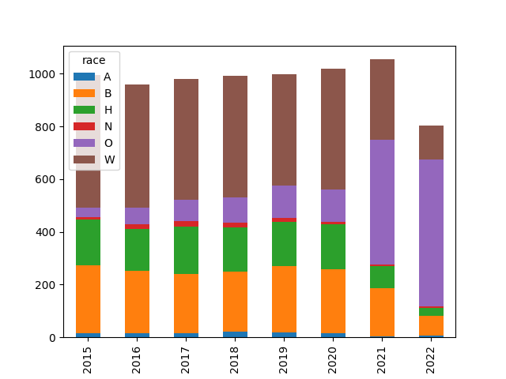

# Conflict Statistics

### UCDP/PRIO Armed Conflict Dataset

[Data](https://ucdp.uu.se/downloads/)

Deaths, Incidences, Globally

```python
import pandas as pd

def overall_deaths(mon):
   url = 'https://ucdp.uu.se/downloads/candidateged/GEDEvent_v22_0_%d.csv' % mon
   df = pd.read_csv(url)
   g = df[['country','deaths_b']].\
       groupby(['country']).\
       agg({'country':'count', 'deaths_b': 'sum'})
   g.columns = ['incidents','deaths']
   return g.sort_values('deaths',ascending=False)

print (overall_deaths(mon=6).head(20))
```

```text
                          incidents  deaths
country                                    
Nigeria                          90     180
Ukraine                         408     128
Somalia                          17     116
Iraq                             25     109
Ethiopia                         11      73
Myanmar (Burma)                 117      71
Mali                             34      67
Burkina Faso                     20      57
Afghanistan                      48      54
India                            38      43
Niger                             7      42
DR Congo (Zaire)                102      39
Pakistan                         25      32
Central African Republic         11      28
Syria                            36      24
Yemen (North Yemen)              30      24
Philippines                      12      18
Egypt                            15      16
Cameroon                         33      13
Mozambique                       34      10
```

Details for Specific Country

```python
import pandas as pd

def country_attacked(mon, country):
   url = 'https://ucdp.uu.se/downloads/candidateged/GEDEvent_v21_0_%d.csv' % mon
   df = pd.read_csv(url)
   df1 = df[df.country == country]
   g = df1[['country','deaths_b','side_b']].\
       groupby(['side_b','country']).\
       agg({'side_b':'count', 'deaths_b': 'sum'})
   g.columns = ['incidents','deaths']
   return g.sort_values('deaths',ascending=False)

print (country_attacked(6, 'Syria'))
```

```text
                              incidents  deaths
side_b               country                   
Syrian insurgents    Syria           22      27
SDF                  Syria           16       8
Civilians            Syria            8       0
Government of Israel Syria            1       0
Government of Syria  Syria            1       0
IS                   Syria           15       0
```

<a name='gdeltme'/>

### GDELT Middle East

Iraq and Syria based conflict stats. GDELT uses natural language
processing ("AI") to extract Actor - Action - Actor triplets. The
result is not curated, there can be mistakes, but as an overall
outlook, it can be useful.

US military bases, Syria, reverse-engineered from [source](https://bit.ly/3gOBQHx),
are also added.

[Codes](http://data.gdeltproject.org/documentation/CAMEO.Manual.1.1b3.pdf)

[Data](http://data.gdeltproject.org/events)

[Script](confstat-me.py)

The output of the code is below

[Output](conflict-out.html)

<a name='ukraine'/>

### Ukraine

Below is the output from VIINA project, it releases a "control file"
which lists, for every town in Ukraine, whether it is under Russian or
Ukrainian control. The report sums Russian controlled towns for each
time period.

[Code](confstats-ukr.py)

[Output](viina-control.png)

<a name='gdtroop'/>

### GDELT, Troop Deployments

Filtering on CAMEO code 154 (military deployment), attempting to
extract geoloc from the text itself, and filtering for the word
'troop' in the URL.  No regional filtering, we attempt to find
worldwide deployments, by all countries.

[Script](confstat-milmob.py)

[Output](conflict-milmob.html)

### People Shot By the Police

Data is from WaPo Github [repo](https://github.com/washingtonpost/data-police-shootings).

<a name='allshoot'/>

All Deaths by Police Shootings, by Race

```python
import pandas as pd

f = 'https://raw.githubusercontent.com/washingtonpost/data-police-shootings/master/fatal-police-shootings-data.csv'
df = pd.read_csv(f)
df['year'] = pd.to_datetime(df['date']).dt.year
df['race'] = df['race'].fillna('O')
g = df.groupby(['year','race']).size().reset_index()
g = g.set_index(['year','race']).unstack(level=1)[0]
g.plot.bar(stacked=True)
plt.savefig('allshoot.png')
```

A: Asian, B: Black, H: Hispanic, N: Native Am, O: Other, W: White



<a name='unarmed'/>

Unarmed People Shot by the Police

```python
df = pd.read_csv(f)
df['year'] = pd.to_datetime(df['date']).dt.year
df1 = df[(df.race != 'W') & (df.armed == 'unarmed')]
df1.groupby('year').size().plot()
df2 = df[(df.race == 'W') & (df.armed == 'unarmed')]
df2.groupby('year').size().plot()
plt.legend(['Non-white','White'])
plt.savefig('unarmed.png')
```


<a name='usgun'/>

### US Gun Violence

Data came from the [Gun Violence Archive](https://www.gunviolencearchive.org/reports),
see data for "mass shootings - all years". Plot is monthly incidents and deaths.


```python
import pandas as pd, zipfile
pd.set_option('display.max_columns', None)
df =  pd.read_csv('us-mass-shootings.csv')
df['Date'] = df.apply(lambda x: pd.to_datetime(x['Incident Date']), axis=1)
df['DateYM'] = df.apply(lambda x: "%d%02d" % (x['Date'].year, x['Date'].month), axis=1)
g = df.groupby('DateYM').agg({'Incident ID':'count', '# Killed': 'sum'})
g['# Killed (Avg)'] = g['# Killed'].rolling(10).mean()
g = g.interpolate(limit_direction='both')
g = g.rename(columns={"Incident ID": "Incidents"})
print (g.tail(5))
g.plot()
plt.savefig('gunvio.png')
```

```text
        Incidents  # Killed  # Killed (Avg)
DateYM                                     
202206         64        70            55.4
202207         89        66            55.8
202208         63        64            55.0
202209         64        49            54.4
202210         51        75            58.1
```


