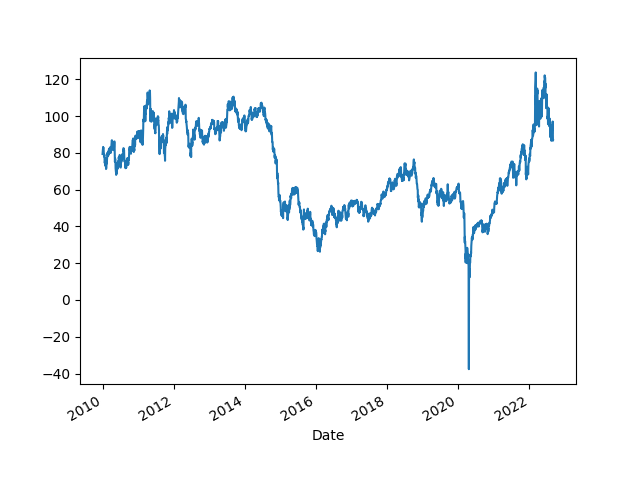
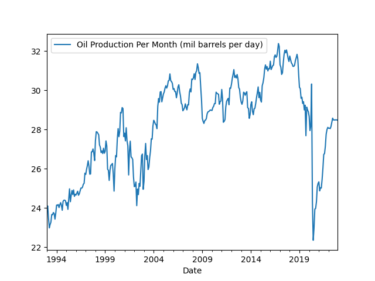
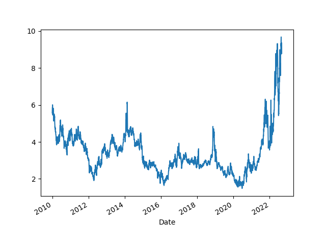
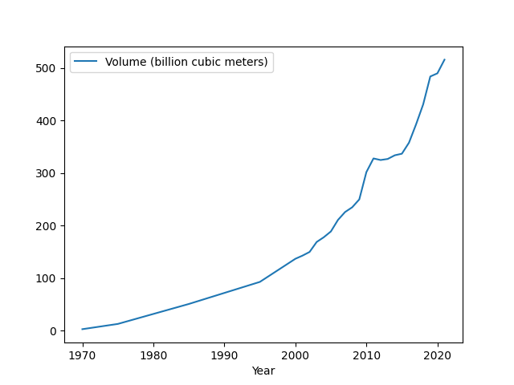

# Energy Stats

### Oil Price (Futures, Continuous Contract, Front Month)

```python
import util; df = util.get_yahoofin(2010,"CL=F")
print (df.tail(5))
df.plot()
plt.axvspan('01-03-2001', '27-10-2001', color='y', alpha=0.5, lw=0)
plt.axvspan('22-12-2007', '09-05-2009', color='y', alpha=0.5, lw=0)
plt.savefig('oil.png')
```

```text
Date
2022-07-07    102.730003
2022-07-08    104.790001
2022-07-11    104.089996
2022-07-12     95.839996
2022-07-13     95.919998
Name: Close, dtype: float64
```



<a name="opec"></a>

### Opec Oil Production

```python
import util; df = util.get_eia("STEO.COPR_OPEC.M"); df.plot()
plt.legend(['Oil Production Per Month (mil barrels per day)'])
plt.savefig('opec.png')
print (df.tail(4))
```

```text
Date
2022-04-01    28.590000
2022-05-01    28.154654
2022-06-01    28.410000
2022-07-01    28.877896
Name: 1, dtype: float64
```



<a name="natgas"></a>

### World Natural Gas Price

```python
import util; df = util.get_yahoofin(2010,"NG=F")
print (df.tail(7))
df.plot()
plt.savefig('natgas.png')
```

```text
Date
2022-07-05    5.523
2022-07-06    5.510
2022-07-07    6.297
2022-07-08    6.034
2022-07-11    6.426
2022-07-12    6.163
2022-07-13    6.604
Name: Close, dtype: float64
```



<a name='engconsumption'/>

Looking at YoY increases per source

```python
dfeng = dfall[descs]
source = 'solar'
dfeng[source+'prev'] = dfeng[source].shift(-12)
dfeng[source+'yoy'] = (dfeng[source]-dfeng[source+'prev']) / dfeng[source+'prev'] * 100.0
print (dfeng[source+'yoy'].dropna().head(5))
```

```text
Date
2021-06-01    24.957553
2021-05-01    24.686058
2021-04-01    24.301684
2021-03-01    24.618614
2021-02-01    24.098390
Name: solaryoy, dtype: float64
```

<a name='gasolineState'/>

### US Retail Gasoline Prices per State

```python
import util

states = \
[("PET.EMM_EPM0_PTE_SCA_DPG.M","CA"),
 ("PET.EMM_EPM0_PTE_STX_DPG.M","TX"),
 ("PET.EMM_EPM0_PTE_SFL_DPG.M","FL"),
 ("PET.EMM_EPM0_PTE_SNY_DPG.M","NY"),
 ("PET.EMM_EPM0_PTE_NUS_DPG.M","USA")]
retail = [ (s[1],float(util.get_eia(s[0]).tail(1))) for s in states]
dfs = pd.DataFrame(retail); dfs.columns = ['state','price']
print (dfs)
```

```text
  state  price
0    CA  6.294
1    TX  4.670
2    FL  4.809
3    NY  4.954
4   USA  5.032
```

<a name='lng'/>

### LNG Traffic per Year

In billion cubic meters 

```python
import pandas as pd
df = pd.read_csv('lng.csv',sep=';',index_col=0)
df.plot(); plt.savefig('lng.png')
```



