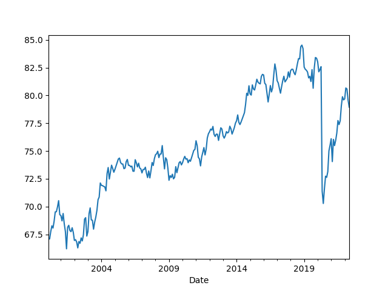

# Energy Stats

### Oil Price (Futures, Continuous Contract, Front Month)

```python
import util; df = util.get_yahoofin(2010,"CL=F")
print (df.tail(5))
df.plot()
plt.axvspan('01-03-2001', '27-10-2001', color='y', alpha=0.5, lw=0)
plt.axvspan('22-12-2007', '09-05-2009', color='y', alpha=0.5, lw=0)
plt.savefig('oil.png')
```

```text
Date
2022-07-07    102.730003
2022-07-08    104.790001
2022-07-11    104.089996
2022-07-12     95.839996
2022-07-13     95.919998
Name: Close, dtype: float64
```


<a name='worldoil'/>

### World Oil Production

Million barrels a day

```python
import util; df = util.get_eia("INTL.57-1-WORL-TBPD.M");
df = df[df.index > '2000-01-01'] / 1000.0
df.plot(); plt.savefig('worldoil.png')
print (df.tail(4))
```

```text
Date
2021-12-01    79.580084
2022-01-01    79.700653
2022-02-01    80.673679
2022-03-01    80.551964
Name: 1, dtype: float64
```



### Opec Oil Production

Million barrels a day

```python
import util; df = util.get_eia("STEO.COPR_OPEC.M"); df.plot()
plt.savefig('opec.png')
print (df.tail(4))
```

```text
Date
2022-04-01    28.590000
2022-05-01    28.154654
2022-06-01    28.410000
2022-07-01    28.877896
Name: 1, dtype: float64
```


<a name="natgas"></a>

### Natural Gas Price

```python
import util; df = util.get_yahoofin(2010,"NG=F")
print (df.tail(7))
df.plot()
plt.savefig('natgas.png')
```

```text
Date
2022-07-05    5.523
2022-07-06    5.510
2022-07-07    6.297
2022-07-08    6.034
2022-07-11    6.426
2022-07-12    6.163
2022-07-13    6.604
Name: Close, dtype: float64
```


### Energy Production by Source

<a name='sources'/>

[Data](https://www.bp.com/en/global/corporate/energy-economics/statistical-review-of-world-energy/downloads.html)

Global production, units terrawatt hours

kbd Thousand of Barrels Per Day

Ej = Exajoules = 277.778 TWh

```python
import pandas as pd
pd.set_option('display.max_columns', None)
fbp = 'bp-stats-review-2022-consolidated-dataset-panel-format.csv'
df = pd.read_csv(fbp)
df = df[df.Country == 'Total World']
df = df.set_index('Year')
df = df[df.index > 1980]
df = df[['wind_twh','solar_twh','oilprod_kbd','nuclear_twh','hydro_twh','gasprod_ej','coalprod_ej']]
df['oil_twh'] = df.oilprod_kbd * 365 * 1700 * 1000 / 1e9
df['coal_twh'] = df.coalprod_ej * 277.778 
df['gas_twh'] = df.gasprod_ej * 277.778
cols = [x for x in df.columns if '_twh' in x]
df[cols].plot()
plt.savefig('energy-sources.png')
print (df[cols].tail(3))
```

```text
         wind_twh    solar_twh  nuclear_twh    hydro_twh       oil_twh  \
Year                                                                     
2019  1420.544110   703.949763  2796.354063  4231.376747  58895.185992   
2020  1596.428212   846.229368  2693.978613  4345.990451  54910.671018   
2021  1861.939824  1032.501231  2800.267792  4273.827522  55768.604518   

          coal_twh       gas_twh  
Year                              
2019  46428.036448  39677.369853  
2020  44068.508171  38615.184559  
2021  46550.642074  40368.860045  
```


```python
df2 = df[cols].tail(1).unstack()
df2 = (df2 / df2.sum())*100.0
df2.plot(kind="pie")
plt.savefig('source-pie.png')
df2
```

```text
Out[1]: 
             Year
wind_twh     2021     1.219691
solar_twh    2021     0.676355
nuclear_twh  2021     1.834357
hydro_twh    2021     2.799634
oil_twh      2021    36.532052
coal_twh     2021    30.493689
gas_twh      2021    26.444221
dtype: float64
```


<a name='primary'/>

### Primary Energy Consumption

In terrawatt hours. Primary energy comprises commercially-traded
fuels, including modern renewables. Energy from all sources of
non-fossil power generation is accounted for on an input-equivalent
basis.

```python
import pandas as pd
df = pd.read_csv(fbp)
df = df[df.Country == 'Total World']
df = df.set_index('Year')
df = df[['primary_ej']]
df['primary_twh'] = df.primary_ej * 277.778
print (df.primary_twh.tail(4))
df.primary_twh.plot()
plt.savefig('world-energy-combined.png')
```

```text
Year
2018    161772.761640
2019    163174.086345
2020    156670.066530
2021    165319.812784
Name: primary_twh, dtype: float64
```


<a name='usgasoline'/>

### US Retail Gasoline Prices

```python
import util, pandas as pd
    
df = util.get_eia_week("PET.EMM_EPM0_PTE_NUS_DPG.W")
print (df.tail(4))
```

```text
            Value
Date             
2022-06-20  5.066
2022-06-27  4.979
2022-07-04  4.879
2022-07-11  4.754
```


<a name='gasolineState'/>

### US Retail Gasoline Prices per State

```python
import util, pandas as pd

states = \
[("PET.EMM_EPM0_PTE_SCA_DPG.M","CA"),
 ("PET.EMM_EPM0_PTE_STX_DPG.M","TX"),
 ("PET.EMM_EPM0_PTE_SFL_DPG.M","FL"),
 ("PET.EMM_EPM0_PTE_SNY_DPG.M","NY")]
retail = [ (s[1],float(util.get_eia(s[0]).tail(1))) for s in states]
dfs = pd.DataFrame(retail); dfs.columns = ['state','price']
print (dfs)
```

```text
  state  price
0    CA  6.294
1    TX  4.670
2    FL  4.809
3    NY  4.954
```

<a name='lng'/>

### LNG Traffic per Year

In billion cubic meters 

```python
import pandas as pd
df = pd.read_csv('lng.csv',sep=';',index_col=0)
df.plot(); plt.savefig('lng.png')
```


