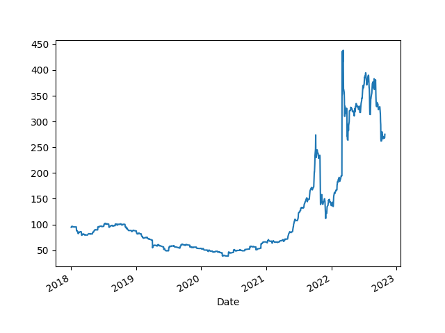
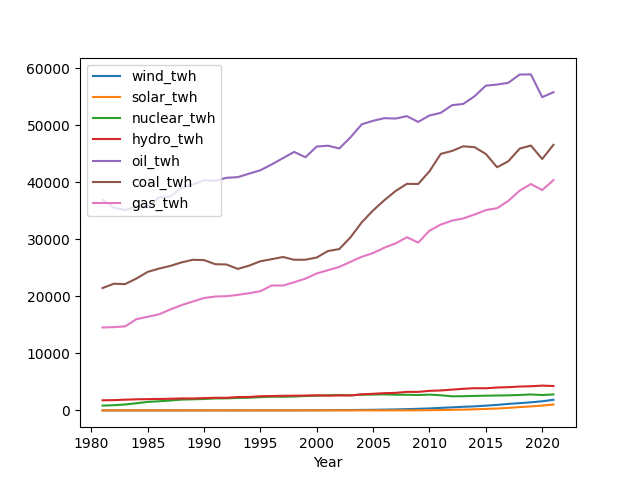

# Energy Stats

Oil Price (Futures, Continuous Contract, Front Month)

```python
import pandas as pd, datetime, time as timelib
import urllib.request as urllib2, io

end = datetime.datetime.now()
start = datetime.datetime(1980, 1, 1)
start = int(timelib.mktime(start.timetuple()))
end = int(timelib.mktime(end.timetuple()))
base_fin_url = "https://query1.finance.yahoo.com/v7/finance/download"
url = base_fin_url + "/CL=F?period1=" + str(start) + "&period2=" + str(end) + "&interval=1d&events=history&includeAdjustedClose=true"
r = urllib2.urlopen(url).read()
file = io.BytesIO(r)
df = pd.read_csv(file,index_col='Date',parse_dates=True)['Close']

print (df.tail(5))
plt.plot(df.tail(1).index, df.tail(1),'ro')
df.plot()
plt.axvspan('01-03-2001', '27-10-2001', color='y', alpha=0.5, lw=0)
plt.axvspan('22-12-2007', '09-05-2009', color='y', alpha=0.5, lw=0)
plt.savefig('oil.png')
```

```text
Date
2022-05-25    110.330002
2022-05-26    114.089996
2022-05-27    115.070000
2022-05-31    114.669998
2022-06-01    115.269997
Name: Close, dtype: float64
```


<a name="opec"></a>

Opec Oil Production

```python
import pandas as pd, requests
from datetime import date

api_key = open('.key/.eiakey').read()
url = 'https://api.eia.gov/series/?api_key=' + api_key + '&series_id=STEO.COPR_OPEC.M' 
r = requests.get(url)
json_data = r.json()
df = pd.DataFrame(json_data.get('series')[0].get('data'))
df['Year'] = df[0].astype(str).str[:4]
df['Month'] = df[0].astype(str).str[4:]
df['Day'] = 1
df['Date'] = pd.to_datetime(df[['Year','Month','Day']])
df = df.set_index('Date')

today = datetime.datetime.now()
today = today.strftime('%Y-%m-%d')
df = df[df.index <= today]
df = df.sort_index()
df[1].plot()
print (df[1].tail(5))
plt.legend(['Oil Production Per Month (mil barrels per day)'])
plt.savefig('opec.png')
```

```text
Date
2022-02-01    28.575000
2022-03-01    28.215000
2022-04-01    28.490000
2022-05-01    28.932083
2022-06-01    29.076941
Name: 1, dtype: float64
```


<a name="natgas"></a>

World Natural Gas Price

```python
import pandas as pd, datetime, time as timelib
import urllib.request as urllib2, io
end = datetime.datetime.now()
start=datetime.datetime(2010, 1, 1)
start = int(timelib.mktime(start.timetuple()))
end = int(timelib.mktime(end.timetuple()))
base_fin_url = "https://query1.finance.yahoo.com/v7/finance/download"
url = base_fin_url + "/NG=F?period1=" + str(start) + "&period2=" + str(end) + "&interval=1d&events=history&includeAdjustedClose=true"
r = urllib2.urlopen(url).read()
file = io.BytesIO(r)
df = pd.read_csv(file,index_col='Date',parse_dates=True)['Adj Close']
df.plot()
plt.plot(df.tail(1).index, df.tail(1),'ro')
print (df.tail(7))
plt.savefig('natgas.png')
```

```text
Date
2022-05-23    8.744
2022-05-24    8.796
2022-05-25    8.971
2022-05-26    8.908
2022-05-27    8.727
2022-05-31    8.145
2022-06-01    8.346
Name: Adj Close, dtype: float64
```


<a name="coal"></a>

Coal Price

```python
import pandas as pd, datetime, time as timelib
import urllib.request as urllib2, io
end = datetime.datetime.now()
start=datetime.datetime(2010, 1, 1)
start = int(timelib.mktime(start.timetuple()))
end = int(timelib.mktime(end.timetuple()))
base_fin_url = "https://query1.finance.yahoo.com/v7/finance/download"
url = base_fin_url + "/MTF=F?period1=" + str(start) + "&period2=" + str(end) + "&interval=1d&events=history&includeAdjustedClose=true"
r = urllib2.urlopen(url).read()
file = io.BytesIO(r)
df = pd.read_csv(file,index_col='Date',parse_dates=True)['Adj Close']
df = df.interpolate()
df.plot()
plt.plot(df.tail(1).index, df.tail(1),'ro')
print (df.tail(7))
plt.savefig('coal.png')
```

```text
Date
2022-02-18    185.00
2022-02-22    189.00
2022-02-23    190.75
2022-02-24    192.00
2022-02-25    194.50
2022-02-28    194.50
2022-03-01    194.50
Name: Adj Close, dtype: float64
```



<a name='engconsumption'/>

World Energy Consumption by Source, Monthly (twh)

```python
import pandas as pd, requests
from datetime import date

api_key = open('.key/.eiakey').read()

sources = ('coal','TOTAL.CLTCBUS.M'),('hydro','TOTAL.HVTCBUS.M'),\
	   ('natgas','TOTAL.NNTCBUS.M'),('oil','TOTAL.PMTCBUS.M'),\
	   ('nuclear','TOTAL.NUETBUS.M'),('solar','TOTAL.SOTCBUS.M'),\
	   ('wind','TOTAL.WYTCBUS.M')

dfall = []
descs = []
for desc,lab in sources:
    url = 'https://api.eia.gov/series/?api_key=' + api_key + '&series_id=' + lab
    r = requests.get(url)
    json_data = r.json()
    df = pd.DataFrame(json_data.get('series')[0].get('data'))
    df = pd.DataFrame(json_data.get('series')[0].get('data'))
    df['Year'] = df[0].astype(str).str[:4]
    df['Month'] = df[0].astype(str).str[4:]
    df['Day'] = 1
    df['Date'] = pd.to_datetime(df[['Year','Month','Day']])
    df = df.set_index('Date')
    df = df.rename(columns={1: desc})
    df = df[df.index > '2000-01-01-']
    df[desc] = df[desc].rolling(10).mean() * 0.293    
    descs.append(desc)
    dfall.append(df)

dfall = pd.concat(dfall,axis=1)
pd.set_option('display.max_columns', None)

dfall[descs].plot()
plt.title('Monthly World Energy Consumption (twh)')
plt.savefig('energy-sources.png')
```



Looking at YoY increases per source

```python
dfeng = dfall[descs]
source = 'solar'
dfeng[source+'prev'] = dfeng[source].shift(-12)
dfeng[source+'yoy'] = (dfeng[source]-dfeng[source+'prev']) / dfeng[source+'prev'] * 100.0
print (dfeng[source+'yoy'].dropna().head(5))
```

```text
Date
2021-04-01    24.301684
2021-03-01    24.618614
2021-02-01    24.098390
2021-01-01    23.621993
2020-12-01    24.047727
Name: solaryoy, dtype: float64
```
