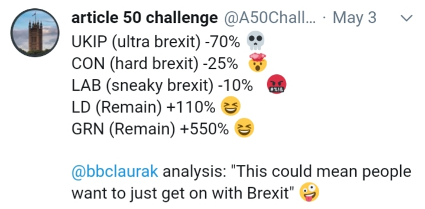

# Get On With It

The percentages shown are from the recent UK local elections, gains /
losses, for each party. What net acronym should I use here? LMAO?
ROFL?

"Get on with it" is a common phrase heard among the Brexiter
citizens. "Ok, we voted and now you do your job" kinda
statement. Except, such citizens need to understand, UK officials
*didn't* do their job by framing a question too much for your dumbass
to handle. This is a perfect example of an idiom seemingly suggesting
a course of action, but the action is shit. "Get on with it" - what
the fuck does that even mean?  Byzantine rules, regulations, gazillion
different interests pullling to all different directions. You cant
just "get on with it". If they could they would have by now.