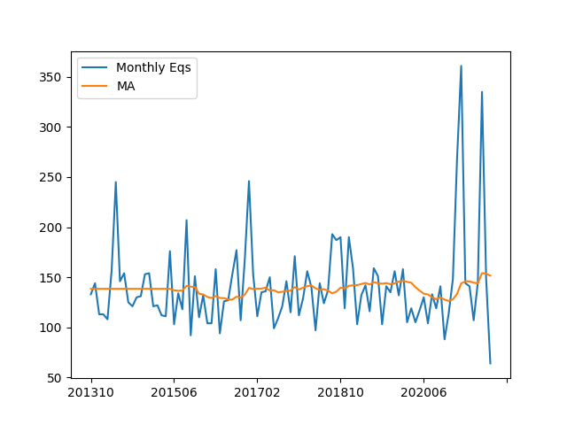

# Natural Disasters

<a name='fires'/>

### Fires

Data comes from [FIRMS](https://firms.modaps.eosdis.nasa.gov/active_fire/),
Fire Information for Resource Management System,  I read their MODIS
CSV dataset for the world, for all fires within last 7 days and filter
out fires below a certain brightness threshold. MODIS works through
satellite images, it scans for certain brighness, color on all Earth
images.

[Script](fires.py)

[Output](fires-out.html)

<a name='equakes'/>

### Earthquake Stats

Report below shows monthly earthquake counts (greater than 5.0 in mag)
since 2013.

```python
import equake, pandas as pd

df = equake.get_eq_all()
df['YM'] = df.apply(lambda x: "%d%02.0f" % (x.name.year,x.name.month), axis=1)
g = df.groupby("YM")
dfp = pd.DataFrame()
dfp['monc'] = g.size()
dfp['ma'] = g.size().rolling(window=20).mean()
dfp = dfp.interpolate(method ='linear', limit_direction ='backward')
dfp.columns = ['Monthly Eqs','MA']
dfp.plot()
plt.savefig('moneq.png')
```



For specific region, see code below, and

```python
import equake
equake.do_region()
```

[Script](equake.py)

[Output](equake-out.html)


