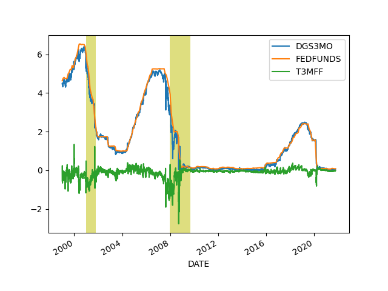

# Economy, Calculations, Data

## GDP

THis GDP calc is taken as annualized quarterly growth rate, quarter
growth compared to previous quarter,
[annualized](https://www.fool.com/knowledge-center/how-to-calculate-the-annual-growth-rate-for-real-g.aspx).


```python
import pandas as pd, datetime
from pandas_datareader import data

today = datetime.datetime.now()
start=datetime.datetime(1945, 1, 1)
end=datetime.datetime(today.year, today.month, today.day)
df = data.DataReader(['GDPC1'], 'fred', start, end)
df['growann'] = (  (  (1+df.pct_change())**4  )-1.0  )*100.0
#print (df[pd.DatetimeIndex(df.index).year == 1984]['growann'])
print (df['growann'].tail(5))
# look at Q2, 04-01 date
```

```text
DATE
2020-04-01   -31.235698
2020-07-01    33.783279
2020-10-01     4.536294
2021-01-01     6.278177
2021-04-01     6.556445
Name: growann, dtype: float64
```

## The Cycle

<a name="cycle"/>


```python
import pandas as pd, datetime
from pandas_datareader import data

today = datetime.datetime.now()
start=datetime.datetime(1970, 1, 1)
end=datetime.datetime(today.year, today.month, today.day)

fig, axs = plt.subplots(2)

df = data.DataReader(['GDPC1'], 'fred', start, end)
df['gdpyoy'] = (df.GDPC1 - df.GDPC1.shift(4)) / df.GDPC1.shift(4) * 100.0
df['gdpyoy'].plot(ax=axs[0],title="GDP and Inflation YoY")
axs[0].axvspan('01-11-1973', '01-03-1975', color='y', alpha=0.5, lw=0)
axs[0].axvspan('01-07-1981', '01-11-1982', color='y', alpha=0.5, lw=0)
axs[0].axvspan('01-09-1990', '01-07-1991', color='y', alpha=0.5, lw=0)
axs[0].axvspan('01-03-2001', '27-10-2001', color='y', alpha=0.5, lw=0)
axs[0].axvspan('22-12-2007', '09-05-2009', color='y', alpha=0.5, lw=0)
print (df[['gdpyoy']].tail(6))

df = data.DataReader(['CPIAUCNS'], 'fred', start, end)
df['infyoy'] = (df.CPIAUCNS - df.CPIAUCNS.shift(12)) / df.CPIAUCNS.shift(12) * 100.0
df['infyoy'].plot(ax=axs[1])
axs[1].axvspan('01-11-1973', '01-03-1975', color='y', alpha=0.5, lw=0)
axs[1].axvspan('01-07-1981', '01-11-1982', color='y', alpha=0.5, lw=0)
axs[1].axvspan('01-09-1990', '01-07-1991', color='y', alpha=0.5, lw=0)
axs[1].axvspan('01-03-2001', '27-10-2001', color='y', alpha=0.5, lw=0)
axs[1].axvspan('22-12-2007', '09-05-2009', color='y', alpha=0.5, lw=0)
print (df[['infyoy']].tail(6))
            
plt.savefig('cycle.png')
```

```text
               gdpyoy
DATE                 
2020-01-01   0.630785
2020-04-01  -9.083737
2020-07-01  -2.887506
2020-10-01  -2.262915
2021-01-01   0.546977
2021-04-01  12.182003
              infyoy
DATE                
2021-03-01  2.619763
2021-04-01  4.159695
2021-05-01  4.992707
2021-06-01  5.391451
2021-07-01  5.365475
2021-08-01  5.251272
```

<a name="infexp"/>

Inflation Expection

Data comes from the University of Michigan [survey](http://www.sca.isr.umich.edu/tables.html). 

```python
import pandas as pd
pd.set_option('display.max_columns', None)
df = pd.read_csv('http://www.sca.isr.umich.edu/files/tbcpx1px5.csv',skiprows=4,header=None)
df1 = df[[0,1,3,5]]
df1 = df1.dropna()
df1.columns = ['Mon','Year','Next Year','Next 5 Years']
df1['sdate'] = df1.apply(lambda x: x.Mon + "-" + str(int(x['Year'])),axis=1)
df1['date'] = pd.to_datetime(df1.sdate)
df1 = df1.set_index('date')
df1[['Next Year','Next 5 Years']].plot()
print (df1[['Next Year', 'Next 5 Years']].tail(5))
plt.savefig('infexp.png')
```

```text
            Next Year  Next 5 Years
date                               
2021-05-01        4.6           3.0
2021-06-01        4.2           2.8
2021-07-01        4.7           2.8
2021-08-01        4.6           2.9
2021-09-01        4.7           2.9
```


## Wages and Unemployment

<a name="nfp"/>

```python
import pandas as pd, datetime
from pandas_datareader import data

today = datetime.datetime.now()
start=datetime.datetime(1986, 1, 1)
end=datetime.datetime(today.year, today.month, today.day)
cols = ['PAYEMS']
df = data.DataReader(cols, 'fred', start, end)
df['nfpyoy'] = (df.PAYEMS - df.PAYEMS.shift(12)) / df.PAYEMS.shift(12) * 100.0
print (df.tail(7))
df.nfpyoy.plot()
plt.grid(True)
plt.axvspan('01-09-1990', '01-07-1991', color='y', alpha=0.5, lw=0)
plt.axvspan('01-03-2001', '27-10-2001', color='y', alpha=0.5, lw=0)
plt.axvspan('22-12-2007', '09-05-2009', color='y', alpha=0.5, lw=0)
plt.title('Non-Farm Payroll YoY Change %')
plt.savefig('nfp.png')
```

```text
            PAYEMS     nfpyoy
DATE                         
2021-02-01  143272  -6.065315
2021-03-01  144057  -4.496818
2021-04-01  144326  10.882676
2021-05-01  144940   8.982360
2021-06-01  145902   5.848810
2021-07-01  146955   5.294269
2021-08-01  147190   4.279874
```


```python
import pandas as pd, datetime
from pandas_datareader import data

start=datetime.datetime(1950, 1, 1)
end=datetime.datetime(2019, 11, 1)
cols = ['ECIWAG']
df3 = data.DataReader(cols, 'fred', start, end)
df3 = df3.dropna()
df3['ECIWAG2'] = df3.shift(4).ECIWAG
df3['wagegrowth'] = (df3.ECIWAG-df3.ECIWAG2) / df3.ECIWAG2 * 100.
print (df3['wagegrowth'].tail(4))
df3['wagegrowth'].plot(title='Wage Growth')
plt.savefig('wages.png')
```

```text
DATE
2019-01-01    2.956785
2019-04-01    3.012048
2019-07-01    2.910448
2019-10-01    2.965159
Name: wagegrowth, dtype: float64
```


<a name="claims"></a>

```python
import pandas as pd, datetime
from pandas_datareader import data

today = datetime.datetime.now()
start=datetime.datetime(1995, 1, 1)
end=datetime.datetime(today.year, today.month, today.day)
cols = ['ICSA']
df = data.DataReader(cols, 'fred', start, end)
df.ICSA.plot()
print (df.tail(4))
plt.title("Initial Unemployment Claims")
plt.axvspan('01-03-2001', '27-10-2001', color='y', alpha=0.5, lw=0)
plt.axvspan('22-12-2007', '09-05-2009', color='y', alpha=0.5, lw=0)
plt.savefig('icsa.png')
```

```text
              ICSA
DATE              
2021-08-28  345000
2021-09-04  312000
2021-09-11  335000
2021-09-18  351000
```


<a name="unempl"></a>

Calculation is based on [2]

```python
import pandas as pd, datetime
from pandas_datareader import data

today = datetime.datetime.now()
start=datetime.datetime(1986, 1, 1)
end=datetime.datetime(today.year, today.month, today.day)
cols = ['LNS12032194','UNEMPLOY','NILFWJN','LNS12600000','CLF16OV','UNRATE','U6RATE']
df = data.DataReader(cols, 'fred', start, end)
df['REAL_UNEMP_LEVEL'] = df.LNS12032194*0.5 + df.UNEMPLOY + df.NILFWJN
df['REAL_UNRATE'] = (df.REAL_UNEMP_LEVEL / df.CLF16OV) * 100.0
pd.set_option('display.max_columns', None)
df1 = df.loc[df.index > '2005-01-01']
df1[['UNRATE','U6RATE','REAL_UNRATE']].plot()
plt.title('Unemployment Rate')
print (df1[['UNRATE','U6RATE','REAL_UNRATE','REAL_UNEMP_LEVEL']].tail(5))
plt.savefig('unemploy.png')
```

```text
            UNRATE  U6RATE  REAL_UNRATE  REAL_UNEMP_LEVEL
DATE                                                     
2021-04-01     6.1    10.4    11.852126           19080.5
2021-05-01     5.8    10.2    11.527325           18551.5
2021-06-01     5.9     9.8    11.314143           18225.5
2021-07-01     5.4     9.2    10.821707           17460.5
2021-08-01     5.2     8.8    10.090877           16300.5
```


<a name="pmi"></a>

## PMI

```python
import quandl, os, datetime
from datetime import timedelta

today = datetime.datetime.now()
start=datetime.datetime(1985, 1, 1)
end=datetime.datetime(today.year, today.month, today.day)
today = datetime.datetime.now()
df = quandl.get("ISM/MAN_PMI-PMI-Composite-Index", 
returns="pandas",
start_date=start.strftime('%Y-%m-%d'),
end_date=today.strftime('%Y-%m-%d'),
authtoken=open(".quandl").read())

print (df['PMI'].tail(4))
df['PMI'].plot()
plt.axvspan('01-09-1990', '01-07-1991', color='y', alpha=0.5, lw=0)
plt.axvspan('01-03-2001', '27-10-2001', color='y', alpha=0.5, lw=0)
plt.axvspan('22-12-2007', '09-05-2009', color='y', alpha=0.5, lw=0)
plt.savefig('pmi.png')
```

```text
Date
2021-05-01    61.2
2021-06-01    60.6
2021-07-01    59.5
2021-08-01    59.9
Name: PMI, dtype: float64
```


<a name="gdpism"></a>

## GDP vs ISM

```python
import pandas as pd, datetime
from pandas_datareader import data
import quandl

today = datetime.datetime.now()
start=datetime.datetime(1992, 1, 1)
end=datetime.datetime(today.year, today.month, today.day)
cols = ['GDPC1']
df = data.DataReader(cols, 'fred', start, end)

df['gdpyoy'] = (df.GDPC1 - df.GDPC1.shift(4)) / df.GDPC1.shift(4) * 100.0

df2 = quandl.get("ISM/MAN_PMI-PMI-Composite-Index", 
returns="pandas",
start_date=start.strftime('%Y-%m-%d'),
end_date=end.strftime('%Y-%m-%d'),
authtoken=open(".quandl").read())

plt.figure(figsize=(12,5))
ax1 = df2.PMI.plot(color='blue', grid=True, label='ISM')
ax2 = df.gdpyoy.plot(color='red', grid=True, label='GDP',secondary_y=True)
h1, l1 = ax1.get_legend_handles_labels()
h2, l2 = ax2.get_legend_handles_labels()
plt.legend(h1+h2, l1+l2, loc=2)
plt.savefig('gdp-ism.png')
```


<a name="cpyoy"></a>

## Profits YoY

```python
import pandas as pd, datetime
from pandas_datareader import data

today = datetime.datetime.now()
start=datetime.datetime(2000, 1, 1)
end=datetime.datetime(today.year, today.month, today.day)
cols = ['CPROFIT']
df = data.DataReader(cols, 'fred', start, end)
df['cpyoy'] = (df.CPROFIT - df.CPROFIT.shift(4)) / df.CPROFIT.shift(4) * 100.0
print (df.tail(4))
df.cpyoy.plot()
plt.grid(True)
plt.savefig('profit.png')
```

```text
             CPROFIT      cpyoy
DATE                           
2020-07-01  2435.435   2.252255
2020-10-01  2427.518   0.930172
2021-01-01  2551.412  17.605585
2021-04-01  2785.864  43.406899
```


## Dollar

<a name="dollar"></a>

```python
import pandas as pd, datetime, time as timelib
import urllib.request as urllib2, io

end = datetime.datetime.now()
start = datetime.datetime(1980, 1, 1)
start = int(timelib.mktime(start.timetuple()))
end = int(timelib.mktime(end.timetuple()))

base_fin_url = "https://query1.finance.yahoo.com/v7/finance/download"
url = base_fin_url + "/DX-Y.NYB?period1=" + str(start) + "&period2=" + str(end) + "&interval=1d&events=history&includeAdjustedClose=true"
r = urllib2.urlopen(url).read()
file = io.BytesIO(r)
df = pd.read_csv(file,index_col='Date',parse_dates=True)['Adj Close']

print (df.tail(4))
m,s = df.mean(),df.std()
print (np.array([m-s,m+s]).T)
df.tail(1000).plot()
plt.grid(True)
plt.savefig('dollar.png')
```

```text
Date
2021-09-14    92.650002
2021-09-15    92.489998
2021-09-16    92.860001
2021-09-17    93.199997
Name: Adj Close, dtype: float64
[ 80.69151546 111.2968622 ]
```


<a name="wagepayroll"></a>

## Difference Between Wage Growth YoY and Payrolls (Hiring)

```python
import pandas as pd, datetime
from pandas_datareader import data

today = datetime.datetime.now()
start=datetime.datetime(1986, 1, 1)
end=datetime.datetime(today.year, today.month, today.day)
cols = ['PAYEMS','AHETPI']
df = data.DataReader(cols, 'fred', start, end)
df['nfpyoy'] = (df.PAYEMS - df.PAYEMS.shift(12)) / df.PAYEMS.shift(12) * 100.0
df['wageyoy'] = (df.AHETPI - df.AHETPI.shift(12)) / df.AHETPI.shift(12) * 100.0
df[['wageyoy','nfpyoy']].plot()
plt.axvspan('01-09-1990', '01-07-1991', color='y', alpha=0.5, lw=0)
plt.axvspan('01-03-2001', '27-10-2001', color='y', alpha=0.5, lw=0)
plt.axvspan('22-12-2007', '09-05-2009', color='y', alpha=0.5, lw=0)
print (df['wageyoy'].tail(5))
print (df['nfpyoy'].tail(5))
plt.savefig('pay-wage.png')
```

```text
DATE
2021-04-01    1.152623
2021-05-01    2.359056
2021-06-01    3.835285
2021-07-01    4.783137
2021-08-01    4.756147
Name: wageyoy, dtype: float64
DATE
2021-04-01    10.882676
2021-05-01     8.982360
2021-06-01     5.848810
2021-07-01     5.294269
2021-08-01     4.279874
Name: nfpyoy, dtype: float64
```


<a name="wilshire"></a>

## Total Market Cap / GDP

```python
import pandas as pd, datetime
from pandas_datareader import data

today = datetime.datetime.now()
start=datetime.datetime(1995, 1, 1)
end=datetime.datetime(today.year, today.month, today.day)
cols = ['WILL5000IND']
df = data.DataReader(cols, 'fred', start, end)
df.plot()
print (df.tail(4))
plt.axvspan('01-03-2001', '27-10-2001', color='y', alpha=0.5, lw=0)
plt.axvspan('22-12-2007', '09-05-2009', color='y', alpha=0.5, lw=0)
plt.savefig('wilshire.png')
```

```text
            WILL5000IND
DATE                   
2021-09-13       221.72
2021-09-14       220.31
2021-09-15       222.22
2021-09-16       222.02
```


<a name="junkbond"></a>

## Junk Bond Yields

```python
import pandas as pd, datetime
from pandas_datareader import data

today = datetime.datetime.now()
start=datetime.datetime(1980, 1, 1)
end=datetime.datetime(today.year, today.month, today.day)
cols = ['BAMLH0A2HYBEY']
df = data.DataReader(cols, 'fred', start, end)
print (df.tail(6))
df.plot()
plt.plot(df.tail(1).index, df.tail(1),'ro')
plt.axvspan('2001-03-03', '2001-10-27', color='y', alpha=0.5, lw=0)
plt.axvspan('2007-12-22', '2009-05-09', color='y', alpha=0.5, lw=0)
plt.savefig('junkbond.png')
```

```text
            BAMLH0A2HYBEY
DATE                     
2021-09-09           4.45
2021-09-10           4.44
2021-09-13           4.41
2021-09-14           4.40
2021-09-15           4.41
2021-09-16           4.42
```


## Yield Curve, Rates

<a name="curve"></a>

10 Year Treasury Yield - 3 Month Bills

```python
import pandas as pd, datetime
from pandas_datareader import data

pd.set_option('display.max_columns', 10)

today = datetime.datetime.now()
start=datetime.datetime(1980, 1, 1)
end=datetime.datetime(today.year, today.month, today.day)
cols = ['DGS10','DGS3MO']
df = data.DataReader(cols, 'fred', start, end)
df['Yield Curve'] = df.DGS10 - df.DGS3MO
print (df.tail(6))
plt.plot(df.tail(1).index, df.tail(1)['Yield Curve'],'ro')
df['Yield Curve'].plot()
plt.axvspan('01-09-1990', '01-07-1991', color='y', alpha=0.5, lw=0)
plt.axvspan('01-03-2001', '27-10-2001', color='y', alpha=0.5, lw=0)
plt.axvspan('22-12-2007', '09-05-2009', color='y', alpha=0.5, lw=0)
plt.savefig('yield-curve.png')
```

```text
            DGS10  DGS3MO  Yield Curve
DATE                                  
2021-09-09   1.30    0.04         1.26
2021-09-10   1.35    0.05         1.30
2021-09-13   1.33    0.06         1.27
2021-09-14   1.28    0.04         1.24
2021-09-15   1.31    0.04         1.27
2021-09-16   1.34    0.04         1.30
```


<a name='t3mff'/>

3-Month Treasury Constant Maturity Minus Federal Funds Rate

```python
import pandas as pd, datetime
from pandas_datareader import data

pd.set_option('display.max_columns', 10)

today = datetime.datetime.now()
start=datetime.datetime(1999, 1, 1)
end=datetime.datetime(today.year, today.month, today.day)
cols = ['DGS3MO','FEDFUNDS','T3MFF']
df = data.DataReader(cols, 'fred', start, end)
df = df.interpolate()
print (df.tail(6))
df.plot()
plt.axvspan('01-03-2001', '27-10-2001', color='y', alpha=0.5, lw=0)
plt.axvspan('22-12-2007', '09-05-2009', color='y', alpha=0.5, lw=0)
plt.savefig('t3mff.png')
```

```text
            DGS3MO  FEDFUNDS  T3MFF
DATE                               
2021-08-26    0.05      0.09  -0.04
2021-08-27    0.05      0.09  -0.03
2021-08-30    0.05      0.09  -0.03
2021-08-31    0.04      0.09  -0.02
2021-09-01    0.05      0.09  -0.03
2021-09-02    0.05      0.09  -0.03
```




Gold and 10 Year Treasuries

```python
from pandas_datareader import data
import datetime

today = datetime.datetime.now()
start=datetime.datetime(2000, 1, 1)
end=datetime.datetime(today.year, today.month, today.day)
df = data.DataReader(['DGS10', 'GOLDAMGBD228NLBM'], 'fred', start, end)
print (df.tail(5))
ax1 = df.DGS10.plot(color='blue', grid=True, label='10Y')
ax2 = df.GOLDAMGBD228NLBM.plot(color='red', grid=True, label='GOLD',secondary_y=True)
h1, l1 = ax1.get_legend_handles_labels()
h2, l2 = ax2.get_legend_handles_labels()
plt.legend(h1+h2, l1+l2, loc=2)
plt.savefig('10yrgld.png')
```

```text
            DGS10  GOLDAMGBD228NLBM
DATE                               
2021-08-30   1.29               NaN
2021-08-31   1.30           1814.30
2021-09-01   1.31           1813.90
2021-09-02   1.29           1815.15
2021-09-03    NaN           1812.05
```


<a name="vix"></a>

## VIX

```python
import pandas as pd, datetime, time as timelib
import urllib.request as urllib2, io
end = datetime.datetime.now()
start=datetime.datetime(2000, 1, 1)
start = int(timelib.mktime(start.timetuple()))
end = int(timelib.mktime(end.timetuple()))
base_fin_url = "https://query1.finance.yahoo.com/v7/finance/download"
url = base_fin_url + "/^VIX?period1=" + str(start) + "&period2=" + str(end) + "&interval=1d&events=history&includeAdjustedClose=true"
r = urllib2.urlopen(url).read()
file = io.BytesIO(r)
df = pd.read_csv(file,index_col='Date',parse_dates=True)['Adj Close']
df.plot()
plt.axvspan('01-03-2001', '27-10-2001', color='y', alpha=0.5, lw=0)
plt.axvspan('22-12-2007', '09-05-2009', color='y', alpha=0.5, lw=0)
print (df.tail(7))
plt.plot(df.tail(1).index, df.tail(1),'ro')
plt.savefig('vix.png')
```

```text
Date
2021-09-09    18.799999
2021-09-10    20.950001
2021-09-13    19.370001
2021-09-14    19.459999
2021-09-15    18.180000
2021-09-16    18.690001
2021-09-17    20.809999
Name: Adj Close, dtype: float64
```


<a name="oil"></a>

## Oil

Futures, Continuous Contract, Front Month

```python
import pandas as pd, datetime, time as timelib
import urllib.request as urllib2, io

end = datetime.datetime.now()
start = datetime.datetime(1980, 1, 1)
start = int(timelib.mktime(start.timetuple()))
end = int(timelib.mktime(end.timetuple()))
base_fin_url = "https://query1.finance.yahoo.com/v7/finance/download"
url = base_fin_url + "/CL=F?period1=" + str(start) + "&period2=" + str(end) + "&interval=1d&events=history&includeAdjustedClose=true"
r = urllib2.urlopen(url).read()
file = io.BytesIO(r)
df = pd.read_csv(file,index_col='Date',parse_dates=True)['Close']

print (df.tail(5))
plt.plot(df.tail(1).index, df.tail(1),'ro')
df.plot()
plt.axvspan('01-03-2001', '27-10-2001', color='y', alpha=0.5, lw=0)
plt.axvspan('22-12-2007', '09-05-2009', color='y', alpha=0.5, lw=0)
plt.savefig('oil.png')
```

```text
Date
2021-09-13    70.449997
2021-09-14    70.459999
2021-09-15    72.610001
2021-09-16    72.610001
2021-09-17    71.970001
Name: Close, dtype: float64
```


Oil Production

```python
import pandas as pd
df = pd.read_csv('world-crude.csv',sep='\s', comment='#',index_col=0)
df.columns = ['Production (mil barrels per day)']
df.plot()
plt.savefig('crude-production.png')
```


<a name="coal"></a>

## Coal

```python
import re, requests, pandas as pd

headers = { 'User-Agent': 'UCWEB/2.0 (compatible; Googlebot/2.1; +google.com/bot.html)'}
url = "https://markets.businessinsider.com/commodities/coal-price"
resp = requests.get(url, headers=headers, timeout=2)
regex = 'historicalPrices\: \{"instrumentName"\:"Coal".*?\}\)\;'
res = re.findall(regex, resp.text, re.DOTALL)
res2 = re.findall('"Close":(.*?),.*?"Date":"(\d\d/\d\d/\d\d)"', res[0])
df = pd.DataFrame(res2, columns =['Price', 'Date'])
df['Date'] = pd.to_datetime(df.Date)
df['Price'] = df.apply(lambda x: float(x.Price), axis=1)
df = df.sort_values('Date').set_index('Date')
df.Price.plot()
plt.savefig('coal.png')
```


<a name="credit"/>

## Private Debt to GDP Ratio

```python
import pandas as pd, datetime
from pandas_datareader import data

today = datetime.datetime.now()
start=datetime.datetime(1960, 1, 1)
end=datetime.datetime(today.year, today.month, today.day)

df = data.DataReader(['GDPC1','QUSPAMUSDA'], 'fred', start, end)
df = df.interpolate()
df['Credit to GDP'] = (df.QUSPAMUSDA / df.GDPC1)*100.0
df['Credit to GDP'].plot()
plt.axvspan('01-09-1990', '01-07-1991', color='y', alpha=0.5, lw=0)
plt.axvspan('01-03-2001', '27-10-2001', color='y', alpha=0.5, lw=0)
plt.axvspan('22-12-2007', '09-05-2009', color='y', alpha=0.5, lw=0)
plt.savefig('creditgdp.png')
print (df['Credit to GDP'].tail(4))
```

```text
DATE
2020-07-01    183.161306
2020-10-01    182.995195
2021-01-01    182.549889
2021-04-01    179.674581
Freq: QS-OCT, Name: Credit to GDP, dtype: float64
```


<a name="debt"/>

# Total Consumer Credit Outstanding as % of GDP

```python
import pandas as pd, datetime
from pandas_datareader import data

pd.set_option('display.max_columns', 10)
today = datetime.datetime.now()
start=datetime.datetime(1980, 1, 1)
end=datetime.datetime(today.year, today.month, today.day)
cols = ['TOTALSL','GDP']
df = data.DataReader(cols, 'fred', start, end)
df = df.interpolate(method='linear')
df['debt'] =   df.TOTALSL / df.GDP * 100.0
print (df.debt.tail(4))
df.debt.plot()
plt.axvspan('01-09-1990', '01-07-1991', color='y', alpha=0.5, lw=0)
plt.axvspan('01-03-2001', '27-10-2001', color='y', alpha=0.5, lw=0)
plt.axvspan('22-12-2007', '09-05-2009', color='y', alpha=0.5, lw=0)
plt.savefig('debt.png')
```

```text
DATE
2021-04-01    18.657921
2021-05-01    18.811866
2021-06-01    18.978441
2021-07-01    19.053243
Freq: MS, Name: debt, dtype: float64
```


<a name="gini"/>

# Wealth Inequality - GINI Index

Code taken from [3]

```python
import pandas as pd, datetime
from pandas_datareader import data

def gini(pop,val):
    pop = list(pop); pop.insert(0,0.0)
    val = list(val); val.insert(0,0.0)        
    poparg = np.array(pop)
    valarg = np.array(val)
    z = valarg * poparg;
    ord = np.argsort(val)
    poparg    = poparg[ord]
    z = z[ord]
    poparg    = np.cumsum(poparg)
    z    = np.cumsum(z)
    relpop = poparg/poparg[-1]
    relz = z/z[-1]    
    g = 1 - np.sum((relz[0:-1]+relz[1:]) * np.diff(relpop))
    return np.round(g,3)

today = datetime.datetime.now()
start=datetime.datetime(1989, 1, 1)
end=datetime.datetime(today.year, today.month, today.day)
cols = ['WFRBLT01026', 'WFRBLN09053','WFRBLN40080','WFRBLB50107']
df = data.DataReader(cols, 'fred', start, end)
p = [0.01, 0.09, 0.40, 0.50]
g = df.apply(lambda x: gini(p,x),axis=1)
print (g.tail(4))
g.plot()
plt.xlim('1990-01-01','2023-01-01')
plt.axvspan('1993-01-01','1993-01-01',color='y')
plt.axvspan('2001-01-01','2001-01-01',color='y')
plt.axvspan('2009-01-01','2009-01-01',color='y')
plt.axvspan('2017-01-01','2017-01-01',color='y')
plt.axvspan('2020-12-01','2020-12-01',color='y')
plt.text('1990-01-01',0.44,'HW')
plt.text('1994-01-01',0.46,'Clinton')
plt.text('2003-01-01',0.47,'Bush')
plt.text('2011-01-01',0.44,'Obama')
plt.text('2018-01-01',0.42,'DJT')
plt.text('2020-03-01',0.48,'Biden')
plt.savefig('gini.png')
```

```text
DATE
2020-04-01    0.466
2020-07-01    0.464
2020-10-01    0.463
2021-01-01    0.459
dtype: float64
```


---

References, Notes

[1] Note: for Quandl retrieval get the API key from Quandl, and place the
key in a `.quandl` file in the same directory as this file.

[2] [Komlos](https://www.longfinance.net/news/pamphleteers/true-us-unemployment-rate-march-2019/)

[3] [Mathworks](https://www.mathworks.com/matlabcentral/mlc-downloads/downloads/submissions/28080/versions/1/previews/gini.m/index.html)

