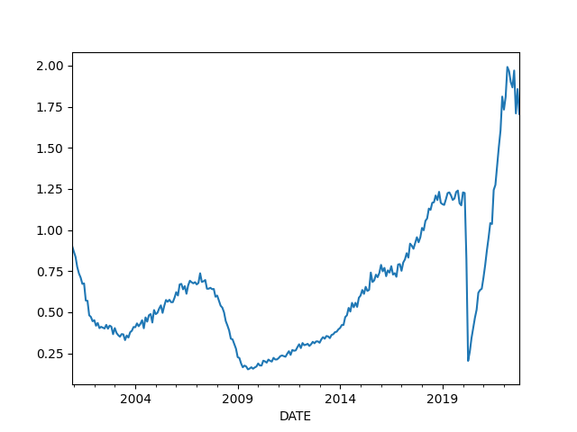
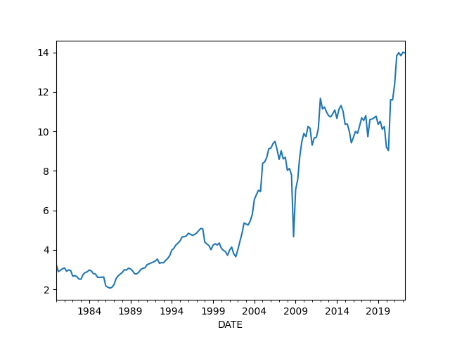

# Economy, Calculations, Data

<a name='gdp'/>

## GDP

GDP calc seen below is computed as annualized quarterly growth rate,
quarter growth compared to previous quarter,
[annualized](https://www.fool.com/knowledge-center/how-to-calculate-the-annual-growth-rate-for-real-g.aspx).


```python
import util; df = util.get_fred(1945,'GDPC1')
df['growann'] = (  (  (1+df.pct_change())**4  )-1.0  )*100.0
print (df['growann'].tail(5))
```

```text
DATE
2021-04-01    6.726283
2021-07-01    2.303426
2021-10-01    6.894521
2022-01-01   -1.573400
2022-04-01   -0.934183
Name: growann, dtype: float64
```

## The Cycle

<a name="cycle"/>


```python
import util; df = util.get_fred(1970,'GDPC1')

fig, axs = plt.subplots(2)

df['gdpyoy'] = (df.GDPC1 - df.GDPC1.shift(4)) / df.GDPC1.shift(4) * 100.0
df['gdpyoy'].plot(ax=axs[0],title="GDP and Inflation (CPI YoY)")
axs[0].axvspan('01-11-1973', '01-03-1975', color='y', alpha=0.5, lw=0)
axs[0].axvspan('01-07-1981', '01-11-1982', color='y', alpha=0.5, lw=0)
axs[0].axvspan('01-09-1990', '01-07-1991', color='y', alpha=0.5, lw=0)
axs[0].axvspan('01-03-2001', '27-10-2001', color='y', alpha=0.5, lw=0)
axs[0].axvspan('22-12-2007', '09-05-2009', color='y', alpha=0.5, lw=0)
print (df[['gdpyoy']].tail(6))

df = util.get_fred(1970,'CPIAUCNS')
df['inf'] = (df.CPIAUCNS - df.CPIAUCNS.shift(12)) / df.CPIAUCNS.shift(12) * 100.0
df['inf'].plot(ax=axs[1])
axs[1].axvspan('01-11-1973', '01-03-1975', color='y', alpha=0.5, lw=0)
axs[1].axvspan('01-07-1981', '01-11-1982', color='y', alpha=0.5, lw=0)
axs[1].axvspan('01-09-1990', '01-07-1991', color='y', alpha=0.5, lw=0)
axs[1].axvspan('01-03-2001', '27-10-2001', color='y', alpha=0.5, lw=0)
axs[1].axvspan('22-12-2007', '09-05-2009', color='y', alpha=0.5, lw=0)
print (df[['inf']].tail(6))
            
plt.savefig('cycle.png')
```

```text
               gdpyoy
DATE                 
2021-01-01   0.546977
2021-04-01  12.226677
2021-07-01   4.946556
2021-10-01   5.533484
2022-01-01   3.527892
2022-04-01   1.617963
                 inf
DATE                
2022-02-01  7.871064
2022-03-01  8.542456
2022-04-01  8.258629
2022-05-01  8.581512
2022-06-01  9.059758
2022-07-01  8.524815
```

<a name='taylor'/>

The Taylor Rule

```python
import util; df = util.get_fred(1970,['GDPC1','GDPPOT','PCEPI','FEDFUNDS'])

df = df.interpolate().resample('AS').mean()
longrun = 2.0
df['Gap'] = 100 * (df.GDPC1 / df.GDPPOT - 1.0)
df['Curr'] = df.PCEPI.pct_change()*100.
df['Taylor'] = (longrun + df.Curr + 0.5*(df.Curr - longrun) + 0.5*df.Gap)
print (df.Taylor.tail(4))
df[['FEDFUNDS','Taylor']].plot()
plt.savefig('taylor.png')
```

```text
DATE
2019-01-01    3.017600
2020-01-01    0.024595
2021-01-01    5.984414
2022-01-01    7.657455
Freq: AS-JAN, Name: Taylor, dtype: float64
```


## Wages and Unemployment

<a name="nfp"/>

Non-Farm Payroll

```python
import util; df = util.get_fred(1986,['PAYEMS'])
df['nfpyoy'] = (df.PAYEMS - df.PAYEMS.shift(12)) / df.PAYEMS.shift(12) * 100.0
print (df.tail(7))
df.nfpyoy.plot()
plt.grid(True)
plt.axvspan('01-09-1990', '01-07-1991', color='y', alpha=0.5, lw=0)
plt.axvspan('01-03-2001', '27-10-2001', color='y', alpha=0.5, lw=0)
plt.axvspan('22-12-2007', '09-05-2009', color='y', alpha=0.5, lw=0)
plt.title('Non-Farm Payroll YoY Change %')
plt.savefig('nfp.png')
```

```text
            PAYEMS    nfpyoy
DATE                        
2022-01-01  149744  4.703637
2022-02-01  150458  4.683184
2022-03-01  150856  4.448491
2022-04-01  151224  4.512972
2022-05-01  151610  4.457045
2022-06-01  152008  4.330876
2022-07-01  152536  4.200510
```


<a name="quits"/>

Job Quits, Resignations

```python
import util; df = util.get_fred(1986,['JTSQUR'])
print (df.JTSQUR.tail(5))
df.JTSQUR.plot()
plt.axvspan('01-09-1990', '01-07-1991', color='y', alpha=0.5, lw=0)
plt.axvspan('01-03-2001', '27-10-2001', color='y', alpha=0.5, lw=0)
plt.axvspan('22-12-2007', '09-05-2009', color='y', alpha=0.5, lw=0)
plt.title('Resignations')
plt.savefig('quits.png')
```

```text
DATE
2022-02-01    2.9
2022-03-01    2.9
2022-04-01    2.9
2022-05-01    2.8
2022-06-01    2.8
Name: JTSQUR, dtype: float64
```


<a name="wages"></a>

Wages

```python
import util; df3 = util.get_fred(1950,['ECIWAG'])
df3 = df3.dropna()
df3['ECIWAG2'] = df3.shift(4).ECIWAG
df3['wagegrowth'] = (df3.ECIWAG-df3.ECIWAG2) / df3.ECIWAG2 * 100.
print (df3['wagegrowth'].tail(4))
df3['wagegrowth'].plot(title='Wage Growth')
plt.savefig('wages.png')
```

```text
DATE
2021-07-01    4.590395
2021-10-01    4.901961
2022-01-01    4.982699
2022-04-01    5.692730
Name: wagegrowth, dtype: float64
```


<a name="claims"></a>

Claims

```python
import util; df = util.get_fred(1995,'ICSA')
df.ICSA.plot()
print (df.tail(4))
plt.title("Initial Unemployment Claims")
plt.axvspan('01-03-2001', '27-10-2001', color='y', alpha=0.5, lw=0)
plt.axvspan('22-12-2007', '09-05-2009', color='y', alpha=0.5, lw=0)
plt.savefig('icsa.png')
```

```text
              ICSA
DATE              
2022-07-09  244000
2022-07-16  261000
2022-07-23  254000
2022-07-30  260000
```


<a name="wagepayroll"></a>

Difference Between Wage Growth YoY and Payrolls (Hiring)

```python
import util; df = util.get_fred(1986,['PAYEMS','AHETPI'])
df['nfpyoy'] = (df.PAYEMS - df.PAYEMS.shift(12)) / df.PAYEMS.shift(12) * 100.0
df['wageyoy'] = (df.AHETPI - df.AHETPI.shift(12)) / df.AHETPI.shift(12) * 100.0
df[['wageyoy','nfpyoy']].plot()
plt.axvspan('01-09-1990', '01-07-1991', color='y', alpha=0.5, lw=0)
plt.axvspan('01-03-2001', '27-10-2001', color='y', alpha=0.5, lw=0)
plt.axvspan('22-12-2007', '09-05-2009', color='y', alpha=0.5, lw=0)
print (df['wageyoy'].tail(5))
print (df['nfpyoy'].tail(5))
plt.savefig('pay-wage.png')
```

```text
DATE
2022-03-01    6.745562
2022-04-01    6.630051
2022-05-01    6.427737
2022-06-01    6.392871
2022-07-01    6.201849
Name: wageyoy, dtype: float64
DATE
2022-03-01    4.448491
2022-04-01    4.512972
2022-05-01    4.457045
2022-06-01    4.330876
2022-07-01    4.200510
Name: nfpyoy, dtype: float64
```


<a name="unempl"></a>

Unemployment

Calculation is based on [2]

```python
cols = ['LNS12032194','UNEMPLOY','NILFWJN','LNS12600000','CLF16OV','UNRATE','U6RATE']
import pandas as pd, util; df = util.get_fred(1986,cols)
df['REAL_UNEMP_LEVEL'] = df.LNS12032194*0.5 + df.UNEMPLOY + df.NILFWJN
df['REAL_UNRATE'] = (df.REAL_UNEMP_LEVEL / df.CLF16OV) * 100.0
pd.set_option('display.max_columns', None)
df1 = df.loc[df.index > '2005-01-01']
df1[['UNRATE','U6RATE','REAL_UNRATE']].plot()
plt.title('Unemployment Rate')
print (df1[['UNRATE','U6RATE','REAL_UNRATE','REAL_UNEMP_LEVEL']].tail(5))
plt.savefig('unemploy.png')
```

```text
            UNRATE  U6RATE  REAL_UNRATE  REAL_UNEMP_LEVEL
DATE                                                     
2022-03-01     3.6     6.9     8.377887           13774.0
2022-04-01     3.6     7.0     8.422333           13816.5
2022-05-01     3.6     7.1     8.392344           13795.0
2022-06-01     3.6     6.7     8.156478           13378.5
2022-07-01     3.5     6.7     8.259332           13542.0
```


<a name='vacrate'/>

Vacancy rate, job openings divided by unemployed people

```python
import util; df = util.get_fred(2000, ['JTSJOL','UNEMPLOY'])
df = df.dropna()
df['VRATE'] = df.JTSJOL / df.UNEMPLOY
df.VRATE.plot()
plt.savefig('vrate.png')
```



<a name="pmi"></a>

## Companies

PMI

```python
import quandl, os, datetime
from datetime import timedelta

today = datetime.datetime.now()
start=datetime.datetime(1985, 1, 1)
end=datetime.datetime(today.year, today.month, today.day)
today = datetime.datetime.now()
df = quandl.get("ISM/MAN_PMI-PMI-Composite-Index", 
returns="pandas",
start_date=start.strftime('%Y-%m-%d'),
end_date=today.strftime('%Y-%m-%d'),
authtoken=open(".key/.quandl").read())

print (df['PMI'].tail(4))
df['PMI'].plot()
plt.axvspan('01-09-1990', '01-07-1991', color='y', alpha=0.5, lw=0)
plt.axvspan('01-03-2001', '27-10-2001', color='y', alpha=0.5, lw=0)
plt.axvspan('22-12-2007', '09-05-2009', color='y', alpha=0.5, lw=0)
plt.savefig('pmi.png')
```

```text
Date
2021-12-01    58.8
2022-01-01    57.6
2022-02-01    58.6
2022-03-01    57.1
Name: PMI, dtype: float64
```


<a name="gdpism"></a>

GDP vs ISM

```python
import pandas as pd, datetime
from pandas_datareader import data
import quandl

today = datetime.datetime.now()
start=datetime.datetime(1992, 1, 1)
end=datetime.datetime(today.year, today.month, today.day)
cols = ['GDPC1']
df = data.DataReader(cols, 'fred', start, end)

df['gdpyoy'] = (df.GDPC1 - df.GDPC1.shift(4)) / df.GDPC1.shift(4) * 100.0

df2 = quandl.get("ISM/MAN_PMI-PMI-Composite-Index", 
returns="pandas",
start_date=start.strftime('%Y-%m-%d'),
end_date=end.strftime('%Y-%m-%d'),
authtoken=open(".key/.quandl").read())

plt.figure(figsize=(12,5))
ax1 = df2.PMI.plot(color='blue', grid=True, label='ISM')
ax2 = df.gdpyoy.plot(color='red', grid=True, label='GDP',secondary_y=True)
h1, l1 = ax1.get_legend_handles_labels()
h2, l2 = ax2.get_legend_handles_labels()
plt.legend(h1+h2, l1+l2, loc=2)
plt.savefig('gdp-ism.png')
```


<a name="pm"></a>

Profit Margins

Divide (1) by (2) as suggested in [4],

(1) Corporate Profits After Tax (without IVA and CCAdj) (CP)

(2) Real Final Sales of Domestic Product (FINSLC1)


```python
import util; df = util.get_fred(1980, ['CP','FINSLC1'])
df = df.dropna()
df['PM'] = df['CP'] / df['FINSLC1'] * 100.0
df.PM.plot()
print (df.tail(4))
plt.savefig('profitmargin.png')
```

```text
                  CP    FINSLC1         PM
DATE                                      
2021-04-01  2690.388  19449.270  13.832848
2021-07-01  2721.601  19453.436  13.990336
2021-10-01  2700.326  19524.288  13.830599
2022-01-01  2726.711  19463.672  14.009232
```



## Finance

Dollar

<a name="dollar"></a>

```python
import util; df = util.get_yahoofin(1980, "DX-Y.NYB").interpolate()
print (df.tail(4))
m,s = df.mean(),df.std()
print (np.array([m-s,m+s]).T)
df.tail(1000).plot()
plt.grid(True)
plt.savefig('dollar.png')
```

```text
Date
2022-07-21    106.910004
2022-07-22    106.730003
2022-07-24    106.589000
2022-07-25    106.447998
Name: Close, dtype: float64
[ 80.85641937 111.42775122]
```


<a name="wilshire"></a>

Total Market Cap / GDP

```python
import util; df = util.get_fred(1995,['WILL5000IND'])
print (df.tail(4))
df.plot()
plt.axvspan('01-03-2001', '27-10-2001', color='y', alpha=0.5, lw=0)
plt.axvspan('22-12-2007', '09-05-2009', color='y', alpha=0.5, lw=0)
plt.savefig('wilshire.png')
```

```text
            WILL5000IND
DATE                   
2022-08-01       203.13
2022-08-02       201.96
2022-08-03       205.19
2022-08-04       205.04
```


<a name="junkbond"></a>

Junk Bond Yields

```python
import util; df = util.get_fred(1980,['BAMLH0A2HYBEY'])
print (df.tail(6))
df.plot()
plt.plot(df.tail(1).index, df.tail(1),'ro')
plt.axvspan('2001-03-03', '2001-10-27', color='y', alpha=0.5, lw=0)
plt.axvspan('2007-12-22', '2009-05-09', color='y', alpha=0.5, lw=0)
plt.savefig('junkbond.png')
```

```text
            BAMLH0A2HYBEY
DATE                     
2022-07-29           8.08
2022-07-31           8.12
2022-08-01           8.07
2022-08-02           8.04
2022-08-03           7.98
2022-08-04           7.88
```


Yield Curve, Rates

<a name="curve"></a>

10 Year Treasury Yield - 3 Month Bills

```python
import util; df = util.get_fred(1980,['DGS10','DGS3MO'])
df['Yield Curve'] = df.DGS10 - df.DGS3MO
print (df.tail(6))
plt.plot(df.tail(1).index, df.tail(1)['Yield Curve'],'ro')
df['Yield Curve'].plot()
plt.axvspan('01-09-1990', '01-07-1991', color='y', alpha=0.5, lw=0)
plt.axvspan('01-03-2001', '27-10-2001', color='y', alpha=0.5, lw=0)
plt.axvspan('22-12-2007', '09-05-2009', color='y', alpha=0.5, lw=0)
plt.savefig('yield-curve.png')
```

```text
            DGS10  DGS3MO  Yield Curve
DATE                                  
2022-07-28   2.68    2.42         0.26
2022-07-29   2.67    2.41         0.26
2022-08-01   2.60    2.56         0.04
2022-08-02   2.75    2.56         0.19
2022-08-03   2.73    2.52         0.21
2022-08-04   2.68    2.50         0.18
```


<a name="vix"></a>

VIX

```python
import util; df = util.get_yahoofin(2000,"^VIX")
df.plot()
plt.axvspan('01-03-2001', '27-10-2001', color='y', alpha=0.5, lw=0)
plt.axvspan('22-12-2007', '09-05-2009', color='y', alpha=0.5, lw=0)
print (df.tail(7))
plt.plot(df.tail(1).index, df.tail(1),'ro')
plt.savefig('vix.png')
```

```text
Date
2022-07-21    23.110001
2022-07-22    23.030001
2022-07-25    23.360001
2022-07-26    24.690001
2022-07-27    23.240000
2022-07-28    22.330000
2022-07-29    21.850000
Name: Close, dtype: float64
```


## Wealth, Debt

<a name="credit"/>

Private Debt to GDP Ratio

```python
import util; df = util.get_fred(1960,['GDPC1','QUSPAMUSDA'])
df = df.interpolate()
df['Credit to GDP'] = (df.QUSPAMUSDA / df.GDPC1)*100.0
df['Credit to GDP'].plot()
plt.axvspan('01-09-1990', '01-07-1991', color='y', alpha=0.5, lw=0)
plt.axvspan('01-03-2001', '27-10-2001', color='y', alpha=0.5, lw=0)
plt.axvspan('22-12-2007', '09-05-2009', color='y', alpha=0.5, lw=0)
plt.axvspan('2020-02-01', '2020-05-01', color='y', alpha=0.5, lw=0)
plt.savefig('creditgdp.png')
print (df['Credit to GDP'].tail(4))
```

```text
DATE
2021-07-01    183.534829
2021-10-01    184.152878
2022-01-01    184.884452
2022-04-01    185.318780
Freq: QS-OCT, Name: Credit to GDP, dtype: float64
```


<a name="debt"/>

Total Consumer Credit Outstanding as % of GDP

```python
import util; df = util.get_fred(1980,['TOTALSL','GDP'])
df = df.interpolate(method='linear')
df['debt'] =   df.TOTALSL / df.GDP * 100.0
print (df.debt.tail(4))
df.debt.plot()
plt.axvspan('01-09-1990', '01-07-1991', color='y', alpha=0.5, lw=0)
plt.axvspan('01-03-2001', '27-10-2001', color='y', alpha=0.5, lw=0)
plt.axvspan('22-12-2007', '09-05-2009', color='y', alpha=0.5, lw=0)
plt.axvspan('2020-02-01', '2020-05-01', color='y', alpha=0.5, lw=0)
plt.savefig('debt.png')
```

```text
DATE
2022-03-01    18.336338
2022-04-01    18.362806
2022-05-01    18.458544
2022-06-01    18.620119
Freq: MS, Name: debt, dtype: float64
```


<a name="gini"/>

Wealth Inequality - GINI Index

Code taken from [3]

```python
def gini(pop,val):
    pop = list(pop); pop.insert(0,0.0)
    val = list(val); val.insert(0,0.0)        
    poparg = np.array(pop)
    valarg = np.array(val)
    z = valarg * poparg;
    ord = np.argsort(val)
    poparg    = poparg[ord]
    z = z[ord]
    poparg    = np.cumsum(poparg)
    z    = np.cumsum(z)
    relpop = poparg/poparg[-1]
    relz = z/z[-1]    
    g = 1 - np.sum((relz[0:-1]+relz[1:]) * np.diff(relpop))
    return np.round(g,3)

cols = ['WFRBLT01026', 'WFRBLN09053','WFRBLN40080','WFRBLB50107']
import util; df = util.get_fred(1989,cols)
p = [0.01, 0.09, 0.40, 0.50]
g = df.apply(lambda x: gini(p,x),axis=1)
print (g.tail(4))
g.plot()
plt.xlim('1990-01-01','2023-01-01')
plt.axvspan('1993-01-01','1993-01-01',color='y')
plt.axvspan('2001-01-01','2001-01-01',color='y')
plt.axvspan('2009-01-01','2009-01-01',color='y')
plt.axvspan('2017-01-01','2017-01-01',color='y')

plt.axvspan('2020-12-01','2020-12-01',color='y')
plt.text('1990-07-01',0.44,'HW')
plt.text('1994-10-01',0.46,'Clinton')
plt.text('2003-12-01',0.47,'W')
plt.text('2011-01-01',0.44,'Obama')
plt.text('2018-01-01',0.42,'DJT')
plt.text('2020-03-01',0.48,'Biden')
plt.savefig('gini.png')
```

```text
DATE
2021-04-01    0.454
2021-07-01    0.445
2021-10-01    0.441
2022-01-01    0.436
dtype: float64
```


---

References, Notes

[1] Note: for Quandl retrieval get the API key from Quandl, and place the
key in a `.quandl` file in the same directory as this file.

[2] [Komlos](https://www.longfinance.net/news/pamphleteers/true-us-unemployment-rate-march-2019/)

[3] [Mathworks](https://www.mathworks.com/matlabcentral/mlc-downloads/downloads/submissions/28080/versions/1/previews/gini.m/index.html)

[4] [Philosophical Economics](https://www.philosophicaleconomics.com/2014/03/foreignpm/)

