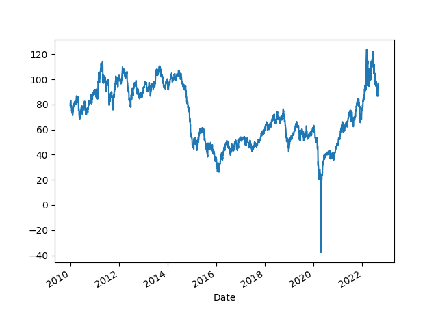

# Economy, Calculations, Data

<a name="prez"></a>

## Potus, Incumbent Elec. College Percentage Prediction 

Time for Change [model](https://pollyvote.com/en/components/models/hybrid/time-for-change-model/),
([my post](../../2015/04/predicting-2016-presidential-election.md))

GDP is taken as annualized quarterly growth rate, quarter growth compared to
previous quarter, [annualized](https://www.fool.com/knowledge-center/how-to-calculate-the-annual-growth-rate-for-real-g.aspx). 


```python
import pandas as pd, datetime
from pandas_datareader import data

today = datetime.datetime.now()
start=datetime.datetime(1945, 1, 1)
end=datetime.datetime(today.year, today.month, today.day)
df = data.DataReader(['GDPC1'], 'fred', start, end)
df['growann'] = (  (  (1+df.pct_change())**4  )-1.0  )*100.0
#print (df[pd.DatetimeIndex(df.index).year == 1984]['growann'])
print (df['growann'].tail(5))
# look at Q2, 04-01 date
```

```text
DATE
2019-10-01     2.365628
2020-01-01    -4.955763
2020-04-01   -31.383181
2020-07-01    33.441306
2020-10-01     4.091780
Name: growann, dtype: float64
```

```python
from io import StringIO
import statsmodels.formula.api as smf
import pandas as pd

s="""year,gdp_growth,net_approval,two_terms,incumbent_vote
2012,1.3,-0.8,0,52
2008,1.3,-37,1,46.3
2004,2.6,-0.5,0,51.2
2000,8,19.5,1,50.3
1996,7.1,15.5,0,54.7
1992,4.3,-18,1,46.5
1988,5.2,10,1,53.9
1984,7.1,20,0,59.2
1980,-7.9,-21.7,0,44.7
1976,3,5,1,48.9
1972,9.8,26,0,61.8
1968,7,-5,1,49.6
1964,4.7,60.3,0,61.3
1960,-1.9,37,1,49.9
1956,3.2,53.5,0,57.8
1952,0.4,-27,1,44.5
1948,7.5,-6,1,52.4
"""
df = pd.read_csv(StringIO(s))
regr = 'incumbent_vote ~ gdp_growth + net_approval + two_terms'
results = smf.ols(regr, data=df).fit()

print ('R^2', results.rsquared)
conf = results.conf_int()

net_approv = -10.0; gdp_growth = 0.0
pred = [1., gdp_growth, net_approv, 0]
print (np.dot(pred, conf), np.dot(pred, results.params))
```

```text
R^2 0.9011858911763367
[49.14454875 51.75431018] 50.4494294659622
```


## The Cycle

<a name="cycle"/>


```python
import pandas as pd, datetime
from pandas_datareader import data

today = datetime.datetime.now()
start=datetime.datetime(1970, 1, 1)
end=datetime.datetime(today.year, today.month, today.day)

fig, axs = plt.subplots(2)

df = data.DataReader(['GDPC1'], 'fred', start, end)
df['gdpyoy'] = (df.GDPC1 - df.GDPC1.shift(4)) / df.GDPC1.shift(4) * 100.0
df['gdpyoy'].plot(ax=axs[0],title="GDP and Inflation YoY")
axs[0].axvspan('01-11-1973', '01-03-1975', color='y', alpha=0.5, lw=0)
axs[0].axvspan('01-07-1981', '01-11-1982', color='y', alpha=0.5, lw=0)
axs[0].axvspan('01-09-1990', '01-07-1991', color='y', alpha=0.5, lw=0)
axs[0].axvspan('01-03-2001', '27-10-2001', color='y', alpha=0.5, lw=0)
axs[0].axvspan('22-12-2007', '09-05-2009', color='y', alpha=0.5, lw=0)
print (df[['gdpyoy']].tail(6))

df = data.DataReader(['CPIAUCNS'], 'fred', start, end)
df['infyoy'] = (df.CPIAUCNS - df.CPIAUCNS.shift(12)) / df.CPIAUCNS.shift(12) * 100.0
df['infyoy'].plot(ax=axs[1])
axs[1].axvspan('01-11-1973', '01-03-1975', color='y', alpha=0.5, lw=0)
axs[1].axvspan('01-07-1981', '01-11-1982', color='y', alpha=0.5, lw=0)
axs[1].axvspan('01-09-1990', '01-07-1991', color='y', alpha=0.5, lw=0)
axs[1].axvspan('01-03-2001', '27-10-2001', color='y', alpha=0.5, lw=0)
axs[1].axvspan('22-12-2007', '09-05-2009', color='y', alpha=0.5, lw=0)
print (df[['infyoy']].tail(6))
            
plt.savefig('cycle.png')
```

```text
              gdpyoy
DATE                
2019-10-01  2.338885
2020-01-01  0.319261
2020-04-01 -9.032775
2020-07-01 -2.848345
2020-10-01 -2.386694
2021-01-01  0.397284
              infyoy
DATE                
2020-12-01  1.362005
2021-01-01  1.399770
2021-02-01  1.676215
2021-03-01  2.619763
2021-04-01  4.159695
2021-05-01  4.992707
```

<a name="infexp"/>

Inflation Expection

Data comes from the University of Michigan [survey](http://www.sca.isr.umich.edu/tables.html). 

```python
import pandas as pd
pd.set_option('display.max_columns', None)
df = pd.read_csv('http://www.sca.isr.umich.edu/files/tbcpx1px5.csv',skiprows=4,header=None)
df1 = df[[0,1,3,5]]
df1 = df1.dropna()
df1.columns = ['Mon','Year','Next Year','Next 5 Years']
df1['sdate'] = df1.apply(lambda x: x.Mon + "-" + str(int(x['Year'])),axis=1)
df1['date'] = pd.to_datetime(df1.sdate)
df1 = df1.set_index('date')
df1[['Next Year','Next 5 Years']].plot()
plt.savefig('infexp.png')
```


## Wages and Unemployment

<a name="nfp"/>

```python
import pandas as pd, datetime
from pandas_datareader import data

today = datetime.datetime.now()
start=datetime.datetime(1986, 1, 1)
end=datetime.datetime(today.year, today.month, today.day)
cols = ['PAYEMS']
df = data.DataReader(cols, 'fred', start, end)
df['nfpyoy'] = (df.PAYEMS - df.PAYEMS.shift(12)) / df.PAYEMS.shift(12) * 100.0
print (df.tail(7))
df.nfpyoy.plot()
plt.grid(True)
plt.axvspan('01-09-1990', '01-07-1991', color='y', alpha=0.5, lw=0)
plt.axvspan('01-03-2001', '27-10-2001', color='y', alpha=0.5, lw=0)
plt.axvspan('22-12-2007', '09-05-2009', color='y', alpha=0.5, lw=0)
plt.title('Non-Farm Payroll YoY Change %')
plt.savefig('nfp.png')
```

```text
            PAYEMS     nfpyoy
DATE                         
2020-12-01  142503  -6.198040
2021-01-01  142736  -6.239079
2021-02-01  143272  -6.065315
2021-03-01  144057  -4.496818
2021-04-01  144326  10.882676
2021-05-01  144909   8.959051
2021-06-01  145759   5.745067
```


```python
import pandas as pd, datetime
from pandas_datareader import data

start=datetime.datetime(1950, 1, 1)
end=datetime.datetime(2019, 11, 1)
cols = ['ECIWAG']
df3 = data.DataReader(cols, 'fred', start, end)
df3 = df3.dropna()
df3['ECIWAG2'] = df3.shift(4).ECIWAG
df3['wagegrowth'] = (df3.ECIWAG-df3.ECIWAG2) / df3.ECIWAG2 * 100.
print (df3['wagegrowth'].tail(4))
df3['wagegrowth'].plot(title='Wage Growth')
plt.savefig('wages.png')
```

```text
DATE
2019-01-01    2.956785
2019-04-01    3.012048
2019-07-01    2.910448
2019-10-01    2.965159
Name: wagegrowth, dtype: float64
```


<a name="claims"></a>

```python
import pandas as pd, datetime
from pandas_datareader import data

today = datetime.datetime.now()
start=datetime.datetime(1995, 1, 1)
end=datetime.datetime(today.year, today.month, today.day)
cols = ['ICSA']
df = data.DataReader(cols, 'fred', start, end)
df.ICSA.plot()
print (df.tail(4))
plt.title("Initial Unemployment Claims")
plt.axvspan('01-03-2001', '27-10-2001', color='y', alpha=0.5, lw=0)
plt.axvspan('22-12-2007', '09-05-2009', color='y', alpha=0.5, lw=0)
plt.savefig('icsa.png')
```

```text
              ICSA
DATE              
2021-06-12  418000
2021-06-19  416000
2021-06-26  371000
2021-07-03  373000
```


<a name="unempl"></a>

Calculation is based on [2]

```python
import pandas as pd, datetime
from pandas_datareader import data

today = datetime.datetime.now()
start=datetime.datetime(1986, 1, 1)
end=datetime.datetime(today.year, today.month, today.day)
cols = ['LNS12032194','UNEMPLOY','NILFWJN','LNS12600000','CLF16OV','UNRATE','U6RATE']
df = data.DataReader(cols, 'fred', start, end)
df['REAL_UNEMP_LEVEL'] = df.LNS12032194*0.5 + df.UNEMPLOY + df.NILFWJN
df['REAL_UNRATE'] = (df.REAL_UNEMP_LEVEL / df.CLF16OV) * 100.0
pd.set_option('display.max_columns', None)
df1 = df.loc[df.index > '2005-01-01']
df1[['UNRATE','U6RATE','REAL_UNRATE']].plot()
plt.title('Unemployment Rate')
print (df1[['UNRATE','U6RATE','REAL_UNRATE','REAL_UNEMP_LEVEL']].tail(5))
plt.savefig('unemploy.png')
```

```text
            UNRATE  U6RATE  REAL_UNRATE  REAL_UNEMP_LEVEL
DATE                                                     
2021-02-01     6.2    11.1    12.451704           19949.0
2021-03-01     6.0    10.7    12.128327           19473.0
2021-04-01     6.1    10.4    11.852126           19080.5
2021-05-01     5.8    10.2    11.527325           18551.5
2021-06-01     5.9     9.8    11.314143           18225.5
```


<a name="pmi"></a>

## PMI

```python
import quandl, os, datetime
from datetime import timedelta

today = datetime.datetime.now()
start=datetime.datetime(1985, 1, 1)
end=datetime.datetime(today.year, today.month, today.day)
today = datetime.datetime.now()
df = quandl.get("ISM/MAN_PMI-PMI-Composite-Index", 
returns="pandas",
start_date=start.strftime('%Y-%m-%d'),
end_date=today.strftime('%Y-%m-%d'),
authtoken=open(".quandl").read())

print (df['PMI'].tail(4))
df['PMI'].plot()
plt.axvspan('01-09-1990', '01-07-1991', color='y', alpha=0.5, lw=0)
plt.axvspan('01-03-2001', '27-10-2001', color='y', alpha=0.5, lw=0)
plt.axvspan('22-12-2007', '09-05-2009', color='y', alpha=0.5, lw=0)
plt.savefig('pmi.png')
```

```text
Date
2021-03-01    64.7
2021-04-01    60.7
2021-05-01    61.2
2021-06-01    60.6
Name: PMI, dtype: float64
```


<a name="gdpism"></a>

## GDP vs ISM

```python
import pandas as pd, datetime
from pandas_datareader import data
import quandl

today = datetime.datetime.now()
start=datetime.datetime(1992, 1, 1)
end=datetime.datetime(today.year, today.month, today.day)
cols = ['GDPC1']
df = data.DataReader(cols, 'fred', start, end)

df['gdpyoy'] = (df.GDPC1 - df.GDPC1.shift(4)) / df.GDPC1.shift(4) * 100.0

df2 = quandl.get("ISM/MAN_PMI-PMI-Composite-Index", 
returns="pandas",
start_date=start.strftime('%Y-%m-%d'),
end_date=end.strftime('%Y-%m-%d'),
authtoken=open(".quandl").read())

plt.figure(figsize=(12,5))
ax1 = df2.PMI.plot(color='blue', grid=True, label='ISM')
ax2 = df.gdpyoy.plot(color='red', grid=True, label='GDP',secondary_y=True)
h1, l1 = ax1.get_legend_handles_labels()
h2, l2 = ax2.get_legend_handles_labels()
plt.legend(h1+h2, l1+l2, loc=2)
plt.savefig('gdp-ism.png')
```


<a name="cpyoy"></a>

## Profits YoY

```python
import pandas as pd, datetime
from pandas_datareader import data

today = datetime.datetime.now()
start=datetime.datetime(2000, 1, 1)
end=datetime.datetime(today.year, today.month, today.day)
cols = ['CPROFIT']
df = data.DataReader(cols, 'fred', start, end)
df['cpyoy'] = (df.CPROFIT - df.CPROFIT.shift(4)) / df.CPROFIT.shift(4) * 100.0
print (df.tail(4))
df.cpyoy.plot()
plt.grid(True)
plt.savefig('profit.png')
```

```text
             CPROFIT      cpyoy
DATE                           
2020-04-01  1826.137 -19.309944
2020-07-01  2325.730   3.528294
2020-10-01  2294.300  -0.734314
2021-01-01  2294.052  12.728166
```


## Dollar

<a name="dollar"></a>

```python
import pandas as pd, datetime, time as timelib
import urllib.request as urllib2, io

end = datetime.datetime.now()
start = datetime.datetime(1980, 1, 1)
start = int(timelib.mktime(start.timetuple()))
end = int(timelib.mktime(end.timetuple()))

base_fin_url = "https://query1.finance.yahoo.com/v7/finance/download"
url = base_fin_url + "/DX-Y.NYB?period1=" + str(start) + "&period2=" + str(end) + "&interval=1d&events=history&includeAdjustedClose=true"
r = urllib2.urlopen(url).read()
file = io.BytesIO(r)
df = pd.read_csv(file,index_col='Date',parse_dates=True)['Adj Close']

print (df.tail(4))
m,s = df.mean(),df.std()
print (np.array([m-s,m+s]).T)
df.tail(1000).plot()
plt.grid(True)
plt.savefig('dollar.png')
```

```text
Date
2021-07-06    92.550003
2021-07-07    92.639999
2021-07-08    92.360001
2021-07-09    92.129997
Name: Adj Close, dtype: float64
[ 80.67397112 111.34537021]
```


<a name="wagepayroll"></a>

## Difference Between Wage Growth YoY and Payrolls (Hiring)

```python
import pandas as pd, datetime
from pandas_datareader import data

today = datetime.datetime.now()
start=datetime.datetime(1986, 1, 1)
end=datetime.datetime(today.year, today.month, today.day)
cols = ['PAYEMS','AHETPI']
df = data.DataReader(cols, 'fred', start, end)
df['nfpyoy'] = (df.PAYEMS - df.PAYEMS.shift(12)) / df.PAYEMS.shift(12) * 100.0
df['wageyoy'] = (df.AHETPI - df.AHETPI.shift(12)) / df.AHETPI.shift(12) * 100.0
df[['wageyoy','nfpyoy']].plot()
plt.axvspan('01-09-1990', '01-07-1991', color='y', alpha=0.5, lw=0)
plt.axvspan('01-03-2001', '27-10-2001', color='y', alpha=0.5, lw=0)
plt.axvspan('22-12-2007', '09-05-2009', color='y', alpha=0.5, lw=0)
print (df['wageyoy'].tail(5))
print (df['nfpyoy'].tail(5))
plt.savefig('pay-wage.png')
```

```text
DATE
2021-02-01    5.217028
2021-03-01    4.637681
2021-04-01    1.152623
2021-05-01    2.279088
2021-06-01    3.673799
Name: wageyoy, dtype: float64
DATE
2021-02-01    -6.065315
2021-03-01    -4.496818
2021-04-01    10.882676
2021-05-01     8.959051
2021-06-01     5.745067
Name: nfpyoy, dtype: float64
```


<a name="wilshire"></a>

## Total Market Cap / GDP

```python
import pandas as pd, datetime
from pandas_datareader import data

today = datetime.datetime.now()
start=datetime.datetime(1995, 1, 1)
end=datetime.datetime(today.year, today.month, today.day)
cols = ['WILL5000IND']
df = data.DataReader(cols, 'fred', start, end)
df.plot()
print (df.tail(4))
plt.axvspan('01-03-2001', '27-10-2001', color='y', alpha=0.5, lw=0)
plt.axvspan('22-12-2007', '09-05-2009', color='y', alpha=0.5, lw=0)
plt.savefig('wilshire.png')
```

```text
            WILL5000IND
DATE                   
2021-06-28       213.97
2021-06-29       213.94
2021-06-30       214.11
2021-07-01       215.21
```


<a name="junkbond"></a>

## Junk Bond Yields

```python
import pandas as pd, datetime
from pandas_datareader import data

today = datetime.datetime.now()
start=datetime.datetime(1980, 1, 1)
end=datetime.datetime(today.year, today.month, today.day)
cols = ['BAMLH0A2HYBEY']
df = data.DataReader(cols, 'fred', start, end)
print (df.tail(6))
df.plot()
plt.plot(df.tail(1).index, df.tail(1),'ro')
plt.axvspan('2001-03-03', '2001-10-27', color='y', alpha=0.5, lw=0)
plt.axvspan('2007-12-22', '2009-05-09', color='y', alpha=0.5, lw=0)
plt.savefig('junkbond.png')
```

```text
            BAMLH0A2HYBEY
DATE                     
2021-05-10           4.49
2021-05-11           4.64
2021-05-12           4.69
2021-05-13           4.70
2021-05-14           4.64
2021-05-17           4.66
```


## Yield Curve, Rates

<a name="curve"></a>

10 Year Treasury Yield - 3 Month Bills

```python
import pandas as pd, datetime
from pandas_datareader import data

pd.set_option('display.max_columns', 10)

today = datetime.datetime.now()
start=datetime.datetime(1980, 1, 1)
end=datetime.datetime(today.year, today.month, today.day)
cols = ['DGS10','DGS3MO']
df = data.DataReader(cols, 'fred', start, end)
df['Yield Curve'] = df.DGS10 - df.DGS3MO
print (df.tail(6))
plt.plot(df.tail(1).index, df.tail(1)['Yield Curve'],'ro')
df['Yield Curve'].plot()
plt.axvspan('01-09-1990', '01-07-1991', color='y', alpha=0.5, lw=0)
plt.axvspan('01-03-2001', '27-10-2001', color='y', alpha=0.5, lw=0)
plt.axvspan('22-12-2007', '09-05-2009', color='y', alpha=0.5, lw=0)
plt.savefig('yield-curve.png')
```

```text
            DGS10  DGS3MO  Yield Curve
DATE                                  
2021-06-24   1.49    0.05         1.44
2021-06-25   1.54    0.06         1.48
2021-06-28   1.49    0.05         1.44
2021-06-29   1.49    0.04         1.45
2021-06-30   1.45    0.05         1.40
2021-07-01   1.48    0.05         1.43
```


<a name='t3mff'/>

3-Month Treasury Constant Maturity Minus Federal Funds Rate

```python
import pandas as pd, datetime
from pandas_datareader import data

pd.set_option('display.max_columns', 10)

today = datetime.datetime.now()
start=datetime.datetime(1999, 1, 1)
end=datetime.datetime(today.year, today.month, today.day)
cols = ['DGS3MO','FEDFUNDS','T3MFF']
df = data.DataReader(cols, 'fred', start, end)
df = df.interpolate()
print (df.tail(6))
df.plot()
plt.axvspan('01-03-2001', '27-10-2001', color='y', alpha=0.5, lw=0)
plt.axvspan('22-12-2007', '09-05-2009', color='y', alpha=0.5, lw=0)
plt.savefig('t3mff.png')
```

```text
            DGS3MO  FEDFUNDS  T3MFF
DATE                               
2021-06-24    0.05      0.08  -0.05
2021-06-25    0.06      0.08  -0.04
2021-06-28    0.05      0.08  -0.05
2021-06-29    0.04      0.08  -0.06
2021-06-30    0.05      0.08  -0.03
2021-07-01    0.05      0.08  -0.05
```


Gold and 10 Year Treasuries

```python
from pandas_datareader import data
import datetime

today = datetime.datetime.now()
start=datetime.datetime(2000, 1, 1)
end=datetime.datetime(today.year, today.month, today.day)
df = data.DataReader(['DGS10', 'GOLDAMGBD228NLBM'], 'fred', start, end)
print (df.tail(5))
ax1 = df.DGS10.plot(color='blue', grid=True, label='10Y')
ax2 = df.GOLDAMGBD228NLBM.plot(color='red', grid=True, label='GOLD',secondary_y=True)
h1, l1 = ax1.get_legend_handles_labels()
h2, l2 = ax2.get_legend_handles_labels()
plt.legend(h1+h2, l1+l2, loc=2)
plt.savefig('10yrgld.png')
```

```text
            DGS10  GOLDAMGBD228NLBM
DATE                               
2021-06-28   1.49           1774.25
2021-06-29   1.49           1769.60
2021-06-30   1.45           1757.80
2021-07-01   1.48           1774.00
2021-07-02    NaN           1783.50
```


<a name="vix"></a>

## VIX

```python
import pandas as pd, datetime, time as timelib
import urllib.request as urllib2, io
end = datetime.datetime.now()
start=datetime.datetime(2000, 1, 1)
start = int(timelib.mktime(start.timetuple()))
end = int(timelib.mktime(end.timetuple()))
base_fin_url = "https://query1.finance.yahoo.com/v7/finance/download"
url = base_fin_url + "/^VIX?period1=" + str(start) + "&period2=" + str(end) + "&interval=1d&events=history&includeAdjustedClose=true"
r = urllib2.urlopen(url).read()
file = io.BytesIO(r)
df = pd.read_csv(file,index_col='Date',parse_dates=True)['Adj Close']
df.plot()
plt.axvspan('01-03-2001', '27-10-2001', color='y', alpha=0.5, lw=0)
plt.axvspan('22-12-2007', '09-05-2009', color='y', alpha=0.5, lw=0)
print (df.tail(7))
plt.plot(df.tail(1).index, df.tail(1),'ro')
plt.savefig('vix.png')
```

```text
Date
2021-06-30    15.830000
2021-07-01    15.480000
2021-07-02    15.070000
2021-07-06    16.440001
2021-07-07    16.200001
2021-07-08    19.000000
2021-07-09    16.180000
Name: Adj Close, dtype: float64
```


<a name="oil"></a>

## Oil

Futures, Continuous Contract, Front Month

```python
import pandas as pd, datetime, time as timelib
import urllib.request as urllib2, io

end = datetime.datetime.now()
start = datetime.datetime(1980, 1, 1)
start = int(timelib.mktime(start.timetuple()))
end = int(timelib.mktime(end.timetuple()))
base_fin_url = "https://query1.finance.yahoo.com/v7/finance/download"
url = base_fin_url + "/CL=F?period1=" + str(start) + "&period2=" + str(end) + "&interval=1d&events=history&includeAdjustedClose=true"
r = urllib2.urlopen(url).read()
file = io.BytesIO(r)
df = pd.read_csv(file,index_col='Date',parse_dates=True)['Close']

print (df.tail(5))
plt.plot(df.tail(1).index, df.tail(1),'ro')
df.plot()
plt.axvspan('01-03-2001', '27-10-2001', color='y', alpha=0.5, lw=0)
plt.axvspan('22-12-2007', '09-05-2009', color='y', alpha=0.5, lw=0)
plt.savefig('oil.png')
```

```text
Date
2021-07-02    75.160004
2021-07-06    73.370003
2021-07-07    72.199997
2021-07-08    72.940002
2021-07-09    74.559998
Name: Close, dtype: float64
```



Oil Production

```python
import pandas as pd
df = pd.read_csv('world-crude.csv',sep='\s', comment='#',index_col=0)
df.columns = ['Production (mil barrels per day)']
df.plot()
plt.savefig('crude-production.png')
```


<a name="credit"/>

## Private Debt to GDP Ratio

```python
import pandas as pd, datetime
from pandas_datareader import data

today = datetime.datetime.now()
start=datetime.datetime(1960, 1, 1)
end=datetime.datetime(today.year, today.month, today.day)

df = data.DataReader(['GDPC1','QUSPAMUSDA'], 'fred', start, end)
df = df.interpolate()
df['Credit to GDP'] = (df.QUSPAMUSDA / df.GDPC1)*100.0
df['Credit to GDP'].plot()
plt.axvspan('01-09-1990', '01-07-1991', color='y', alpha=0.5, lw=0)
plt.axvspan('01-03-2001', '27-10-2001', color='y', alpha=0.5, lw=0)
plt.axvspan('22-12-2007', '09-05-2009', color='y', alpha=0.5, lw=0)
plt.savefig('creditgdp.png')
print (df['Credit to GDP'].tail(4))
```

```text
DATE
2020-04-01    195.193495
2020-07-01    182.902748
2020-10-01    182.816315
2021-01-01    180.019920
Freq: QS-OCT, Name: Credit to GDP, dtype: float64
```


<a name="debt"/>

# Total Consumer Credit Outstanding as % of GDP

```python
import pandas as pd, datetime
from pandas_datareader import data

pd.set_option('display.max_columns', 10)
today = datetime.datetime.now()
start=datetime.datetime(1980, 1, 1)
end=datetime.datetime(today.year, today.month, today.day)
cols = ['TOTALSL','GDP']
df = data.DataReader(cols, 'fred', start, end)
df = df.interpolate(method='linear')
df['debt'] =   df.TOTALSL / df.GDP * 100.0
print (df.debt.tail(4))
df.debt.plot()
plt.axvspan('01-09-1990', '01-07-1991', color='y', alpha=0.5, lw=0)
plt.axvspan('01-03-2001', '27-10-2001', color='y', alpha=0.5, lw=0)
plt.axvspan('22-12-2007', '09-05-2009', color='y', alpha=0.5, lw=0)
plt.savefig('debt.png')
```

```text
DATE
2021-01-01    18.956443
2021-02-01    19.039059
2021-03-01    19.123295
2021-04-01    19.207661
Freq: MS, Name: debt, dtype: float64
```


<a name="gini"/>

# Wealth Inequality - GINI Index

Code taken from [3]

```python
import pandas as pd, datetime
from pandas_datareader import data

def gini(pop,val):
    pop = list(pop); pop.insert(0,0.0)
    val = list(val); val.insert(0,0.0)        
    poparg = np.array(pop)
    valarg = np.array(val)
    z = valarg * poparg;
    ord = np.argsort(val)
    poparg    = poparg[ord]
    z = z[ord]
    poparg    = np.cumsum(poparg)
    z    = np.cumsum(z)
    relpop = poparg/poparg[-1]
    relz = z/z[-1]    
    g = 1 - np.sum((relz[0:-1]+relz[1:]) * np.diff(relpop))
    return np.round(g,3)

today = datetime.datetime.now()
start=datetime.datetime(1989, 1, 1)
end=datetime.datetime(today.year, today.month, today.day)
cols = ['WFRBLT01026', 'WFRBLN09053','WFRBLN40080','WFRBLB50107']
df = data.DataReader(cols, 'fred', start, end)
p = [0.01, 0.09, 0.40, 0.50]
g = df.apply(lambda x: gini(p,x),axis=1)
print (g.tail(4))
g.plot()
plt.xlim('1990-01-01','2023-01-01')
plt.axvspan('1993-01-01','1993-01-01',color='y')
plt.axvspan('2001-01-01','2001-01-01',color='y')
plt.axvspan('2009-01-01','2009-01-01',color='y')
plt.axvspan('2017-01-01','2017-01-01',color='y')
plt.axvspan('2020-12-01','2020-12-01',color='y')
plt.text('1990-01-01',0.44,'HW')
plt.text('1994-01-01',0.46,'Clinton')
plt.text('2003-01-01',0.47,'Bush')
plt.text('2011-01-01',0.44,'Obama')
plt.text('2018-01-01',0.42,'DJT')
plt.text('2020-03-01',0.48,'Biden')
plt.savefig('gini.png')
```

```text
DATE
2020-04-01    0.466
2020-07-01    0.464
2020-10-01    0.463
2021-01-01    0.459
dtype: float64
```


---

References, Notes

[1] Note: for Quandl retrieval get the API key from Quandl, and place the
key in a `.quandl` file in the same directory as this file.

[2] [Komlos](https://www.longfinance.net/news/pamphleteers/true-us-unemployment-rate-march-2019/)

[3] [Mathworks](https://www.mathworks.com/matlabcentral/mlc-downloads/downloads/submissions/28080/versions/1/previews/gini.m/index.html)

