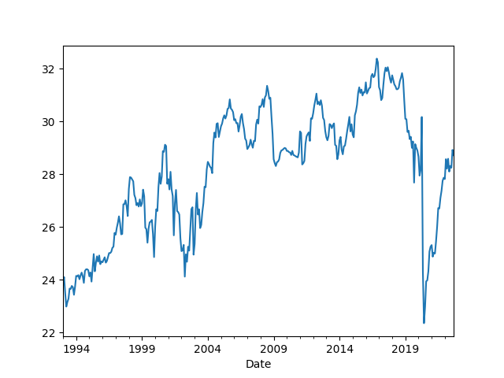
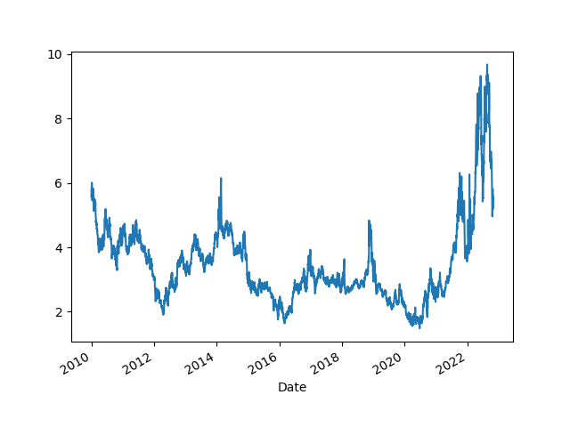

# Economy, Calculations, Data

## GDP

GDP calc seen below is computed as annualized quarterly growth rate,
quarter growth compared to previous quarter,
[annualized](https://www.fool.com/knowledge-center/how-to-calculate-the-annual-growth-rate-for-real-g.aspx).


```python
import pandas as pd, datetime
from pandas_datareader import data

today = datetime.datetime.now()
start=datetime.datetime(1945, 1, 1)
end=datetime.datetime(today.year, today.month, today.day)
df = data.DataReader(['GDPC1'], 'fred', start, end)
df['growann'] = (  (  (1+df.pct_change())**4  )-1.0  )*100.0
print (df['growann'].tail(5))
```

```text
DATE
2020-10-01    4.536294
2021-01-01    6.278177
2021-04-01    6.726283
2021-07-01    2.303426
2021-10-01    6.887441
Name: growann, dtype: float64
```

## The Cycle

<a name="cycle"/>


```python
import pandas as pd, datetime
from pandas_datareader import data

today = datetime.datetime.now()
start=datetime.datetime(1970, 1, 1)
end=datetime.datetime(today.year, today.month, today.day)

fig, axs = plt.subplots(2)

df = data.DataReader(['GDPC1'], 'fred', start, end)
df['gdpyoy'] = (df.GDPC1 - df.GDPC1.shift(4)) / df.GDPC1.shift(4) * 100.0
df['gdpyoy'].plot(ax=axs[0],title="GDP and Inflation (CPI YoY)")
axs[0].axvspan('01-11-1973', '01-03-1975', color='y', alpha=0.5, lw=0)
axs[0].axvspan('01-07-1981', '01-11-1982', color='y', alpha=0.5, lw=0)
axs[0].axvspan('01-09-1990', '01-07-1991', color='y', alpha=0.5, lw=0)
axs[0].axvspan('01-03-2001', '27-10-2001', color='y', alpha=0.5, lw=0)
axs[0].axvspan('22-12-2007', '09-05-2009', color='y', alpha=0.5, lw=0)
print (df[['gdpyoy']].tail(6))

df = data.DataReader(['CPIAUCNS'], 'fred', start, end)
df['inf'] = (df.CPIAUCNS - df.CPIAUCNS.shift(12)) / df.CPIAUCNS.shift(12) * 100.0
df['inf'].plot(ax=axs[1])
axs[1].axvspan('01-11-1973', '01-03-1975', color='y', alpha=0.5, lw=0)
axs[1].axvspan('01-07-1981', '01-11-1982', color='y', alpha=0.5, lw=0)
axs[1].axvspan('01-09-1990', '01-07-1991', color='y', alpha=0.5, lw=0)
axs[1].axvspan('01-03-2001', '27-10-2001', color='y', alpha=0.5, lw=0)
axs[1].axvspan('22-12-2007', '09-05-2009', color='y', alpha=0.5, lw=0)
print (df[['inf']].tail(6))
            
plt.savefig('cycle.png')
```

```text
               gdpyoy
DATE                 
2020-07-01  -2.887506
2020-10-01  -2.262915
2021-01-01   0.546977
2021-04-01  12.226677
2021-07-01   4.946556
2021-10-01   5.531736
                 inf
DATE                
2021-07-01  5.365475
2021-08-01  5.251272
2021-09-01  5.390349
2021-10-01  6.221869
2021-11-01  6.809003
2021-12-01  7.036403
```

<a name="infexp"/>

Inflation Expection

Data comes from the University of Michigan [survey](http://www.sca.isr.umich.edu/tables.html). 

```python
import pandas as pd
pd.set_option('display.max_columns', None)
df = pd.read_csv('http://www.sca.isr.umich.edu/files/tbcpx1px5.csv',skiprows=4,header=None)
df1 = df[[0,1,3,5]]
df1 = df1.dropna()
df1.columns = ['Mon','Year','Next Year','Next 5 Years']
df1['sdate'] = df1.apply(lambda x: x.Mon + "-" + str(int(x['Year'])),axis=1)
df1['date'] = pd.to_datetime(df1.sdate)
df1 = df1.set_index('date')
df1[['Next Year','Next 5 Years']].plot()
print (df1[['Next Year', 'Next 5 Years']].tail(5))
plt.savefig('infexp.png')
```

```text
            Next Year  Next 5 Years
date                               
2021-09-01        4.6           3.0
2021-10-01        4.8           2.9
2021-11-01        4.9           3.0
2021-12-01        4.8           2.9
2022-01-01        4.9           3.1
```


<a name='taylor'/>

The Taylor Rule

```python
import pandas as pd, datetime
from pandas_datareader import data

today = datetime.datetime.now()
start=datetime.datetime(1970, 1, 1)
end=datetime.datetime(today.year, today.month, today.day)
df = data.DataReader(['GDPC1','GDPPOT','PCEPI','FEDFUNDS'], 'fred', start, end)

df = df.interpolate().resample('AS').mean()
longrun = 2.0
df['Gap'] = 100 * (df.GDPC1 / df.GDPPOT - 1.0)
df['Curr'] = df.PCEPI.pct_change()*100.
df['Taylor'] = (longrun + df.Curr + 0.5*(df.Curr - longrun) + 0.5*df.Gap) 
df[['FEDFUNDS','Taylor']].plot()
plt.savefig('taylor.png')
```


## Wages and Unemployment

<a name="nfp"/>

Non-Farm Payroll

```python
import pandas as pd, datetime
from pandas_datareader import data

today = datetime.datetime.now()
start=datetime.datetime(1986, 1, 1)
end=datetime.datetime(today.year, today.month, today.day)
cols = ['PAYEMS']
df = data.DataReader(cols, 'fred', start, end)
df['nfpyoy'] = (df.PAYEMS - df.PAYEMS.shift(12)) / df.PAYEMS.shift(12) * 100.0
print (df.tail(7))
df.nfpyoy.plot()
plt.grid(True)
plt.axvspan('01-09-1990', '01-07-1991', color='y', alpha=0.5, lw=0)
plt.axvspan('01-03-2001', '27-10-2001', color='y', alpha=0.5, lw=0)
plt.axvspan('22-12-2007', '09-05-2009', color='y', alpha=0.5, lw=0)
plt.title('Non-Farm Payroll YoY Change %')
plt.savefig('nfp.png')
```

```text
            PAYEMS    nfpyoy
DATE                        
2021-05-01  144940  8.982360
2021-06-01  145902  5.848810
2021-07-01  146993  5.321497
2021-08-01  147476  4.482497
2021-09-01  147855  4.222324
2021-10-01  148401  4.108176
2021-11-01  148611  4.062769
```


<a name="quits"/>

Job Quits, Resignations

```python
import pandas as pd, datetime
from pandas_datareader import data

today = datetime.datetime.now()
start=datetime.datetime(1986, 1, 1)
end=datetime.datetime(today.year, today.month, today.day)
cols = ['JTSQUR']
df = data.DataReader(cols, 'fred', start, end)
print (df.JTSQUR.tail(5))
df.JTSQUR.plot()
plt.axvspan('01-09-1990', '01-07-1991', color='y', alpha=0.5, lw=0)
plt.axvspan('01-03-2001', '27-10-2001', color='y', alpha=0.5, lw=0)
plt.axvspan('22-12-2007', '09-05-2009', color='y', alpha=0.5, lw=0)
plt.title('Resignations')
plt.savefig('quits.png')
```

```text
DATE
2021-06-01    2.7
2021-07-01    2.7
2021-08-01    2.9
2021-09-01    3.0
2021-10-01    2.8
Name: JTSQUR, dtype: float64
```


<a name="wages"></a>

Wages

```python
import pandas as pd, datetime
from pandas_datareader import data

start=datetime.datetime(1950, 1, 1)
today = datetime.datetime.now()
end=datetime.datetime(today.year, today.month, today.day)
cols = ['ECIWAG']
df3 = data.DataReader(cols, 'fred', start, end)
df3 = df3.dropna()
df3['ECIWAG2'] = df3.shift(4).ECIWAG
df3['wagegrowth'] = (df3.ECIWAG-df3.ECIWAG2) / df3.ECIWAG2 * 100.
print (df3['wagegrowth'].tail(4))
df3['wagegrowth'].plot(title='Wage Growth')
plt.savefig('wages.png')
```

```text
DATE
2020-10-01    2.807775
2021-01-01    2.995720
2021-04-01    3.551136
2021-07-01    4.590395
Name: wagegrowth, dtype: float64
```


<a name="claims"></a>

Claims

```python
import pandas as pd, datetime
from pandas_datareader import data

today = datetime.datetime.now()
start=datetime.datetime(1995, 1, 1)
end=datetime.datetime(today.year, today.month, today.day)
cols = ['ICSA']
df = data.DataReader(cols, 'fred', start, end)
df.ICSA.plot()
print (df.tail(4))
plt.title("Initial Unemployment Claims")
plt.axvspan('01-03-2001', '27-10-2001', color='y', alpha=0.5, lw=0)
plt.axvspan('22-12-2007', '09-05-2009', color='y', alpha=0.5, lw=0)
plt.savefig('icsa.png')
```

```text
              ICSA
DATE              
2021-11-06  269000
2021-11-13  270000
2021-11-20  194000
2021-11-27  222000
```


<a name="wagepayroll"></a>

Difference Between Wage Growth YoY and Payrolls (Hiring)

```python
import pandas as pd, datetime
from pandas_datareader import data

today = datetime.datetime.now()
start=datetime.datetime(1986, 1, 1)
end=datetime.datetime(today.year, today.month, today.day)
cols = ['PAYEMS','AHETPI']
df = data.DataReader(cols, 'fred', start, end)
df['nfpyoy'] = (df.PAYEMS - df.PAYEMS.shift(12)) / df.PAYEMS.shift(12) * 100.0
df['wageyoy'] = (df.AHETPI - df.AHETPI.shift(12)) / df.AHETPI.shift(12) * 100.0
df[['wageyoy','nfpyoy']].plot()
plt.axvspan('01-09-1990', '01-07-1991', color='y', alpha=0.5, lw=0)
plt.axvspan('01-03-2001', '27-10-2001', color='y', alpha=0.5, lw=0)
plt.axvspan('22-12-2007', '09-05-2009', color='y', alpha=0.5, lw=0)
print (df['wageyoy'].tail(5))
print (df['nfpyoy'].tail(5))
plt.savefig('pay-wage.png')
```

```text
DATE
2021-06-01    3.835285
2021-07-01    4.823672
2021-08-01    4.836759
2021-09-01    5.526422
2021-10-01    5.759162
Name: wageyoy, dtype: float64
DATE
2021-06-01    5.848810
2021-07-01    5.321497
2021-08-01    4.482497
2021-09-01    4.175096
2021-10-01    4.050651
Name: nfpyoy, dtype: float64
```


<a name="unempl"></a>

Unemployment

Calculation is based on [2]

```python
import pandas as pd, datetime
from pandas_datareader import data

today = datetime.datetime.now()
start=datetime.datetime(1986, 1, 1)
end=datetime.datetime(today.year, today.month, today.day)
cols = ['LNS12032194','UNEMPLOY','NILFWJN','LNS12600000','CLF16OV','UNRATE','U6RATE']
df = data.DataReader(cols, 'fred', start, end)
df['REAL_UNEMP_LEVEL'] = df.LNS12032194*0.5 + df.UNEMPLOY + df.NILFWJN
df['REAL_UNRATE'] = (df.REAL_UNEMP_LEVEL / df.CLF16OV) * 100.0
pd.set_option('display.max_columns', None)
df1 = df.loc[df.index > '2005-01-01']
df1[['UNRATE','U6RATE','REAL_UNRATE']].plot()
plt.title('Unemployment Rate')
print (df1[['UNRATE','U6RATE','REAL_UNRATE','REAL_UNEMP_LEVEL']].tail(5))
plt.savefig('unemploy.png')
```

```text
            UNRATE  U6RATE  REAL_UNRATE  REAL_UNEMP_LEVEL
DATE                                                     
2021-07-01     5.4     9.2    10.821707           17460.5
2021-08-01     5.2     8.8    10.090877           16300.5
2021-09-01     4.8     8.5     9.839855           15877.0
2021-10-01     4.6     8.3     9.667220           15608.5
2021-11-01     4.2     7.8     9.181621           14879.0
```


<a name="pmi"></a>

## Companies

PMI

```python
import quandl, os, datetime
from datetime import timedelta

today = datetime.datetime.now()
start=datetime.datetime(1985, 1, 1)
end=datetime.datetime(today.year, today.month, today.day)
today = datetime.datetime.now()
df = quandl.get("ISM/MAN_PMI-PMI-Composite-Index", 
returns="pandas",
start_date=start.strftime('%Y-%m-%d'),
end_date=today.strftime('%Y-%m-%d'),
authtoken=open(".quandl").read())

print (df['PMI'].tail(4))
df['PMI'].plot()
plt.axvspan('01-09-1990', '01-07-1991', color='y', alpha=0.5, lw=0)
plt.axvspan('01-03-2001', '27-10-2001', color='y', alpha=0.5, lw=0)
plt.axvspan('22-12-2007', '09-05-2009', color='y', alpha=0.5, lw=0)
plt.savefig('pmi.png')
```

```text
Date
2021-07-01    59.5
2021-08-01    59.9
2021-09-01    61.1
2021-10-01    60.8
Name: PMI, dtype: float64
```


<a name="gdpism"></a>

GDP vs ISM

```python
import pandas as pd, datetime
from pandas_datareader import data
import quandl

today = datetime.datetime.now()
start=datetime.datetime(1992, 1, 1)
end=datetime.datetime(today.year, today.month, today.day)
cols = ['GDPC1']
df = data.DataReader(cols, 'fred', start, end)

df['gdpyoy'] = (df.GDPC1 - df.GDPC1.shift(4)) / df.GDPC1.shift(4) * 100.0

df2 = quandl.get("ISM/MAN_PMI-PMI-Composite-Index", 
returns="pandas",
start_date=start.strftime('%Y-%m-%d'),
end_date=end.strftime('%Y-%m-%d'),
authtoken=open(".quandl").read())

plt.figure(figsize=(12,5))
ax1 = df2.PMI.plot(color='blue', grid=True, label='ISM')
ax2 = df.gdpyoy.plot(color='red', grid=True, label='GDP',secondary_y=True)
h1, l1 = ax1.get_legend_handles_labels()
h2, l2 = ax2.get_legend_handles_labels()
plt.legend(h1+h2, l1+l2, loc=2)
plt.savefig('gdp-ism.png')
```


<a name="cpyoy"></a>

Profits YoY

```python
import pandas as pd, datetime
from pandas_datareader import data

today = datetime.datetime.now()
start=datetime.datetime(2000, 1, 1)
end=datetime.datetime(today.year, today.month, today.day)
cols = ['CPROFIT']
df = data.DataReader(cols, 'fred', start, end)
df['cpyoy'] = (df.CPROFIT - df.CPROFIT.shift(4)) / df.CPROFIT.shift(4) * 100.0
print (df.tail(4))
df.cpyoy.plot()
plt.grid(True)
plt.savefig('profit.png')
```

```text
             CPROFIT      cpyoy
DATE                           
2020-10-01  2427.518   0.930172
2021-01-01  2551.412  17.605585
2021-04-01  2819.190  45.122409
2021-07-01  2916.068  19.734996
```


## Finance

Dollar

<a name="dollar"></a>

```python
import pandas as pd, datetime, time as timelib
import urllib.request as urllib2, io

end = datetime.datetime.now()
start = datetime.datetime(1980, 1, 1)
start = int(timelib.mktime(start.timetuple()))
end = int(timelib.mktime(end.timetuple()))

base_fin_url = "https://query1.finance.yahoo.com/v7/finance/download"
url = base_fin_url + "/DX-Y.NYB?period1=" + str(start) + "&period2=" + str(end) + "&interval=1d&events=history&includeAdjustedClose=true"
r = urllib2.urlopen(url).read()
file = io.BytesIO(r)
df = pd.read_csv(file,index_col='Date',parse_dates=True)['Adj Close']

print (df.tail(4))
m,s = df.mean(),df.std()
print (np.array([m-s,m+s]).T)
df.tail(1000).plot()
plt.grid(True)
plt.savefig('dollar.png')
```

```text
Date
2022-01-14    95.169998
2022-01-16          NaN
2022-01-18    95.730003
2022-01-19    95.549004
Name: Adj Close, dtype: float64
[ 80.71814075 111.18989674]
```


<a name="wilshire"></a>

Total Market Cap / GDP

```python
import pandas as pd, datetime
from pandas_datareader import data

today = datetime.datetime.now()
start=datetime.datetime(1995, 1, 1)
end=datetime.datetime(today.year, today.month, today.day)
cols = ['WILL5000IND']
df = data.DataReader(cols, 'fred', start, end)
print (df.tail(4))
df.plot()
plt.axvspan('01-03-2001', '27-10-2001', color='y', alpha=0.5, lw=0)
plt.axvspan('22-12-2007', '09-05-2009', color='y', alpha=0.5, lw=0)
plt.savefig('wilshire.png')
```

```text
            WILL5000IND
DATE                   
2022-01-17          NaN
2022-01-18       224.88
2022-01-19       222.57
2022-01-20       219.99
```


<a name="junkbond"></a>

Junk Bond Yields

```python
import pandas as pd, datetime
from pandas_datareader import data

today = datetime.datetime.now()
start=datetime.datetime(1980, 1, 1)
end=datetime.datetime(today.year, today.month, today.day)
cols = ['BAMLH0A2HYBEY']
df = data.DataReader(cols, 'fred', start, end)
print (df.tail(6))
df.plot()
plt.plot(df.tail(1).index, df.tail(1),'ro')
plt.axvspan('2001-03-03', '2001-10-27', color='y', alpha=0.5, lw=0)
plt.axvspan('2007-12-22', '2009-05-09', color='y', alpha=0.5, lw=0)
plt.savefig('junkbond.png')
```

```text
            BAMLH0A2HYBEY
DATE                     
2022-01-06           5.02
2022-01-07           5.09
2022-01-10           5.16
2022-01-11           5.06
2022-01-12           4.90
2022-01-13           4.93
```


Yield Curve, Rates

<a name="curve"></a>

10 Year Treasury Yield - 3 Month Bills

```python
import pandas as pd, datetime
from pandas_datareader import data

pd.set_option('display.max_columns', 10)

today = datetime.datetime.now()
start=datetime.datetime(1980, 1, 1)
end=datetime.datetime(today.year, today.month, today.day)
cols = ['DGS10','DGS3MO']
df = data.DataReader(cols, 'fred', start, end)
df['Yield Curve'] = df.DGS10 - df.DGS3MO
print (df.tail(6))
plt.plot(df.tail(1).index, df.tail(1)['Yield Curve'],'ro')
df['Yield Curve'].plot()
plt.axvspan('01-09-1990', '01-07-1991', color='y', alpha=0.5, lw=0)
plt.axvspan('01-03-2001', '27-10-2001', color='y', alpha=0.5, lw=0)
plt.axvspan('22-12-2007', '09-05-2009', color='y', alpha=0.5, lw=0)
plt.savefig('yield-curve.png')
```

```text
            DGS10  DGS3MO  Yield Curve
DATE                                  
2022-01-06   1.73    0.10         1.63
2022-01-07   1.76    0.10         1.66
2022-01-10   1.78    0.13         1.65
2022-01-11   1.75    0.11         1.64
2022-01-12   1.74    0.12         1.62
2022-01-13   1.70    0.12         1.58
```


Gold and 10 Year Treasuries

```python
from pandas_datareader import data
import datetime

today = datetime.datetime.now()
start=datetime.datetime(2000, 1, 1)
end=datetime.datetime(today.year, today.month, today.day)
df = data.DataReader(['DGS10', 'GOLDAMGBD228NLBM'], 'fred', start, end)
df = df.interpolate()
print (df.tail(10))
ax1 = df.DGS10.plot(color='blue', grid=True, label='10Y')
ax2 = df.GOLDAMGBD228NLBM.plot(color='red', grid=True, label='GOLD',secondary_y=True)
h1, l1 = ax1.get_legend_handles_labels()
h2, l2 = ax2.get_legend_handles_labels()
plt.legend(h1+h2, l1+l2, loc=2)
plt.savefig('10yrgld.png')
```

```text
            DGS10  GOLDAMGBD228NLBM
DATE                               
2022-01-10  1.780           1800.55
2022-01-11  1.750           1805.20
2022-01-12  1.740           1816.40
2022-01-13  1.700           1822.40
2022-01-14  1.780           1822.25
2022-01-17  1.825           1820.05
2022-01-18  1.870           1810.80
2022-01-19  1.830           1817.50
2022-01-20  1.830           1836.70
2022-01-21  1.830           1834.25
```


<a name="vix"></a>

VIX

```python
import pandas as pd, datetime, time as timelib
import urllib.request as urllib2, io
end = datetime.datetime.now()
start=datetime.datetime(2000, 1, 1)
start = int(timelib.mktime(start.timetuple()))
end = int(timelib.mktime(end.timetuple()))
base_fin_url = "https://query1.finance.yahoo.com/v7/finance/download"
url = base_fin_url + "/^VIX?period1=" + str(start) + "&period2=" + str(end) + "&interval=1d&events=history&includeAdjustedClose=true"
r = urllib2.urlopen(url).read()
file = io.BytesIO(r)
df = pd.read_csv(file,index_col='Date',parse_dates=True)['Adj Close']
df.plot()
plt.axvspan('01-03-2001', '27-10-2001', color='y', alpha=0.5, lw=0)
plt.axvspan('22-12-2007', '09-05-2009', color='y', alpha=0.5, lw=0)
print (df.tail(7))
plt.plot(df.tail(1).index, df.tail(1),'ro')
plt.savefig('vix.png')
```

```text
Date
2022-01-20    25.590000
2022-01-21    28.850000
2022-01-24    29.900000
2022-01-25    31.160000
2022-01-26    31.959999
2022-01-27    30.490000
2022-01-28    27.660000
Name: Adj Close, dtype: float64
```


## Commodities

<a name="oil"></a>

Oil Price (Futures, Continuous Contract, Front Month)

```python
import pandas as pd, datetime, time as timelib
import urllib.request as urllib2, io

end = datetime.datetime.now()
start = datetime.datetime(1980, 1, 1)
start = int(timelib.mktime(start.timetuple()))
end = int(timelib.mktime(end.timetuple()))
base_fin_url = "https://query1.finance.yahoo.com/v7/finance/download"
url = base_fin_url + "/CL=F?period1=" + str(start) + "&period2=" + str(end) + "&interval=1d&events=history&includeAdjustedClose=true"
r = urllib2.urlopen(url).read()
file = io.BytesIO(r)
df = pd.read_csv(file,index_col='Date',parse_dates=True)['Close']

print (df.tail(5))
plt.plot(df.tail(1).index, df.tail(1),'ro')
df.plot()
plt.axvspan('01-03-2001', '27-10-2001', color='y', alpha=0.5, lw=0)
plt.axvspan('22-12-2007', '09-05-2009', color='y', alpha=0.5, lw=0)
plt.savefig('oil.png')
```

```text
Date
2022-01-12    82.639999
2022-01-13    82.120003
2022-01-14    83.820000
2022-01-18    85.430000
2022-01-19    85.889999
Name: Close, dtype: float64
```


<a name="gasoline"></a>

Gasoline Price

```python
import pandas as pd, requests
from datetime import date

api_key = open('.eiakey').read()
url = 'http://api.eia.gov/series/?api_key=' + api_key + '&series_id=PET.EMM_EPM0_PTE_NUS_DPG.W' 
r = requests.get(url)
json_data = r.json()
df = pd.DataFrame(json_data.get('series')[0].get('data'))
df['Date'] = pd.to_datetime(df[0])
df = df.set_index('Date')
df[1].plot()
plt.savefig('gasoline.png')
```


<a name="opec"></a>

Opec Oil Production

```python
import pandas as pd, requests
from datetime import date

api_key = open('.eiakey').read()
url = 'http://api.eia.gov/series/?api_key=' + api_key + '&series_id=STEO.COPR_OPEC.M' 
r = requests.get(url)
json_data = r.json()
df = pd.DataFrame(json_data.get('series')[0].get('data'))
df = pd.DataFrame(json_data.get('series')[0].get('data'))
df['Year'] = df[0].astype(str).str[:4]
df['Month'] = df[0].astype(str).str[4:]
df['Day'] = 1
df['Date'] = pd.to_datetime(df[['Year','Month','Day']])
df = df.set_index('Date')
df[1].plot()
print (df[1].head(5))
plt.legend(['Oil Production Per Month (mil barrels per day)'])
plt.savefig('opec.png')
```

```text
Date
2023-12-01    28.838708
2023-11-01    28.850048
2023-10-01    28.871389
2023-09-01    28.887729
2023-08-01    28.899069
Name: 1, dtype: float64
```



<a name="worldoil"></a>

World Oil Production 

```python
import pandas as pd, requests
from datetime import date

api_key = open('.eiakey').read()
url = 'http://api.eia.gov/series/?api_key=' + api_key + '&series_id=INTL.53-1-WORL-TBPD.M' 
r = requests.get(url)
json_data = r.json()
df = pd.DataFrame(json_data.get('series')[0].get('data'))
df['Year'] = df[0].astype(str).str[:4]
df['Month'] = df[0].astype(str).str[4:]
df['Day'] = 1
df['Date'] = pd.to_datetime(df[['Year','Month','Day']])
df = df.set_index('Date')
df[1].plot()
plt.legend(['World Oil Production Per Month (thousand barrels per day)'])
plt.savefig('crude-production.png')
```


<a name="natgas"></a>

World Natural Gas Price

```python
import pandas as pd, datetime, time as timelib
import urllib.request as urllib2, io
end = datetime.datetime.now()
start=datetime.datetime(2010, 1, 1)
start = int(timelib.mktime(start.timetuple()))
end = int(timelib.mktime(end.timetuple()))
base_fin_url = "https://query1.finance.yahoo.com/v7/finance/download"
url = base_fin_url + "/NG=F?period1=" + str(start) + "&period2=" + str(end) + "&interval=1d&events=history&includeAdjustedClose=true"
r = urllib2.urlopen(url).read()
file = io.BytesIO(r)
df = pd.read_csv(file,index_col='Date',parse_dates=True)['Adj Close']
df.plot()
plt.plot(df.tail(1).index, df.tail(1),'ro')
print (df.tail(7))
plt.savefig('natgas.png')
```

```text
Date
2022-01-07    3.916
2022-01-10    4.079
2022-01-11    4.249
2022-01-12    4.857
2022-01-13    4.270
2022-01-14    4.262
2022-01-14    4.228
Name: Adj Close, dtype: float64
```



<a name="eunatgas"></a>

EI Natural Gas Price

Price is from Dutch TTF contract which is considered as the benchmark
price for natural gas in Europe. Unit is 1 MW of energy, priced in
Euros.

```python
import pandas as pd, datetime, time as timelib
import urllib.request as urllib2, io
end = datetime.datetime.now()
start=datetime.datetime(2010, 1, 1)
start = int(timelib.mktime(start.timetuple()))
end = int(timelib.mktime(end.timetuple()))
base_fin_url = "https://query1.finance.yahoo.com/v7/finance/download"
url = base_fin_url + "/TTF=F?period1=" + str(start) + "&period2=" + str(end) + "&interval=1d&events=history&includeAdjustedClose=true"
r = urllib2.urlopen(url).read()
file = io.BytesIO(r)
df = pd.read_csv(file,index_col='Date',parse_dates=True)['Adj Close']
df.plot()
plt.plot(df.tail(1).index, df.tail(1),'ro')
print (df.tail(7))
plt.savefig('eunatgas.png')
```

```text
Date
2022-01-20    75.203003
2022-01-21    78.980003
2022-01-24    93.000000
2022-01-25    93.582001
2022-01-26    91.836998
2022-01-27    92.301003
2022-01-28    92.061996
Name: Adj Close, dtype: float64
```


<a name="coal"></a>

Coal Price

```python
import pandas as pd, datetime, time as timelib
import urllib.request as urllib2, io
end = datetime.datetime.now()
start=datetime.datetime(2010, 1, 1)
start = int(timelib.mktime(start.timetuple()))
end = int(timelib.mktime(end.timetuple()))
base_fin_url = "https://query1.finance.yahoo.com/v7/finance/download"
url = base_fin_url + "/MTF=F?period1=" + str(start) + "&period2=" + str(end) + "&interval=1d&events=history&includeAdjustedClose=true"
r = urllib2.urlopen(url).read()
file = io.BytesIO(r)
df = pd.read_csv(file,index_col='Date',parse_dates=True)['Adj Close']
df = df.interpolate()
df.plot()
plt.plot(df.tail(1).index, df.tail(1),'ro')
print (df.tail(7))
plt.savefig('coal.png')
```

```text
Date
2022-01-23    162.675003
2022-01-24    163.350006
2022-01-25    164.250000
2022-01-26    165.699997
2022-01-27    165.649994
2022-01-28    167.199997
2022-01-30    167.199997
Name: Adj Close, dtype: float64
```


## Wealth, Debt

<a name="credit"/>

Private Debt to GDP Ratio

```python
import pandas as pd, datetime
from pandas_datareader import data

today = datetime.datetime.now()
start=datetime.datetime(1960, 1, 1)
end=datetime.datetime(today.year, today.month, today.day)

df = data.DataReader(['GDPC1','QUSPAMUSDA'], 'fred', start, end)
df = df.interpolate()
df['Credit to GDP'] = (df.QUSPAMUSDA / df.GDPC1)*100.0
df['Credit to GDP'].plot()
plt.axvspan('01-09-1990', '01-07-1991', color='y', alpha=0.5, lw=0)
plt.axvspan('01-03-2001', '27-10-2001', color='y', alpha=0.5, lw=0)
plt.axvspan('22-12-2007', '09-05-2009', color='y', alpha=0.5, lw=0)
plt.axvspan('2020-02-01', '2020-05-01', color='y', alpha=0.5, lw=0)
plt.savefig('creditgdp.png')
print (df['Credit to GDP'].tail(4))
```

```text
DATE
2021-01-01    182.993106
2021-04-01    181.919434
2021-07-01    180.886665
2021-10-01    177.899564
Freq: QS-OCT, Name: Credit to GDP, dtype: float64
```


<a name="debt"/>

Total Consumer Credit Outstanding as % of GDP

```python
import pandas as pd, datetime
from pandas_datareader import data

pd.set_option('display.max_columns', 10)
today = datetime.datetime.now()
start=datetime.datetime(1980, 1, 1)
end=datetime.datetime(today.year, today.month, today.day)
cols = ['TOTALSL','GDP']
df = data.DataReader(cols, 'fred', start, end)
df = df.interpolate(method='linear')
df['debt'] =   df.TOTALSL / df.GDP * 100.0
print (df.debt.tail(4))
df.debt.plot()
plt.axvspan('01-09-1990', '01-07-1991', color='y', alpha=0.5, lw=0)
plt.axvspan('01-03-2001', '27-10-2001', color='y', alpha=0.5, lw=0)
plt.axvspan('22-12-2007', '09-05-2009', color='y', alpha=0.5, lw=0)
plt.axvspan('2020-02-01', '2020-05-01', color='y', alpha=0.5, lw=0)
plt.savefig('debt.png')
```

```text
DATE
2021-08-01    18.464180
2021-09-01    18.368829
2021-10-01    18.233940
2021-11-01    18.400624
Freq: MS, Name: debt, dtype: float64
```


<a name="gini"/>

Wealth Inequality - GINI Index

Code taken from [3]

```python
import pandas as pd, datetime
from pandas_datareader import data

def gini(pop,val):
    pop = list(pop); pop.insert(0,0.0)
    val = list(val); val.insert(0,0.0)        
    poparg = np.array(pop)
    valarg = np.array(val)
    z = valarg * poparg;
    ord = np.argsort(val)
    poparg    = poparg[ord]
    z = z[ord]
    poparg    = np.cumsum(poparg)
    z    = np.cumsum(z)
    relpop = poparg/poparg[-1]
    relz = z/z[-1]    
    g = 1 - np.sum((relz[0:-1]+relz[1:]) * np.diff(relpop))
    return np.round(g,3)

today = datetime.datetime.now()
start=datetime.datetime(1989, 1, 1)
end=datetime.datetime(today.year, today.month, today.day)
cols = ['WFRBLT01026', 'WFRBLN09053','WFRBLN40080','WFRBLB50107']
df = data.DataReader(cols, 'fred', start, end)
p = [0.01, 0.09, 0.40, 0.50]
g = df.apply(lambda x: gini(p,x),axis=1)
print (g.tail(4))
g.plot()
plt.xlim('1990-01-01','2023-01-01')
plt.axvspan('1993-01-01','1993-01-01',color='y')
plt.axvspan('2001-01-01','2001-01-01',color='y')
plt.axvspan('2009-01-01','2009-01-01',color='y')
plt.axvspan('2017-01-01','2017-01-01',color='y')
plt.axvspan('2020-12-01','2020-12-01',color='y')
plt.text('1990-01-01',0.44,'HW')
plt.text('1994-01-01',0.46,'Clinton')
plt.text('2003-01-01',0.47,'Bush')
plt.text('2011-01-01',0.44,'Obama')
plt.text('2018-01-01',0.42,'DJT')
plt.text('2020-03-01',0.48,'Biden')
plt.savefig('gini.png')
```

```text
DATE
2020-10-01    0.465
2021-01-01    0.462
2021-04-01    0.454
2021-07-01    0.445
dtype: float64
```


---

References, Notes

[1] Note: for Quandl retrieval get the API key from Quandl, and place the
key in a `.quandl` file in the same directory as this file.

[2] [Komlos](https://www.longfinance.net/news/pamphleteers/true-us-unemployment-rate-march-2019/)

[3] [Mathworks](https://www.mathworks.com/matlabcentral/mlc-downloads/downloads/submissions/28080/versions/1/previews/gini.m/index.html)

