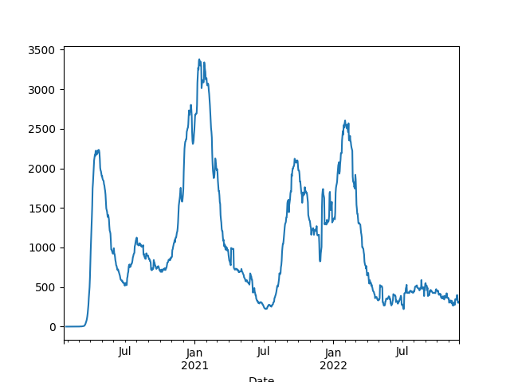
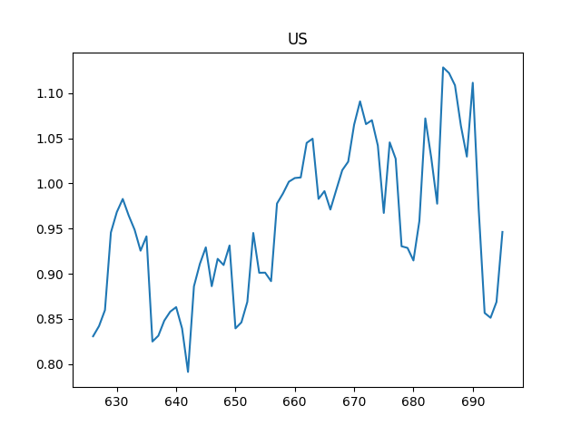

# Coronavirus Data, Analysis

### Mortality Rate

Fatality / Cases ratio is around 2.2%, the cases is for people with
symptoms. What would be the fatality rate for the broader population?
On one of those cruise ships which experienced the epidemic in an
isolated environment, they found about 1/3 rd of the people were
infected. We can assume the virus reached everyone possible on that
ship. 1/3 of mortality rate is nearly 1%. So if given the chance,
covid can kill 1% of an entire population. As a reference point,
annual growth of world population hovers around the same ratio


Code is from [2]

<a mame='mortality'/>

```python
import util
world_rate_df = util.mortality_rate()
world_rate_df['deaths / 100 confirmed'].plot(title='Worldwide Mortality Rate')
plt.savefig('mort.png')
```

```text
8/31/21    2.075917
9/1/21     2.074744
9/2/21     2.073132
9/3/21     2.071545
Name: deaths / 100 confirmed, dtype: float64
```


The SIR Model

$$
\frac{ds}{dt} = -\beta s i
$$

$$
\frac{di}{dt} = \beta s i - \gamma i
$$

$$
\frac{dr}{dt} = \gamma i
$$

Where does $R_0$ come from? Epidemic occurs if \# of infected ppl
increase, meaning $di / dt > 0$. That means (from 2nd eq above)

$$
\beta si - \gamma i > 0  \implies \frac{\beta s i }{\gamma} > i
$$

Then,

$$
\frac{\beta s }{\gamma} > 1
$$

At the beginning of the epidemic everyone is susceptible, so $s
\approx 1$. Substitute $s=1$

$$
\frac{\beta}{\gamma} = R_0 > 1
$$

To find $R_0$ from data, we fit the differential equation system above
to data, and using the found $\beta$ and $\gamma$ we calculate $R_0$.

### Graphs

<a name='usdailydeath'/>

US Daily Deaths, 7-Day Moving Average

```python
import util, pandas as pd
df = util.get_data_combined()
df1 = df[(df['Country/Region']=='US')&(df.index > '2020-01-01')]
df1['New deaths'] = df1['New deaths'].rolling(7).mean()
print (df1['New deaths'].tail(5))
df1['New deaths'].plot()
plt.savefig('US-deaths.png')
```

```text
Date
2022-01-04    1221.142857
2022-01-05    1191.000000
2022-01-06    1256.428571
2022-01-07    1546.714286
2022-01-08    1602.714286
Name: New deaths, dtype: float64
```



<a name='Rt'/>

Reproduction Rate $R_t$

This calculation is based on [1]

```python
import util, pandas as pd

df1 = df[(df['Country/Region']=='US')&(df.index > '2021-01-01')]
tau = 7 # length of time window
si_mean = 6.3 # mean of serial interval
si_std = 4.2 # standard deviation of serial interval
conf = 0.95 # confidence level of estimated Reff
c = df1['New cases']
R = util.Reff(c, si_mean, si_std, tau, conf)
df2 = pd.DataFrame(R.T)
print (df2[1].tail(5))
# 0,2 indices 95% conf
df2[1].tail(70).plot()
plt.title('US')
plt.savefig('Rt-US.png')
```

```text
354    1.291096
355    1.379105
356    1.278807
357    1.273641
358    1.310040
Name: 1, dtype: float64
```




Code

[util.py](util.py)

References

[1] https://github.com/tt-nakamura/Reff.git

[2] https://notebooks.ai/rmotr-curriculum/analyzing-covid19-outbreak-40c03c06

[4] https://web.stanford.edu/~jhj1/teachingdocs/Jones-on-R0.pdf


