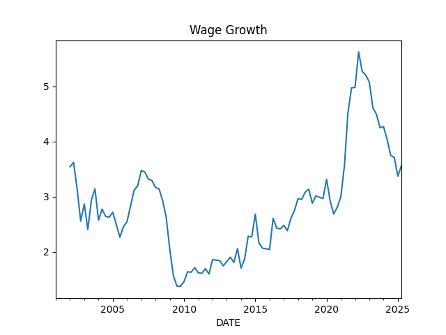
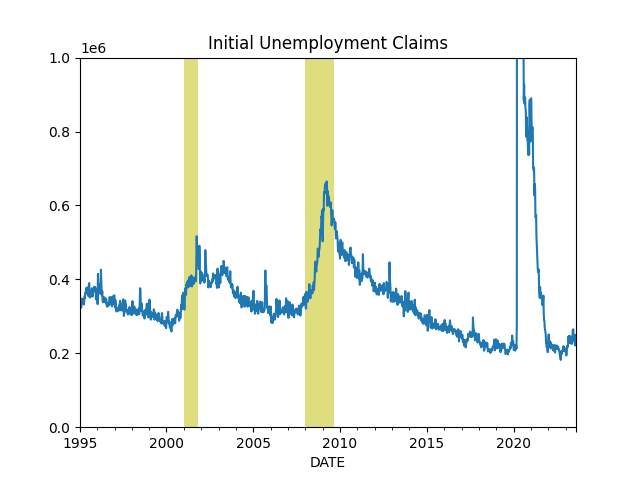
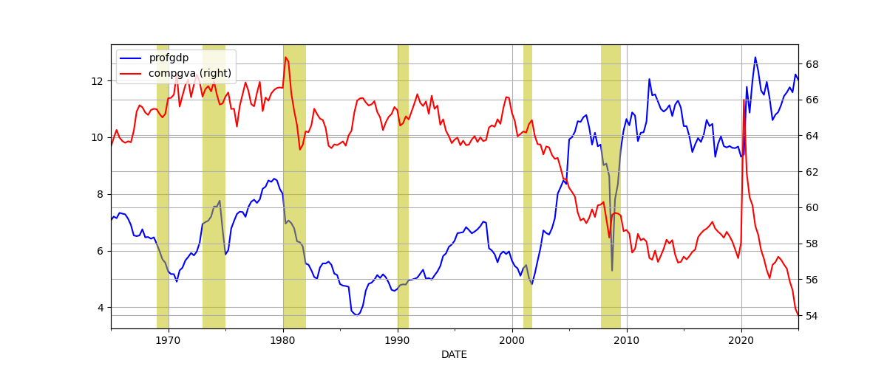
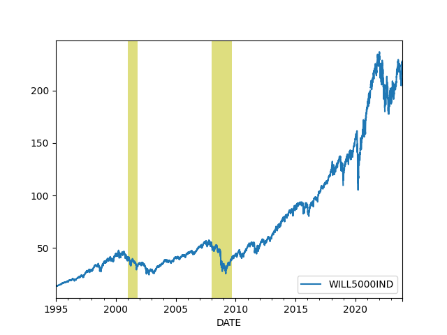
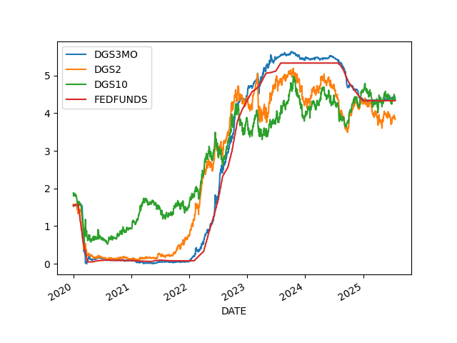
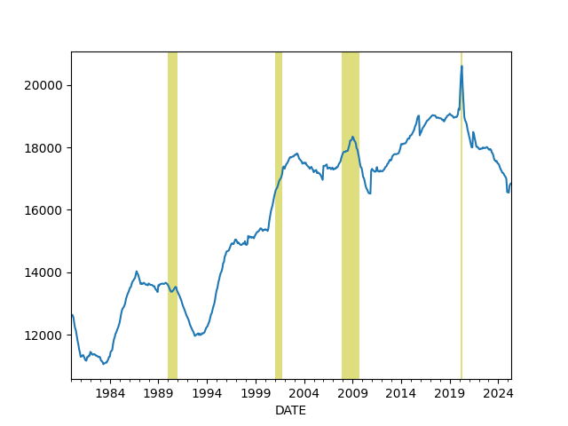

# Economy, Calculations, Data

```python
import impl as u
import pandas as pd
pd.set_option('display.max_columns', None)
```

<a name='gdp'/>

## GDP

GDP calc seen below is computed as annualized quarterly growth rate,
quarter growth compared to previous quarter,
[annualized](https://www.fool.com/knowledge-center/how-to-calculate-the-annual-growth-rate-for-real-g.aspx).


```python
df = u.get_fred(1945,'GDPC1')
df['growann'] = (  (  (1+df.pct_change())**4  )-1.0  )*100.0
print (df['growann'].tail(5))
```

```text
DATE
2021-10-01    6.957257
2022-01-01   -1.631278
2022-04-01   -0.577282
2022-07-01    3.243338
2022-10-01    2.574072
Name: growann, dtype: float64
```

## The Cycle

<a name="cycle"/>


```python
df = u.get_fred(1970,'GDPC1')

fig, axs = plt.subplots(2)

df['gdpyoy'] = (df.GDPC1 - df.GDPC1.shift(4)) / df.GDPC1.shift(4) * 100.0
df['gdpyoy'].plot(ax=axs[0],title="GDP and Inflation (CPI YoY)")
axs[0].axvspan('01-11-1973', '01-03-1975', color='y', alpha=0.5, lw=0)
axs[0].axvspan('01-07-1981', '01-11-1982', color='y', alpha=0.5, lw=0)
axs[0].axvspan('01-09-1990', '01-07-1991', color='y', alpha=0.5, lw=0)
axs[0].axvspan('01-03-2001', '27-10-2001', color='y', alpha=0.5, lw=0)
axs[0].axvspan('22-12-2007', '09-05-2009', color='y', alpha=0.5, lw=0)
print (df[['gdpyoy']].tail(6))

df = u.get_fred(1970,'CPIAUCNS')
df['inf'] = (df.CPIAUCNS - df.CPIAUCNS.shift(12)) / df.CPIAUCNS.shift(12) * 100.0
df['inf'].plot(ax=axs[1])
axs[1].axvspan('01-11-1973', '01-03-1975', color='y', alpha=0.5, lw=0)
axs[1].axvspan('01-07-1981', '01-11-1982', color='y', alpha=0.5, lw=0)
axs[1].axvspan('01-09-1990', '01-07-1991', color='y', alpha=0.5, lw=0)
axs[1].axvspan('01-03-2001', '27-10-2001', color='y', alpha=0.5, lw=0)
axs[1].axvspan('22-12-2007', '09-05-2009', color='y', alpha=0.5, lw=0)
print (df[['inf']].tail(6))
            
plt.savefig('cycle.png')
```

```text
              gdpyoy
DATE                
2021-07-01  4.955654
2021-10-01  5.717100
2022-01-01  3.683679
2022-04-01  1.796042
2022-07-01  1.942138
2022-10-01  0.881278
                 inf
DATE                
2022-10-01  7.745427
2022-11-01  7.110323
2022-12-01  6.454401
2023-01-01  6.410147
2023-02-01  6.035613
2023-03-01  4.984974
```

<a name='taylor'/>

The Taylor Rule

```python
df = u.get_fred(1970,['GDPC1','GDPPOT','PCEPI','FEDFUNDS'])

df = df.interpolate().resample('AS').mean()
longrun = 2.0
df['Gap'] = 100 * (df.GDPC1 / df.GDPPOT - 1.0)
df['Curr'] = df.PCEPI.pct_change()*100.
df['Taylor'] = (longrun + df.Curr + 0.5*(df.Curr - longrun) + 0.5*df.Gap)
print (df.Taylor.tail(4))
df[['FEDFUNDS','Taylor']].plot()
plt.savefig('taylor.jpg',quality=40)
```

```text
DATE
2020-01-01     0.245628
2021-01-01     6.687927
2022-01-01    10.028728
2023-01-01     4.208603
Freq: AS-JAN, Name: Taylor, dtype: float64
```


## Wages and Unemployment

<a name="quits"/>

Job Quits, Resignations

```python
df = u.get_fred(1986,['JTSQUR'])
print (df.JTSQUR.tail(5))
df.JTSQUR.plot()
plt.axvspan('01-09-1990', '01-07-1991', color='y', alpha=0.5, lw=0)
plt.axvspan('01-03-2001', '27-10-2001', color='y', alpha=0.5, lw=0)
plt.axvspan('22-12-2007', '09-05-2009', color='y', alpha=0.5, lw=0)
plt.title('Resignations')
plt.savefig('quits.png')
```

```text
DATE
2022-10-01    2.6
2022-11-01    2.7
2022-12-01    2.6
2023-01-01    2.5
2023-02-01    2.6
Name: JTSQUR, dtype: float64
```


<a name="wages"></a>

Wages

```python
df3 = u.get_fred(1950,['ECIWAG'])
df3 = df3.dropna()
df3['ECIWAG2'] = df3.shift(4).ECIWAG
df3['wagegrowth'] = (df3.ECIWAG-df3.ECIWAG2) / df3.ECIWAG2 * 100.
print (df3['wagegrowth'].tail(4))
df3['wagegrowth'].plot(title='Wage Growth')
plt.savefig('wages.png')
```

```text
DATE
2022-01-01    4.982699
2022-04-01    5.692730
2022-07-01    5.266712
2022-10-01    5.140187
Name: wagegrowth, dtype: float64
```



<a name="claims"></a>

Claims

```python
df = u.get_fred(1995,'ICSA')
df.ICSA.plot()
print (df.tail(4))
plt.title("Initial Unemployment Claims")
plt.axvspan('01-03-2001', '27-10-2001', color='y', alpha=0.5, lw=0)
plt.axvspan('22-12-2007', '09-05-2009', color='y', alpha=0.5, lw=0)
plt.savefig('icsa.png')
```

```text
              ICSA
DATE              
2023-03-11  230000
2023-03-18  247000
2023-03-25  246000
2023-04-01  228000
```



<a name="wagepayroll"></a>

Difference Between Wage Growth YoY and Total Payrolls, see [5]

```python
df = u.get_fred(1986,['PAYEMS','AHETPI'])
df['nfpyoy'] = (df.PAYEMS - df.PAYEMS.shift(12)) / df.PAYEMS.shift(12) * 100.0
df['wageyoy'] = (df.AHETPI - df.AHETPI.shift(12)) / df.AHETPI.shift(12) * 100.0
df[['wageyoy','nfpyoy']].plot()
plt.axvspan('01-09-1990', '01-07-1991', color='y', alpha=0.5, lw=0)
plt.axvspan('01-03-2001', '27-10-2001', color='y', alpha=0.5, lw=0)
plt.axvspan('22-12-2007', '09-05-2009', color='y', alpha=0.5, lw=0)
print (df['wageyoy'].tail(5))
print (df['nfpyoy'].tail(5))
plt.savefig('pay-wage.png')
```

```text
DATE
2022-05-01    6.427737
2022-06-01    6.354126
2022-07-01    6.201849
2022-08-01    6.015326
2022-09-01    5.750190
Name: wageyoy, dtype: float64
DATE
2022-05-01    4.457045
2022-06-01    4.258809
2022-07-01    4.134930
2022-08-01    3.982873
2022-09-01    3.862131
Name: nfpyoy, dtype: float64
```


<a name="compprof"></a>

Compensation and Profits Comparison [5]

1) US Employee Compensation as a % of GVA of Domestic Corporations 

2) US Corporate Profits as a % of GDP

```python
df = u.get_fred(1965, ['A442RC1A027NBEA','A451RC1Q027SBEA','CP','GDP']).interpolate()
df['profgdp'] = (df.CP / df.GDP)*100.0
df['compgva'] = (df.A442RC1A027NBEA / df.A451RC1Q027SBEA)*100.0
u.two_plot(df, 'profgdp','compgva')
print (df[['profgdp','compgva']].tail(5))
plt.axvspan('01-12-1969', '01-11-1970', color='y', alpha=0.5, lw=0)
plt.axvspan('01-11-1973', '01-03-1975', color='y', alpha=0.5, lw=0)
plt.axvspan('01-01-1980', '01-11-1982', color='y', alpha=0.5, lw=0)
plt.axvspan('01-09-1990', '01-07-1991', color='y', alpha=0.5, lw=0)
plt.axvspan('01-03-2001', '27-10-2001', color='y', alpha=0.5, lw=0)
plt.axvspan('22-12-2007', '09-05-2009', color='y', alpha=0.5, lw=0)
plt.savefig('compprof.png')
```

```text
              profgdp    compgva
DATE                            
2021-10-01  11.338303  58.331646
2022-01-01  11.452611  58.282841
2022-04-01  12.052664  56.963379
2022-07-01  11.237827  56.265719
2022-10-01  11.062151  56.265719
```



<a name="unempl"></a>

Unemployment

Calculation is based on [2]

```python
cols = ['LNS12032194','UNEMPLOY','NILFWJN','LNS12600000','CLF16OV','UNRATE','U6RATE']
df = u.get_fred(1986,cols)
df['REAL_UNEMP_LEVEL'] = df.LNS12032194*0.5 + df.UNEMPLOY + df.NILFWJN
df['REAL_UNRATE'] = (df.REAL_UNEMP_LEVEL / df.CLF16OV) * 100.0
pd.set_option('display.max_columns', None)
df1 = df.loc[df.index > '2005-01-01']
df1[['UNRATE','U6RATE','REAL_UNRATE']].plot()
plt.title('Unemployment Rate')
print (df1[['UNRATE','U6RATE','REAL_UNRATE','REAL_UNEMP_LEVEL']].tail(5))
plt.savefig('unemploy.png')
```

```text
            UNRATE  U6RATE  REAL_UNRATE  REAL_UNEMP_LEVEL
DATE                                                     
2022-11-01     3.6     6.7     8.127541           13372.0
2022-12-01     3.5     6.5     7.781603           12837.0
2023-01-01     3.4     6.6     7.859159           13033.0
2023-02-01     3.6     6.8     7.863111           13072.5
2023-03-01     3.5     6.7     7.686033           12815.0
```


<a name='vacrate'/>

Vacancy rate, job openings divided by unemployed people

```python
df = u.get_fred(2000, ['JTSJOL','UNEMPLOY'])
df = df.dropna()
df['VRATE'] = df.JTSJOL / df.UNEMPLOY
df.VRATE.plot()
print (df.VRATE.tail(3))
plt.savefig('vrate.png')
```

```text
DATE
2022-12-01    1.963300
2023-01-01    1.855111
2023-02-01    1.673012
Freq: MS, Name: VRATE, dtype: float64
```


## Companies

<a name="pm"></a>

Profit Margins

Divide (1) by (2) as suggested in [4],

(1) Corporate Profits After Tax (without IVA and CCAdj) (CP)

(2) Real Final Sales of Domestic Product (FINSLC1)


```python
df = u.get_fred(1980, ['CP','FINSLC1']); df = df.interpolate()
df = df.dropna()
df['PM'] = df['CP'] / df['FINSLC1'] * 100.0
df.PM.plot()
print (df.tail(4))
plt.savefig('profitmargin.png')
```

```text
                  CP    FINSLC1         PM
DATE                                      
2022-01-01  2833.431  19669.845  14.404948
2022-04-01  3043.114  19735.891  15.419187
2022-07-01  2890.812  19954.225  14.487218
2022-10-01  2890.812  20013.717  14.444153
```


<a name="earnings"/>

```python
df = u.get_quandl("MULTPL/SP500_EARNINGS_MONTH")
df.columns = ['SP 500 Earnings']
print (df.tail(5))
df[df.index > '2010-01-01'].plot()
plt.savefig('sp500-earnings.png')
```

```text
            SP 500 Earnings
Date                       
2022-05-31           199.82
2022-06-30           195.20
2022-07-31           193.47
2022-08-31           191.78
2022-09-30           189.62
```


SP 500 Earnings Per Share

```python
import pandas as pd, urllib.request as urllib2, io
url = "https://www.spglobal.com/spdji/en/documents/additional-material/sp-500-eps-est.xlsx"
hdr = {'User-Agent':'Mozilla/5.0'}
req = urllib2.Request(url,headers=hdr)
file = io.BytesIO(urllib2.urlopen(req).read())
df = pd.read_excel(file,sheet_name="QUARTERLY DATA",skiprows=6,header=None)
df.columns = ['date','op_ex_ps','eps','cash_div_ps','sales_ps','book_val_ps','capex_ps','price','divisor']
df = df.set_index(pd.to_datetime(df.date))
print (df['eps'].head(4))

df['eps'].plot()
plt.axvspan('01-09-1990', '01-07-1991', color='y', alpha=0.5, lw=0)
plt.axvspan('01-03-2001', '27-10-2001', color='y', alpha=0.5, lw=0)
plt.axvspan('22-12-2007', '09-05-2009', color='y', alpha=0.5, lw=0)
plt.axvspan('02-01-2020', '05-01-2020', color='y', alpha=0.5, lw=0)
plt.savefig('sp500-eps.png')
```

```text
date
2023-03-31      NaN
2022-12-31    39.61
2022-09-30    44.41
2022-06-30    42.74
Name: eps, dtype: float64
```


## Finance

Dollar

<a name="dollar"></a>

```python
df = u.get_yahoofin(1980, "DX-Y.NYB").interpolate()
print (df.tail(4))
m,s = df.mean(),df.std()
print (np.array([m-s,m+s]).T)
df.tail(1000).plot()
plt.grid(True)
plt.savefig('dollar.png')
```

```text
Date
2023-04-10    102.580002
2023-04-11    102.199997
2023-04-12    101.500000
2023-04-13    101.327003
Name: Close, dtype: float64
[ 81.09099234 111.5327794 ]
```


<a name="wilshire"></a>

Total Market Cap / GDP

```python
df = u.get_fred(1995,['WILL5000IND'])
print (df.tail(4))
df.plot()
plt.axvspan('01-03-2001', '27-10-2001', color='y', alpha=0.5, lw=0)
plt.axvspan('22-12-2007', '09-05-2009', color='y', alpha=0.5, lw=0)
plt.savefig('wilshire.png')
```

```text
            WILL5000IND
DATE                   
2023-04-06       203.20
2023-04-07          NaN
2023-04-10       203.64
2023-04-11       203.84
```



<a name="junkbond"></a>

Junk Bond Yields

```python
df = u.get_fred(1980,['BAMLH0A2HYBEY'])
print (df.tail(6))
df.plot()
plt.axvspan('2001-03-03', '2001-10-27', color='y', alpha=0.5, lw=0)
plt.axvspan('2007-12-22', '2009-05-09', color='y', alpha=0.5, lw=0)
df.BAMLH0A2HYBEY.tail(1).plot(style='r.',markersize=10)
plt.savefig('junkbond.png')
```

```text
            BAMLH0A2HYBEY
DATE                     
2023-04-04           8.61
2023-04-05           8.71
2023-04-06           8.73
2023-04-07            NaN
2023-04-10           8.73
2023-04-11           8.66
```


<a name="treas"></a>

3 Month, 2 and 10 Year Treasury Rates

```python
df = u.get_fred(1980,['DGS3MO','DGS2','DGS10','FEDFUNDS'])
df = df.interpolate()
df.plot()
plt.axvspan('01-09-1990', '01-07-1991', color='y', alpha=0.5, lw=0)
plt.axvspan('01-03-2001', '27-10-2001', color='y', alpha=0.5, lw=0)
plt.axvspan('22-12-2007', '09-05-2009', color='y', alpha=0.5, lw=0)
print (df.tail(3))
plt.savefig('treasuries.png')
```

```text
            DGS3MO  DGS2  DGS10  FEDFUNDS
DATE                                     
2023-04-07    4.95  3.97   3.39      4.65
2023-04-10    5.08  4.00   3.41      4.65
2023-04-11    5.04  4.03   3.43      4.65
```



<a name="tcurve"></a>

Treasury Curve

```python
df = u.get_fred(2021,['DGS3MO','DGS6MO','DGS1','DGS2','DGS3','DGS5','DGS7','DGS10','DGS20','DGS30'])
inv = df.tail(1).T
inv.columns = ['Treasury Curve']
inv.plot()
plt.savefig('tcurve.jpg',quality=50)
```


<a name="vix"></a>

VIX

```python
df = u.get_yahoofin(2000,"^VIX")
df.plot()
plt.axvspan('22-12-2007', '09-05-2009', color='y', alpha=0.5, lw=0)
print (df.tail(7))
df.tail(1).plot(style='r.',markersize=10)
plt.savefig('vix.png')
```

```text
Date
2023-02-23    21.139999
2023-02-24    21.670000
2023-02-27    20.950001
2023-02-28    20.700001
2023-03-01    20.580000
2023-03-02    19.590000
2023-03-03    18.490000
Name: Close, dtype: float64
```


## Wealth, Debt

<a name="credit"/>

Private Debt to GDP Ratio

```python
df = u.get_fred(1960,['GDPC1','QUSPAMUSDA'])
df = df.interpolate()
df['Credit to GDP'] = (df.QUSPAMUSDA / df.GDPC1)*100.0
df['Credit to GDP'].plot()
plt.axvspan('01-09-1990', '01-07-1991', color='y', alpha=0.5, lw=0)
plt.axvspan('01-03-2001', '27-10-2001', color='y', alpha=0.5, lw=0)
plt.axvspan('22-12-2007', '09-05-2009', color='y', alpha=0.5, lw=0)
plt.axvspan('2020-02-01', '2020-05-01', color='y', alpha=0.5, lw=0)
plt.savefig('creditgdp.png')
print (df['Credit to GDP'].tail(4))
```

```text
DATE
2022-01-01    187.269234
2022-04-01    190.887317
2022-07-01    192.008532
2022-10-01    190.792425
Freq: QS-OCT, Name: Credit to GDP, dtype: float64
```


<a name="debt"/>

Total Consumer Credit Outstanding as % of GDP

```python
df = u.get_fred(1980,['TOTALSL','GDP'])
df = df.interpolate(method='linear')
df['debt'] =   df.TOTALSL / df.GDP * 100.0
print (df.debt.tail(4))
df.debt.plot()
plt.axvspan('01-09-1990', '01-07-1991', color='y', alpha=0.5, lw=0)
plt.axvspan('01-03-2001', '27-10-2001', color='y', alpha=0.5, lw=0)
plt.axvspan('22-12-2007', '09-05-2009', color='y', alpha=0.5, lw=0)
plt.axvspan('2020-02-01', '2020-05-01', color='y', alpha=0.5, lw=0)
plt.savefig('debt.png')
```

```text
DATE
2022-11-01    18.258089
2022-12-01    18.309781
2023-01-01    18.384255
2023-02-01    18.442754
Freq: MS, Name: debt, dtype: float64
```



<a name="gini"/>

Wealth Inequality - GINI Index

Code taken from [3]

```python
def gini(pop,val):
    pop = list(pop); pop.insert(0,0.0)
    val = list(val); val.insert(0,0.0)        
    poparg = np.array(pop)
    valarg = np.array(val)
    z = valarg * poparg;
    ord = np.argsort(val)
    poparg    = poparg[ord]
    z = z[ord]
    poparg    = np.cumsum(poparg)
    z    = np.cumsum(z)
    relpop = poparg/poparg[-1]
    relz = z/z[-1]    
    g = 1 - np.sum((relz[0:-1]+relz[1:]) * np.diff(relpop))
    return np.round(g,3)

cols = ['WFRBLT01026', 'WFRBLN09053','WFRBLN40080','WFRBLB50107']
df = u.get_fred(1989,cols)
df = df.interpolate()
p = [0.01, 0.09, 0.40, 0.50]
g = df.apply(lambda x: gini(p,x),axis=1)
print (g.tail(4))
g.plot()
plt.xlim('1990-01-01','2023-01-01')
plt.axvspan('1993-01-01','1993-01-01',color='y')
plt.axvspan('2001-01-01','2001-01-01',color='y')
plt.axvspan('2009-01-01','2009-01-01',color='y')
plt.axvspan('2017-01-01','2017-01-01',color='y')

plt.axvspan('2020-12-01','2020-12-01',color='y')
plt.text('1990-07-01',0.44,'HW')
plt.text('1994-10-01',0.46,'Clinton')
plt.text('2003-12-01',0.47,'W')
plt.text('2011-01-01',0.44,'Obama')
plt.text('2018-01-01',0.42,'DJT')
plt.text('2020-03-01',0.48,'Biden')
plt.savefig('gini.png')
```

```text
DATE
2022-01-01    0.442
2022-04-01    0.429
2022-07-01    0.426
2022-10-01    0.430
Freq: QS-OCT, dtype: float64
```


## Foreign

Chinese Exports

```python
df = u.get_fred(2010,['XTEXVA01CNM667S']); df.plot()
plt.savefig('exchina.jpg',quality=50)
print (df.tail(5))
```

```text
            XTEXVA01CNM667S
DATE                       
2022-08-01     2.994446e+11
2022-09-01     3.021855e+11
2022-10-01     2.957428e+11
2022-11-01     2.781333e+11
2022-12-01     2.792561e+11
```


---

References, Notes

[1] Note: for Quandl retrieval get the API key from Quandl, and place the
key in a `.quandl` file in the same directory as this file.

[2] [Komlos](https://www.longfinance.net/news/pamphleteers/true-us-unemployment-rate-march-2019/)

[3] [Mathworks](https://www.mathworks.com/matlabcentral/mlc-downloads/downloads/submissions/28080/versions/1/previews/gini.m/index.html)

[4] [Philosophical Economics](https://www.philosophicaleconomics.com/2014/03/foreignpm/)

[5] [Hedgeeye](https://app.hedgeye.com/mu/he_qio_4q19_10-3-2019?encoded_data=ft9F,6yjgJ3+iFdaasKwdMTJVgzgnZlI=,)

